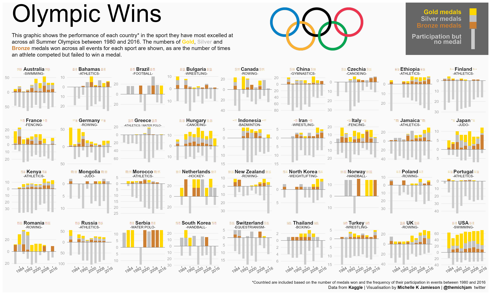

Olympics
================
Developed by Michelle K Jamieson

``` r
library(tidyverse)
```

    ## -- Attaching packages --------------------------------------- tidyverse 1.3.1 --

    ## v ggplot2 3.3.5     v purrr   0.3.4
    ## v tibble  3.1.2     v dplyr   1.0.7
    ## v tidyr   1.1.3     v stringr 1.4.0
    ## v readr   1.4.0     v forcats 0.5.1

    ## -- Conflicts ------------------------------------------ tidyverse_conflicts() --
    ## x dplyr::filter() masks stats::filter()
    ## x dplyr::lag()    masks stats::lag()

``` r
library(emoji)
library(ggtext)
library(patchwork)
```

``` r
# Check necessary pkgs are available
invisible(lapply(
  c("magick", "rsvg", "cowplot", "sysfonts", "showtext"),
  requireNamespace
))
```

    ## Loading required namespace: magick

    ## Loading required namespace: rsvg

    ## Loading required namespace: cowplot

    ## Loading required namespace: sysfonts

    ## Loading required namespace: showtext

``` r
# Read data
tuesdata <- tidytuesdayR::tt_load("2021-07-27")
```

    ## --- Compiling #TidyTuesday Information for 2021-07-27 ----

    ## --- There are 2 files available ---

    ## --- Starting Download ---

    ## 
    ##  Downloading file 1 of 2: `olympics.csv`
    ##  Downloading file 2 of 2: `regions.csv`

    ## --- Download complete ---

``` r
olympics <- tuesdata$olympics
regions <- tuesdata$regions
```

``` r
# Get the olympics logo
olympics_logo <- magick::image_read_svg(
  "https://upload.wikimedia.org/wikipedia/commons/5/5c/Olympic_rings_without_rims.svg"
)
```

``` r
# Prepare emoji flags - only mac/linux :'(
emojis <- emoji::emojis %>%
  filter(grepl("country", subgroup)) %>%
  select(emoji, name) %>%
  mutate(country = str_remove(name, "flag: "), .keep = "unused") %>%
  mutate(country = fct_recode(
    country,
    "UK" = "United Kingdom",
    "USA" = "United States"
  ))
```

``` r
# Medal colours
clr <- list(
  Gold = "#FFD700",
  Silver = "#C0C0C0",
  Bronze = "#cd7f32",
  None = "grey80"
)
```

``` r
# Medal colours that'll show nicely as html
clr1 <- as.list(glue::glue(
  "<span style = 'color:{unlist(clr)}'>**{names(clr)}**</span>"
)) %>% setNames(names(clr))

# Helper to insert whitespace
spacer <- function(size = 1, n = 1) glue::glue("<span style = 'font-size: {size}pt'>{strrep(' ', n)}</span>")
```

``` r
# Prepare the 'key' plot
key <- tibble(
  medal = fct_inorder(names(clr)),
  height = c(1, 1, 1, -3),
  colour = unlist(clr),
  label = c("Gold medals", "Silver medals", "Bronze medals", "Participation but\nno medal")
) %>%
  ggplot(aes(x = 0, y = height, fill = colour, label = label, group = medal)) +
  geom_col(data = ~filter(., medal != "None"), width = 0.6) +
  geom_col(data = ~filter(., medal == "None"), width = 0.3) +
  geom_segment(aes(x = -.35, xend = .35, y = 0, yend = 0), size = 0.3, colour = "grey50") +
  geom_text(
    aes(x = -1, y = c(2.5, 1.5, 0.5, -1.5), colour = colour),
    size = 4.5, hjust = "right", fontface = "bold", lineheight = 0.7, family = "Roboto"
  ) +
  scale_fill_identity() +
  scale_colour_identity() +
  theme_void() +
  xlim(-5.5, 1) +
  ylim(-3.5, 3.5) +
  theme(panel.background = element_rect(fill = "grey40", colour = NA))
```

``` r
# Prepare data for the plot
plot_data <- olympics %>%
  
  filter(season == "Summer", year >= 1980) %>%
  
  left_join(regions, by = c("noc" = "NOC")) %>%
  rename(country = region) %>%
  
  mutate(medal = replace_na(medal, "None") %>% factor(names(clr))) %>%
  
  group_by(country, sport) %>%
  mutate(
    total_medals = sum(medal != "None"),
    total_golds = sum(medal == "Gold")
  ) %>%
  ungroup() %>%
  
  group_by(country) %>%
  filter(total_medals == max(total_medals)) %>%
  ungroup() %>%
  
  filter(total_medals >= 1) %>%
  
  group_by(country) %>%
  mutate(top_sports = paste(sort(unique(sport)), collapse = " / ")) %>%
  ungroup() %>%
  
  group_by(country, year, top_sports, medal) %>%
  summarise(n = n(), .groups = "drop") %>%
  mutate(n = ifelse(medal == "None", -n, n)) %>%
  
  mutate(country = fct_recode(country, "Czechia" = "Czech Republic")) %>%
  left_join(emojis, by = "country") %>%
  
  arrange(country) %>%
  
  mutate(label = fct_inorder(glue::glue(
    "<span style = 'font-size: 11pt; font-family: \"Apple Color Emoji\"'>{emoji}</span>",
    "{spacer(3)}**{country}**{spacer(3)}",
    "<span style = 'font-size: 11pt; font-family: \"Apple Color Emoji\"'>{emoji}</span>"
  ))) %>%
  
  mutate(n_years = n_distinct(year)) %>%
  group_by(country) %>%
  filter(
    n_years - n_distinct(year[medal != "None"]) <= 4,
    n_years - n_distinct(year) <= 3
  ) %>%
  
  group_by(country, year) %>%
  mutate(total_wins = sum(n[medal != "None"])) %>%
  ungroup()

plot <- plot_data %>%
  ggplot(aes(x = year, y = n)) +
  geom_col(aes(fill = medal), data = ~filter(., medal != "None"), width = 3) +
  geom_col(aes(fill = medal), data = ~filter(., medal == "None"), width = 2) +
  geom_hline(yintercept = 0, size = 0.3, colour = "grey50") +
  scale_fill_manual(
    breaks = names(clr),
    values = unlist(clr),
    guide = FALSE
  ) +
  geom_text(
    aes(label = lab, size = size),
    family = "Lora", vjust = -.7,
    data = ~group_by(., label) %>%
      summarise(
        year = 1998,
        n = max(total_wins) * 1,
        lab = glue::glue("-{toupper(unique(top_sports))}-"),
        size = ifelse(nchar(lab) > 15, 2, 2.5),
        .groups = "drop"
      )
  ) +
  scale_size_identity() +
  scale_y_continuous(
    breaks = scales::extended_breaks(n = 5, Q = c(5, 10, 20)),
    labels = abs
  ) +
  scale_x_continuous(
    breaks = olympics %>%
      filter(season == "Summer", year %% 8 == 0) %>%
      pull(year) %>%
      unique()
  ) +
  facet_wrap(~label, scales = "free_y", ncol = 9) +
  theme_minimal() +
  theme(
    text = element_text(family = "Roboto"),
    panel.grid = element_blank(),
    plot.title = element_textbox_simple(family = "Lora", size = 50),
    plot.subtitle = element_textbox_simple(
      family = "Roboto", width = unit(16, "cm"), hjust = 0, halign = 0
    ),
    panel.grid.major.y = element_line(colour = "grey85", size = 0.2),
    axis.text.y = element_text(colour = "grey60", size = 8),
    axis.text.x = element_text(angle = 30, size = 8),
    axis.ticks.x = element_line(colour = "grey40"),
    strip.text = element_textbox_simple(
      halign = 0.5, margin = margin(6, 0, 6, 0), size = 10, lineheight = 0.7
    ),
    plot.caption = element_textbox_simple(halign = 1, height = unit(1, "cm")),
    plot.background = element_rect(fill = "grey98", colour = "grey98", size = 30),
    panel.background = element_rect(fill = NA, colour = NA)
  ) +
  labs(
    x = NULL, y = NULL,
    title = "Olympic Wins",
    subtitle = glue::glue(
      "<br>This graphic shows the performance of each country* in the sport they ",
      "have most excelled at across all Summer Olympics between 1980 and 2016. ",
      "The numbers of {clr1$Gold}, {clr1$Silver} and {clr1$Bronze} medals won across ",
      "all events for each sport are shown, as are the number of times an athlete ",
      "competed but failed to win a medal.<br>"
    ),
    caption = paste0(
      "<span style = 'font-size: 8pt'><br>\\*Countried are included based on the number of medals won and the ",
      "frequency of their participation in events between 1980 and 2016</span>",
      "<br>Data from **Kaggle** | Visualisation by **Michelle K Jamieson** | ",
      "**@themichjam** <span style = 'font-family: \"Font Awesome 5 Brands\"'>twitter</span>"
    )
  ) +
  coord_cartesian(clip = "off") +
  inset_element(
    key, left = .83, bottom = .82, right = 1, top = 1,
    align_to = "full", clip = FALSE
  )
```

``` r
# Set up a device to save the graphic
ragg::agg_png("render/olympics.png", width = 4000, height = 2400, scaling = 4)
```

``` r
# Print the graphic to save
cowplot::ggdraw(plot) +
  cowplot::draw_image(
    olympics_logo,
    x = .55, y = .975, width = 0.19,
    hjust = 0, vjust = 1, halign = 1, valign = 1
  )
```

    ## Warning in grid.Call(C_stringMetric, as.graphicsAnnot(x$label)): font family
    ## 'Roboto' not found in PostScript font database

    ## Warning in grid.Call(C_stringMetric, as.graphicsAnnot(x$label)): font family
    ## 'Roboto' not found in PostScript font database

    ## Warning in grid.Call(C_stringMetric, as.graphicsAnnot(x$label)): font family
    ## 'Roboto' not found in PostScript font database

    ## Warning in grid.Call(C_stringMetric, as.graphicsAnnot(x$label)): font family
    ## 'Roboto' not found in PostScript font database

    ## Warning in grid.Call(C_stringMetric, as.graphicsAnnot(x$label)): font family
    ## 'Roboto' not found in PostScript font database

    ## Warning in grid.Call(C_stringMetric, as.graphicsAnnot(x$label)): font family
    ## 'Roboto' not found in PostScript font database

    ## Warning in grid.Call(C_stringMetric, as.graphicsAnnot(x$label)): font family
    ## 'Roboto' not found in PostScript font database

    ## Warning in grid.Call(C_stringMetric, as.graphicsAnnot(x$label)): font family
    ## 'Roboto' not found in PostScript font database

    ## Warning in grid.Call(C_stringMetric, as.graphicsAnnot(x$label)): font family
    ## 'Roboto' not found in PostScript font database

    ## Warning in grid.Call(C_stringMetric, as.graphicsAnnot(x$label)): font family
    ## 'Roboto' not found in PostScript font database

    ## Warning in grid.Call(C_stringMetric, as.graphicsAnnot(x$label)): font family
    ## 'Roboto' not found in PostScript font database

    ## Warning in grid.Call(C_stringMetric, as.graphicsAnnot(x$label)): font family
    ## 'Roboto' not found in PostScript font database

    ## Warning in grid.Call(C_stringMetric, as.graphicsAnnot(x$label)): font family
    ## 'Roboto' not found in PostScript font database

    ## Warning in grid.Call(C_stringMetric, as.graphicsAnnot(x$label)): font family
    ## 'Roboto' not found in PostScript font database

    ## Warning in grid.Call(C_textBounds, as.graphicsAnnot(x$label), x$x, x$y, : font
    ## family 'Roboto' not found in PostScript font database

    ## Warning in grid.Call(C_stringMetric, as.graphicsAnnot(x$label)): font family
    ## 'Roboto' not found in PostScript font database

    ## Warning in grid.Call(C_stringMetric, as.graphicsAnnot(x$label)): font family
    ## 'Roboto' not found in PostScript font database

    ## Warning in grid.Call(C_stringMetric, as.graphicsAnnot(x$label)): font family
    ## 'Roboto' not found in PostScript font database

    ## Warning in grid.Call(C_stringMetric, as.graphicsAnnot(x$label)): font family
    ## 'Roboto' not found in PostScript font database

    ## Warning in grid.Call(C_stringMetric, as.graphicsAnnot(x$label)): font family
    ## 'Roboto' not found in PostScript font database

    ## Warning in grid.Call(C_stringMetric, as.graphicsAnnot(x$label)): font family
    ## 'Roboto' not found in PostScript font database

    ## Warning in grid.Call(C_stringMetric, as.graphicsAnnot(x$label)): font family
    ## 'Roboto' not found in PostScript font database

    ## Warning in grid.Call(C_stringMetric, as.graphicsAnnot(x$label)): font family
    ## 'Roboto' not found in PostScript font database

    ## Warning in grid.Call(C_stringMetric, as.graphicsAnnot(x$label)): font family
    ## 'Roboto' not found in PostScript font database

    ## Warning in grid.Call(C_stringMetric, as.graphicsAnnot(x$label)): font family
    ## 'Roboto' not found in PostScript font database

    ## Warning in grid.Call(C_stringMetric, as.graphicsAnnot(x$label)): font family
    ## 'Roboto' not found in PostScript font database

    ## Warning in grid.Call(C_stringMetric, as.graphicsAnnot(x$label)): font family
    ## 'Roboto' not found in PostScript font database

    ## Warning in grid.Call(C_stringMetric, as.graphicsAnnot(x$label)): font family
    ## 'Roboto' not found in PostScript font database

    ## Warning in grid.Call(C_textBounds, as.graphicsAnnot(x$label), x$x, x$y, : font
    ## family 'Roboto' not found in PostScript font database

    ## Warning in grid.Call(C_textBounds, as.graphicsAnnot(x$label), x$x, x$y, : font
    ## family 'Apple Color Emoji' not found in PostScript font database

    ## Warning in grid.Call(C_stringMetric, as.graphicsAnnot(x$label)): font family
    ## 'Apple Color Emoji' not found in PostScript font database

    ## Warning in grid.Call(C_stringMetric, as.graphicsAnnot(x$label)): font family
    ## 'Apple Color Emoji' not found in PostScript font database

    ## Warning in grid.Call(C_stringMetric, as.graphicsAnnot(x$label)): font family
    ## 'Apple Color Emoji' not found in PostScript font database

    ## Warning in grid.Call(C_stringMetric, as.graphicsAnnot(x$label)): font family
    ## 'Apple Color Emoji' not found in PostScript font database

    ## Warning in grid.Call(C_stringMetric, as.graphicsAnnot(x$label)): font family
    ## 'Apple Color Emoji' not found in PostScript font database

    ## Warning in grid.Call(C_stringMetric, as.graphicsAnnot(x$label)): font family
    ## 'Apple Color Emoji' not found in PostScript font database

    ## Warning in grid.Call(C_stringMetric, as.graphicsAnnot(x$label)): font family
    ## 'Apple Color Emoji' not found in PostScript font database

    ## Warning in grid.Call(C_stringMetric, as.graphicsAnnot(x$label)): font family
    ## 'Apple Color Emoji' not found in PostScript font database

    ## Warning in grid.Call(C_stringMetric, as.graphicsAnnot(x$label)): font family
    ## 'Apple Color Emoji' not found in PostScript font database

    ## Warning in grid.Call(C_stringMetric, as.graphicsAnnot(x$label)): font family
    ## 'Apple Color Emoji' not found in PostScript font database

    ## Warning in grid.Call(C_stringMetric, as.graphicsAnnot(x$label)): font family
    ## 'Apple Color Emoji' not found in PostScript font database

    ## Warning in grid.Call(C_stringMetric, as.graphicsAnnot(x$label)): font family
    ## 'Apple Color Emoji' not found in PostScript font database

    ## Warning in grid.Call(C_stringMetric, as.graphicsAnnot(x$label)): font family
    ## 'Apple Color Emoji' not found in PostScript font database

    ## Warning in grid.Call(C_textBounds, as.graphicsAnnot(x$label), x$x, x$y, : font
    ## family 'Apple Color Emoji' not found in PostScript font database

    ## Warning in grid.Call(C_textBounds, as.graphicsAnnot(x$label), x$x, x$y, : font
    ## family 'Roboto' not found in PostScript font database

    ## Warning in grid.Call(C_stringMetric, as.graphicsAnnot(x$label)): font family
    ## 'Roboto' not found in PostScript font database

    ## Warning in grid.Call(C_stringMetric, as.graphicsAnnot(x$label)): font family
    ## 'Roboto' not found in PostScript font database

    ## Warning in grid.Call(C_stringMetric, as.graphicsAnnot(x$label)): font family
    ## 'Roboto' not found in PostScript font database

    ## Warning in grid.Call(C_stringMetric, as.graphicsAnnot(x$label)): font family
    ## 'Roboto' not found in PostScript font database

    ## Warning in grid.Call(C_stringMetric, as.graphicsAnnot(x$label)): font family
    ## 'Roboto' not found in PostScript font database

    ## Warning in grid.Call(C_stringMetric, as.graphicsAnnot(x$label)): font family
    ## 'Roboto' not found in PostScript font database

    ## Warning in grid.Call(C_stringMetric, as.graphicsAnnot(x$label)): font family
    ## 'Roboto' not found in PostScript font database

    ## Warning in grid.Call(C_stringMetric, as.graphicsAnnot(x$label)): font family
    ## 'Roboto' not found in PostScript font database

    ## Warning in grid.Call(C_stringMetric, as.graphicsAnnot(x$label)): font family
    ## 'Roboto' not found in PostScript font database

    ## Warning in grid.Call(C_stringMetric, as.graphicsAnnot(x$label)): font family
    ## 'Roboto' not found in PostScript font database

    ## Warning in grid.Call(C_stringMetric, as.graphicsAnnot(x$label)): font family
    ## 'Roboto' not found in PostScript font database

    ## Warning in grid.Call(C_stringMetric, as.graphicsAnnot(x$label)): font family
    ## 'Roboto' not found in PostScript font database

    ## Warning in grid.Call(C_stringMetric, as.graphicsAnnot(x$label)): font family
    ## 'Roboto' not found in PostScript font database

    ## Warning in grid.Call(C_textBounds, as.graphicsAnnot(x$label), x$x, x$y, : font
    ## family 'Roboto' not found in PostScript font database

    ## Warning in grid.Call(C_textBounds, as.graphicsAnnot(x$label), x$x, x$y, : font
    ## family 'Roboto' not found in PostScript font database

    ## Warning in grid.Call(C_stringMetric, as.graphicsAnnot(x$label)): font family
    ## 'Roboto' not found in PostScript font database

    ## Warning in grid.Call(C_stringMetric, as.graphicsAnnot(x$label)): font family
    ## 'Roboto' not found in PostScript font database

    ## Warning in grid.Call(C_stringMetric, as.graphicsAnnot(x$label)): font family
    ## 'Roboto' not found in PostScript font database

    ## Warning in grid.Call(C_stringMetric, as.graphicsAnnot(x$label)): font family
    ## 'Roboto' not found in PostScript font database

    ## Warning in grid.Call(C_stringMetric, as.graphicsAnnot(x$label)): font family
    ## 'Roboto' not found in PostScript font database

    ## Warning in grid.Call(C_stringMetric, as.graphicsAnnot(x$label)): font family
    ## 'Roboto' not found in PostScript font database

    ## Warning in grid.Call(C_stringMetric, as.graphicsAnnot(x$label)): font family
    ## 'Roboto' not found in PostScript font database

    ## Warning in grid.Call(C_stringMetric, as.graphicsAnnot(x$label)): font family
    ## 'Roboto' not found in PostScript font database

    ## Warning in grid.Call(C_stringMetric, as.graphicsAnnot(x$label)): font family
    ## 'Roboto' not found in PostScript font database

    ## Warning in grid.Call(C_stringMetric, as.graphicsAnnot(x$label)): font family
    ## 'Roboto' not found in PostScript font database

    ## Warning in grid.Call(C_stringMetric, as.graphicsAnnot(x$label)): font family
    ## 'Roboto' not found in PostScript font database

    ## Warning in grid.Call(C_stringMetric, as.graphicsAnnot(x$label)): font family
    ## 'Roboto' not found in PostScript font database

    ## Warning in grid.Call(C_stringMetric, as.graphicsAnnot(x$label)): font family
    ## 'Roboto' not found in PostScript font database

    ## Warning in grid.Call(C_textBounds, as.graphicsAnnot(x$label), x$x, x$y, : font
    ## family 'Roboto' not found in PostScript font database

    ## Warning in text_info(label, fontkey, fontfamily, fontface, fontsize, cache):
    ## unable to translate '<U+0001F1E6><U+0001F1FA>pdfApple Color Emojiplain11' to
    ## native encoding

    ## Warning in grid.Call(C_textBounds, as.graphicsAnnot(x$label), x$x, x$y, : font
    ## family 'Apple Color Emoji' not found in PostScript font database

    ## Warning in grid.Call(C_textBounds, as.graphicsAnnot(x$label), x$x, x$y, : font
    ## family 'Apple Color Emoji' not found in PostScript font database

    ## Warning in grid.Call(C_textBounds, as.graphicsAnnot(x$label), x$x, x$y, : font
    ## family 'Apple Color Emoji' not found in PostScript font database

    ## Warning in text_info_cache[[key]] <- info: unable to translate
    ## '<U+0001F1E6><U+0001F1FA>pdfApple Color Emojiplain11' to native encoding

    ## Warning in grid.Call(C_textBounds, as.graphicsAnnot(x$label), x$x, x$y, : font
    ## family 'Roboto' not found in PostScript font database

    ## Warning in grid.Call(C_textBounds, as.graphicsAnnot(x$label), x$x, x$y, : font
    ## family 'Roboto' not found in PostScript font database

    ## Warning in grid.Call(C_textBounds, as.graphicsAnnot(x$label), x$x, x$y, : font
    ## family 'Roboto' not found in PostScript font database

    ## Warning in grid.Call(C_textBounds, as.graphicsAnnot(x$label), x$x, x$y, : font
    ## family 'Roboto' not found in PostScript font database

    ## Warning in grid.Call(C_textBounds, as.graphicsAnnot(x$label), x$x, x$y, : font
    ## family 'Roboto' not found in PostScript font database

    ## Warning in grid.Call(C_textBounds, as.graphicsAnnot(x$label), x$x, x$y, : font
    ## family 'Roboto' not found in PostScript font database

    ## Warning in text_info(label, fontkey, fontfamily, fontface, fontsize, cache):
    ## unable to translate '<U+0001F1E6><U+0001F1FA>pdfApple Color Emojiplain11' to
    ## native encoding

    ## Warning in text_info(label, fontkey, fontfamily, fontface, fontsize, cache):
    ## unable to translate '<U+0001F1E7><U+0001F1F8>pdfApple Color Emojiplain11' to
    ## native encoding

    ## Warning in grid.Call(C_textBounds, as.graphicsAnnot(x$label), x$x, x$y, : font
    ## family 'Apple Color Emoji' not found in PostScript font database

    ## Warning in grid.Call(C_textBounds, as.graphicsAnnot(x$label), x$x, x$y, : font
    ## family 'Apple Color Emoji' not found in PostScript font database

    ## Warning in grid.Call(C_textBounds, as.graphicsAnnot(x$label), x$x, x$y, : font
    ## family 'Apple Color Emoji' not found in PostScript font database

    ## Warning in text_info_cache[[key]] <- info: unable to translate
    ## '<U+0001F1E7><U+0001F1F8>pdfApple Color Emojiplain11' to native encoding

    ## Warning in grid.Call(C_textBounds, as.graphicsAnnot(x$label), x$x, x$y, : font
    ## family 'Roboto' not found in PostScript font database

    ## Warning in grid.Call(C_textBounds, as.graphicsAnnot(x$label), x$x, x$y, : font
    ## family 'Roboto' not found in PostScript font database

    ## Warning in grid.Call(C_textBounds, as.graphicsAnnot(x$label), x$x, x$y, : font
    ## family 'Roboto' not found in PostScript font database

    ## Warning in text_info(label, fontkey, fontfamily, fontface, fontsize, cache):
    ## unable to translate '<U+0001F1E7><U+0001F1F8>pdfApple Color Emojiplain11' to
    ## native encoding

    ## Warning in text_info(label, fontkey, fontfamily, fontface, fontsize, cache):
    ## unable to translate '<U+0001F1E7><U+0001F1F7>pdfApple Color Emojiplain11' to
    ## native encoding

    ## Warning in grid.Call(C_textBounds, as.graphicsAnnot(x$label), x$x, x$y, : font
    ## family 'Apple Color Emoji' not found in PostScript font database

    ## Warning in grid.Call(C_textBounds, as.graphicsAnnot(x$label), x$x, x$y, : font
    ## family 'Apple Color Emoji' not found in PostScript font database

    ## Warning in grid.Call(C_textBounds, as.graphicsAnnot(x$label), x$x, x$y, : font
    ## family 'Apple Color Emoji' not found in PostScript font database

    ## Warning in text_info_cache[[key]] <- info: unable to translate
    ## '<U+0001F1E7><U+0001F1F7>pdfApple Color Emojiplain11' to native encoding

    ## Warning in grid.Call(C_textBounds, as.graphicsAnnot(x$label), x$x, x$y, : font
    ## family 'Roboto' not found in PostScript font database

    ## Warning in grid.Call(C_textBounds, as.graphicsAnnot(x$label), x$x, x$y, : font
    ## family 'Roboto' not found in PostScript font database

    ## Warning in grid.Call(C_textBounds, as.graphicsAnnot(x$label), x$x, x$y, : font
    ## family 'Roboto' not found in PostScript font database

    ## Warning in text_info(label, fontkey, fontfamily, fontface, fontsize, cache):
    ## unable to translate '<U+0001F1E7><U+0001F1F7>pdfApple Color Emojiplain11' to
    ## native encoding

    ## Warning in text_info(label, fontkey, fontfamily, fontface, fontsize, cache):
    ## unable to translate '<U+0001F1E7><U+0001F1EC>pdfApple Color Emojiplain11' to
    ## native encoding

    ## Warning in grid.Call(C_textBounds, as.graphicsAnnot(x$label), x$x, x$y, : font
    ## family 'Apple Color Emoji' not found in PostScript font database

    ## Warning in grid.Call(C_textBounds, as.graphicsAnnot(x$label), x$x, x$y, : font
    ## family 'Apple Color Emoji' not found in PostScript font database

    ## Warning in grid.Call(C_textBounds, as.graphicsAnnot(x$label), x$x, x$y, : font
    ## family 'Apple Color Emoji' not found in PostScript font database

    ## Warning in text_info_cache[[key]] <- info: unable to translate
    ## '<U+0001F1E7><U+0001F1EC>pdfApple Color Emojiplain11' to native encoding

    ## Warning in grid.Call(C_textBounds, as.graphicsAnnot(x$label), x$x, x$y, : font
    ## family 'Roboto' not found in PostScript font database

    ## Warning in grid.Call(C_textBounds, as.graphicsAnnot(x$label), x$x, x$y, : font
    ## family 'Roboto' not found in PostScript font database

    ## Warning in grid.Call(C_textBounds, as.graphicsAnnot(x$label), x$x, x$y, : font
    ## family 'Roboto' not found in PostScript font database

    ## Warning in text_info(label, fontkey, fontfamily, fontface, fontsize, cache):
    ## unable to translate '<U+0001F1E7><U+0001F1EC>pdfApple Color Emojiplain11' to
    ## native encoding

    ## Warning in text_info(label, fontkey, fontfamily, fontface, fontsize, cache):
    ## unable to translate '<U+0001F1E8><U+0001F1E6>pdfApple Color Emojiplain11' to
    ## native encoding

    ## Warning in grid.Call(C_textBounds, as.graphicsAnnot(x$label), x$x, x$y, : font
    ## family 'Apple Color Emoji' not found in PostScript font database

    ## Warning in grid.Call(C_textBounds, as.graphicsAnnot(x$label), x$x, x$y, : font
    ## family 'Apple Color Emoji' not found in PostScript font database

    ## Warning in grid.Call(C_textBounds, as.graphicsAnnot(x$label), x$x, x$y, : font
    ## family 'Apple Color Emoji' not found in PostScript font database

    ## Warning in text_info_cache[[key]] <- info: unable to translate
    ## '<U+0001F1E8><U+0001F1E6>pdfApple Color Emojiplain11' to native encoding

    ## Warning in grid.Call(C_textBounds, as.graphicsAnnot(x$label), x$x, x$y, : font
    ## family 'Roboto' not found in PostScript font database

    ## Warning in grid.Call(C_textBounds, as.graphicsAnnot(x$label), x$x, x$y, : font
    ## family 'Roboto' not found in PostScript font database

    ## Warning in grid.Call(C_textBounds, as.graphicsAnnot(x$label), x$x, x$y, : font
    ## family 'Roboto' not found in PostScript font database

    ## Warning in text_info(label, fontkey, fontfamily, fontface, fontsize, cache):
    ## unable to translate '<U+0001F1E8><U+0001F1E6>pdfApple Color Emojiplain11' to
    ## native encoding

    ## Warning in text_info(label, fontkey, fontfamily, fontface, fontsize, cache):
    ## unable to translate '<U+0001F1E8><U+0001F1F3>pdfApple Color Emojiplain11' to
    ## native encoding

    ## Warning in grid.Call(C_textBounds, as.graphicsAnnot(x$label), x$x, x$y, : font
    ## family 'Apple Color Emoji' not found in PostScript font database

    ## Warning in grid.Call(C_textBounds, as.graphicsAnnot(x$label), x$x, x$y, : font
    ## family 'Apple Color Emoji' not found in PostScript font database

    ## Warning in grid.Call(C_textBounds, as.graphicsAnnot(x$label), x$x, x$y, : font
    ## family 'Apple Color Emoji' not found in PostScript font database

    ## Warning in text_info_cache[[key]] <- info: unable to translate
    ## '<U+0001F1E8><U+0001F1F3>pdfApple Color Emojiplain11' to native encoding

    ## Warning in grid.Call(C_textBounds, as.graphicsAnnot(x$label), x$x, x$y, : font
    ## family 'Roboto' not found in PostScript font database

    ## Warning in grid.Call(C_textBounds, as.graphicsAnnot(x$label), x$x, x$y, : font
    ## family 'Roboto' not found in PostScript font database

    ## Warning in grid.Call(C_textBounds, as.graphicsAnnot(x$label), x$x, x$y, : font
    ## family 'Roboto' not found in PostScript font database

    ## Warning in text_info(label, fontkey, fontfamily, fontface, fontsize, cache):
    ## unable to translate '<U+0001F1E8><U+0001F1F3>pdfApple Color Emojiplain11' to
    ## native encoding

    ## Warning in text_info(label, fontkey, fontfamily, fontface, fontsize, cache):
    ## unable to translate '<U+0001F1E8><U+0001F1FF>pdfApple Color Emojiplain11' to
    ## native encoding

    ## Warning in grid.Call(C_textBounds, as.graphicsAnnot(x$label), x$x, x$y, : font
    ## family 'Apple Color Emoji' not found in PostScript font database

    ## Warning in grid.Call(C_textBounds, as.graphicsAnnot(x$label), x$x, x$y, : font
    ## family 'Apple Color Emoji' not found in PostScript font database

    ## Warning in grid.Call(C_textBounds, as.graphicsAnnot(x$label), x$x, x$y, : font
    ## family 'Apple Color Emoji' not found in PostScript font database

    ## Warning in text_info_cache[[key]] <- info: unable to translate
    ## '<U+0001F1E8><U+0001F1FF>pdfApple Color Emojiplain11' to native encoding

    ## Warning in grid.Call(C_textBounds, as.graphicsAnnot(x$label), x$x, x$y, : font
    ## family 'Roboto' not found in PostScript font database

    ## Warning in grid.Call(C_textBounds, as.graphicsAnnot(x$label), x$x, x$y, : font
    ## family 'Roboto' not found in PostScript font database

    ## Warning in grid.Call(C_textBounds, as.graphicsAnnot(x$label), x$x, x$y, : font
    ## family 'Roboto' not found in PostScript font database

    ## Warning in text_info(label, fontkey, fontfamily, fontface, fontsize, cache):
    ## unable to translate '<U+0001F1E8><U+0001F1FF>pdfApple Color Emojiplain11' to
    ## native encoding

    ## Warning in text_info(label, fontkey, fontfamily, fontface, fontsize, cache):
    ## unable to translate '<U+0001F1EA><U+0001F1F9>pdfApple Color Emojiplain11' to
    ## native encoding

    ## Warning in grid.Call(C_textBounds, as.graphicsAnnot(x$label), x$x, x$y, : font
    ## family 'Apple Color Emoji' not found in PostScript font database

    ## Warning in grid.Call(C_textBounds, as.graphicsAnnot(x$label), x$x, x$y, : font
    ## family 'Apple Color Emoji' not found in PostScript font database

    ## Warning in grid.Call(C_textBounds, as.graphicsAnnot(x$label), x$x, x$y, : font
    ## family 'Apple Color Emoji' not found in PostScript font database

    ## Warning in text_info_cache[[key]] <- info: unable to translate
    ## '<U+0001F1EA><U+0001F1F9>pdfApple Color Emojiplain11' to native encoding

    ## Warning in grid.Call(C_textBounds, as.graphicsAnnot(x$label), x$x, x$y, : font
    ## family 'Roboto' not found in PostScript font database

    ## Warning in grid.Call(C_textBounds, as.graphicsAnnot(x$label), x$x, x$y, : font
    ## family 'Roboto' not found in PostScript font database

    ## Warning in grid.Call(C_textBounds, as.graphicsAnnot(x$label), x$x, x$y, : font
    ## family 'Roboto' not found in PostScript font database

    ## Warning in text_info(label, fontkey, fontfamily, fontface, fontsize, cache):
    ## unable to translate '<U+0001F1EA><U+0001F1F9>pdfApple Color Emojiplain11' to
    ## native encoding

    ## Warning in text_info(label, fontkey, fontfamily, fontface, fontsize, cache):
    ## unable to translate '<U+0001F1EB><U+0001F1EE>pdfApple Color Emojiplain11' to
    ## native encoding

    ## Warning in grid.Call(C_textBounds, as.graphicsAnnot(x$label), x$x, x$y, : font
    ## family 'Apple Color Emoji' not found in PostScript font database

    ## Warning in grid.Call(C_textBounds, as.graphicsAnnot(x$label), x$x, x$y, : font
    ## family 'Apple Color Emoji' not found in PostScript font database

    ## Warning in grid.Call(C_textBounds, as.graphicsAnnot(x$label), x$x, x$y, : font
    ## family 'Apple Color Emoji' not found in PostScript font database

    ## Warning in text_info_cache[[key]] <- info: unable to translate
    ## '<U+0001F1EB><U+0001F1EE>pdfApple Color Emojiplain11' to native encoding

    ## Warning in grid.Call(C_textBounds, as.graphicsAnnot(x$label), x$x, x$y, : font
    ## family 'Roboto' not found in PostScript font database

    ## Warning in grid.Call(C_textBounds, as.graphicsAnnot(x$label), x$x, x$y, : font
    ## family 'Roboto' not found in PostScript font database

    ## Warning in grid.Call(C_textBounds, as.graphicsAnnot(x$label), x$x, x$y, : font
    ## family 'Roboto' not found in PostScript font database

    ## Warning in text_info(label, fontkey, fontfamily, fontface, fontsize, cache):
    ## unable to translate '<U+0001F1EB><U+0001F1EE>pdfApple Color Emojiplain11' to
    ## native encoding

    ## Warning in text_info(label, fontkey, fontfamily, fontface, fontsize, cache):
    ## unable to translate '<U+0001F1EB><U+0001F1F7>pdfApple Color Emojiplain11' to
    ## native encoding

    ## Warning in grid.Call(C_textBounds, as.graphicsAnnot(x$label), x$x, x$y, : font
    ## family 'Apple Color Emoji' not found in PostScript font database

    ## Warning in grid.Call(C_textBounds, as.graphicsAnnot(x$label), x$x, x$y, : font
    ## family 'Apple Color Emoji' not found in PostScript font database

    ## Warning in grid.Call(C_textBounds, as.graphicsAnnot(x$label), x$x, x$y, : font
    ## family 'Apple Color Emoji' not found in PostScript font database

    ## Warning in text_info_cache[[key]] <- info: unable to translate
    ## '<U+0001F1EB><U+0001F1F7>pdfApple Color Emojiplain11' to native encoding

    ## Warning in grid.Call(C_textBounds, as.graphicsAnnot(x$label), x$x, x$y, : font
    ## family 'Roboto' not found in PostScript font database

    ## Warning in grid.Call(C_textBounds, as.graphicsAnnot(x$label), x$x, x$y, : font
    ## family 'Roboto' not found in PostScript font database

    ## Warning in grid.Call(C_textBounds, as.graphicsAnnot(x$label), x$x, x$y, : font
    ## family 'Roboto' not found in PostScript font database

    ## Warning in text_info(label, fontkey, fontfamily, fontface, fontsize, cache):
    ## unable to translate '<U+0001F1EB><U+0001F1F7>pdfApple Color Emojiplain11' to
    ## native encoding

    ## Warning in text_info(label, fontkey, fontfamily, fontface, fontsize, cache):
    ## unable to translate '<U+0001F1E9><U+0001F1EA>pdfApple Color Emojiplain11' to
    ## native encoding

    ## Warning in grid.Call(C_textBounds, as.graphicsAnnot(x$label), x$x, x$y, : font
    ## family 'Apple Color Emoji' not found in PostScript font database

    ## Warning in grid.Call(C_textBounds, as.graphicsAnnot(x$label), x$x, x$y, : font
    ## family 'Apple Color Emoji' not found in PostScript font database

    ## Warning in grid.Call(C_textBounds, as.graphicsAnnot(x$label), x$x, x$y, : font
    ## family 'Apple Color Emoji' not found in PostScript font database

    ## Warning in text_info_cache[[key]] <- info: unable to translate
    ## '<U+0001F1E9><U+0001F1EA>pdfApple Color Emojiplain11' to native encoding

    ## Warning in grid.Call(C_textBounds, as.graphicsAnnot(x$label), x$x, x$y, : font
    ## family 'Roboto' not found in PostScript font database

    ## Warning in grid.Call(C_textBounds, as.graphicsAnnot(x$label), x$x, x$y, : font
    ## family 'Roboto' not found in PostScript font database

    ## Warning in grid.Call(C_textBounds, as.graphicsAnnot(x$label), x$x, x$y, : font
    ## family 'Roboto' not found in PostScript font database

    ## Warning in text_info(label, fontkey, fontfamily, fontface, fontsize, cache):
    ## unable to translate '<U+0001F1E9><U+0001F1EA>pdfApple Color Emojiplain11' to
    ## native encoding

    ## Warning in text_info(label, fontkey, fontfamily, fontface, fontsize, cache):
    ## unable to translate '<U+0001F1EC><U+0001F1F7>pdfApple Color Emojiplain11' to
    ## native encoding

    ## Warning in grid.Call(C_textBounds, as.graphicsAnnot(x$label), x$x, x$y, : font
    ## family 'Apple Color Emoji' not found in PostScript font database

    ## Warning in grid.Call(C_textBounds, as.graphicsAnnot(x$label), x$x, x$y, : font
    ## family 'Apple Color Emoji' not found in PostScript font database

    ## Warning in grid.Call(C_textBounds, as.graphicsAnnot(x$label), x$x, x$y, : font
    ## family 'Apple Color Emoji' not found in PostScript font database

    ## Warning in text_info_cache[[key]] <- info: unable to translate
    ## '<U+0001F1EC><U+0001F1F7>pdfApple Color Emojiplain11' to native encoding

    ## Warning in grid.Call(C_textBounds, as.graphicsAnnot(x$label), x$x, x$y, : font
    ## family 'Roboto' not found in PostScript font database

    ## Warning in grid.Call(C_textBounds, as.graphicsAnnot(x$label), x$x, x$y, : font
    ## family 'Roboto' not found in PostScript font database

    ## Warning in grid.Call(C_textBounds, as.graphicsAnnot(x$label), x$x, x$y, : font
    ## family 'Roboto' not found in PostScript font database

    ## Warning in text_info(label, fontkey, fontfamily, fontface, fontsize, cache):
    ## unable to translate '<U+0001F1EC><U+0001F1F7>pdfApple Color Emojiplain11' to
    ## native encoding

    ## Warning in text_info(label, fontkey, fontfamily, fontface, fontsize, cache):
    ## unable to translate '<U+0001F1ED><U+0001F1FA>pdfApple Color Emojiplain11' to
    ## native encoding

    ## Warning in grid.Call(C_textBounds, as.graphicsAnnot(x$label), x$x, x$y, : font
    ## family 'Apple Color Emoji' not found in PostScript font database

    ## Warning in grid.Call(C_textBounds, as.graphicsAnnot(x$label), x$x, x$y, : font
    ## family 'Apple Color Emoji' not found in PostScript font database

    ## Warning in grid.Call(C_textBounds, as.graphicsAnnot(x$label), x$x, x$y, : font
    ## family 'Apple Color Emoji' not found in PostScript font database

    ## Warning in text_info_cache[[key]] <- info: unable to translate
    ## '<U+0001F1ED><U+0001F1FA>pdfApple Color Emojiplain11' to native encoding

    ## Warning in grid.Call(C_textBounds, as.graphicsAnnot(x$label), x$x, x$y, : font
    ## family 'Roboto' not found in PostScript font database

    ## Warning in grid.Call(C_textBounds, as.graphicsAnnot(x$label), x$x, x$y, : font
    ## family 'Roboto' not found in PostScript font database

    ## Warning in grid.Call(C_textBounds, as.graphicsAnnot(x$label), x$x, x$y, : font
    ## family 'Roboto' not found in PostScript font database

    ## Warning in text_info(label, fontkey, fontfamily, fontface, fontsize, cache):
    ## unable to translate '<U+0001F1ED><U+0001F1FA>pdfApple Color Emojiplain11' to
    ## native encoding

    ## Warning in text_info(label, fontkey, fontfamily, fontface, fontsize, cache):
    ## unable to translate '<U+0001F1EE><U+0001F1E9>pdfApple Color Emojiplain11' to
    ## native encoding

    ## Warning in grid.Call(C_textBounds, as.graphicsAnnot(x$label), x$x, x$y, : font
    ## family 'Apple Color Emoji' not found in PostScript font database

    ## Warning in grid.Call(C_textBounds, as.graphicsAnnot(x$label), x$x, x$y, : font
    ## family 'Apple Color Emoji' not found in PostScript font database

    ## Warning in grid.Call(C_textBounds, as.graphicsAnnot(x$label), x$x, x$y, : font
    ## family 'Apple Color Emoji' not found in PostScript font database

    ## Warning in text_info_cache[[key]] <- info: unable to translate
    ## '<U+0001F1EE><U+0001F1E9>pdfApple Color Emojiplain11' to native encoding

    ## Warning in grid.Call(C_textBounds, as.graphicsAnnot(x$label), x$x, x$y, : font
    ## family 'Roboto' not found in PostScript font database

    ## Warning in grid.Call(C_textBounds, as.graphicsAnnot(x$label), x$x, x$y, : font
    ## family 'Roboto' not found in PostScript font database

    ## Warning in grid.Call(C_textBounds, as.graphicsAnnot(x$label), x$x, x$y, : font
    ## family 'Roboto' not found in PostScript font database

    ## Warning in text_info(label, fontkey, fontfamily, fontface, fontsize, cache):
    ## unable to translate '<U+0001F1EE><U+0001F1E9>pdfApple Color Emojiplain11' to
    ## native encoding

    ## Warning in text_info(label, fontkey, fontfamily, fontface, fontsize, cache):
    ## unable to translate '<U+0001F1EE><U+0001F1F7>pdfApple Color Emojiplain11' to
    ## native encoding

    ## Warning in grid.Call(C_textBounds, as.graphicsAnnot(x$label), x$x, x$y, : font
    ## family 'Apple Color Emoji' not found in PostScript font database

    ## Warning in grid.Call(C_textBounds, as.graphicsAnnot(x$label), x$x, x$y, : font
    ## family 'Apple Color Emoji' not found in PostScript font database

    ## Warning in grid.Call(C_textBounds, as.graphicsAnnot(x$label), x$x, x$y, : font
    ## family 'Apple Color Emoji' not found in PostScript font database

    ## Warning in text_info_cache[[key]] <- info: unable to translate
    ## '<U+0001F1EE><U+0001F1F7>pdfApple Color Emojiplain11' to native encoding

    ## Warning in grid.Call(C_textBounds, as.graphicsAnnot(x$label), x$x, x$y, : font
    ## family 'Roboto' not found in PostScript font database

    ## Warning in grid.Call(C_textBounds, as.graphicsAnnot(x$label), x$x, x$y, : font
    ## family 'Roboto' not found in PostScript font database

    ## Warning in grid.Call(C_textBounds, as.graphicsAnnot(x$label), x$x, x$y, : font
    ## family 'Roboto' not found in PostScript font database

    ## Warning in text_info(label, fontkey, fontfamily, fontface, fontsize, cache):
    ## unable to translate '<U+0001F1EE><U+0001F1F7>pdfApple Color Emojiplain11' to
    ## native encoding

    ## Warning in text_info(label, fontkey, fontfamily, fontface, fontsize, cache):
    ## unable to translate '<U+0001F1EE><U+0001F1F9>pdfApple Color Emojiplain11' to
    ## native encoding

    ## Warning in grid.Call(C_textBounds, as.graphicsAnnot(x$label), x$x, x$y, : font
    ## family 'Apple Color Emoji' not found in PostScript font database

    ## Warning in grid.Call(C_textBounds, as.graphicsAnnot(x$label), x$x, x$y, : font
    ## family 'Apple Color Emoji' not found in PostScript font database

    ## Warning in grid.Call(C_textBounds, as.graphicsAnnot(x$label), x$x, x$y, : font
    ## family 'Apple Color Emoji' not found in PostScript font database

    ## Warning in text_info_cache[[key]] <- info: unable to translate
    ## '<U+0001F1EE><U+0001F1F9>pdfApple Color Emojiplain11' to native encoding

    ## Warning in grid.Call(C_textBounds, as.graphicsAnnot(x$label), x$x, x$y, : font
    ## family 'Roboto' not found in PostScript font database

    ## Warning in grid.Call(C_textBounds, as.graphicsAnnot(x$label), x$x, x$y, : font
    ## family 'Roboto' not found in PostScript font database

    ## Warning in grid.Call(C_textBounds, as.graphicsAnnot(x$label), x$x, x$y, : font
    ## family 'Roboto' not found in PostScript font database

    ## Warning in text_info(label, fontkey, fontfamily, fontface, fontsize, cache):
    ## unable to translate '<U+0001F1EE><U+0001F1F9>pdfApple Color Emojiplain11' to
    ## native encoding

    ## Warning in text_info(label, fontkey, fontfamily, fontface, fontsize, cache):
    ## unable to translate '<U+0001F1EF><U+0001F1F2>pdfApple Color Emojiplain11' to
    ## native encoding

    ## Warning in grid.Call(C_textBounds, as.graphicsAnnot(x$label), x$x, x$y, : font
    ## family 'Apple Color Emoji' not found in PostScript font database

    ## Warning in grid.Call(C_textBounds, as.graphicsAnnot(x$label), x$x, x$y, : font
    ## family 'Apple Color Emoji' not found in PostScript font database

    ## Warning in grid.Call(C_textBounds, as.graphicsAnnot(x$label), x$x, x$y, : font
    ## family 'Apple Color Emoji' not found in PostScript font database

    ## Warning in text_info_cache[[key]] <- info: unable to translate
    ## '<U+0001F1EF><U+0001F1F2>pdfApple Color Emojiplain11' to native encoding

    ## Warning in grid.Call(C_textBounds, as.graphicsAnnot(x$label), x$x, x$y, : font
    ## family 'Roboto' not found in PostScript font database

    ## Warning in grid.Call(C_textBounds, as.graphicsAnnot(x$label), x$x, x$y, : font
    ## family 'Roboto' not found in PostScript font database

    ## Warning in grid.Call(C_textBounds, as.graphicsAnnot(x$label), x$x, x$y, : font
    ## family 'Roboto' not found in PostScript font database

    ## Warning in text_info(label, fontkey, fontfamily, fontface, fontsize, cache):
    ## unable to translate '<U+0001F1EF><U+0001F1F2>pdfApple Color Emojiplain11' to
    ## native encoding

    ## Warning in text_info(label, fontkey, fontfamily, fontface, fontsize, cache):
    ## unable to translate '<U+0001F1EF><U+0001F1F5>pdfApple Color Emojiplain11' to
    ## native encoding

    ## Warning in grid.Call(C_textBounds, as.graphicsAnnot(x$label), x$x, x$y, : font
    ## family 'Apple Color Emoji' not found in PostScript font database

    ## Warning in grid.Call(C_textBounds, as.graphicsAnnot(x$label), x$x, x$y, : font
    ## family 'Apple Color Emoji' not found in PostScript font database

    ## Warning in grid.Call(C_textBounds, as.graphicsAnnot(x$label), x$x, x$y, : font
    ## family 'Apple Color Emoji' not found in PostScript font database

    ## Warning in text_info_cache[[key]] <- info: unable to translate
    ## '<U+0001F1EF><U+0001F1F5>pdfApple Color Emojiplain11' to native encoding

    ## Warning in grid.Call(C_textBounds, as.graphicsAnnot(x$label), x$x, x$y, : font
    ## family 'Roboto' not found in PostScript font database

    ## Warning in grid.Call(C_textBounds, as.graphicsAnnot(x$label), x$x, x$y, : font
    ## family 'Roboto' not found in PostScript font database

    ## Warning in grid.Call(C_textBounds, as.graphicsAnnot(x$label), x$x, x$y, : font
    ## family 'Roboto' not found in PostScript font database

    ## Warning in text_info(label, fontkey, fontfamily, fontface, fontsize, cache):
    ## unable to translate '<U+0001F1EF><U+0001F1F5>pdfApple Color Emojiplain11' to
    ## native encoding

    ## Warning in text_info(label, fontkey, fontfamily, fontface, fontsize, cache):
    ## unable to translate '<U+0001F1F0><U+0001F1EA>pdfApple Color Emojiplain11' to
    ## native encoding

    ## Warning in grid.Call(C_textBounds, as.graphicsAnnot(x$label), x$x, x$y, : font
    ## family 'Apple Color Emoji' not found in PostScript font database

    ## Warning in grid.Call(C_textBounds, as.graphicsAnnot(x$label), x$x, x$y, : font
    ## family 'Apple Color Emoji' not found in PostScript font database

    ## Warning in grid.Call(C_textBounds, as.graphicsAnnot(x$label), x$x, x$y, : font
    ## family 'Apple Color Emoji' not found in PostScript font database

    ## Warning in text_info_cache[[key]] <- info: unable to translate
    ## '<U+0001F1F0><U+0001F1EA>pdfApple Color Emojiplain11' to native encoding

    ## Warning in grid.Call(C_textBounds, as.graphicsAnnot(x$label), x$x, x$y, : font
    ## family 'Roboto' not found in PostScript font database

    ## Warning in grid.Call(C_textBounds, as.graphicsAnnot(x$label), x$x, x$y, : font
    ## family 'Roboto' not found in PostScript font database

    ## Warning in grid.Call(C_textBounds, as.graphicsAnnot(x$label), x$x, x$y, : font
    ## family 'Roboto' not found in PostScript font database

    ## Warning in text_info(label, fontkey, fontfamily, fontface, fontsize, cache):
    ## unable to translate '<U+0001F1F0><U+0001F1EA>pdfApple Color Emojiplain11' to
    ## native encoding

    ## Warning in text_info(label, fontkey, fontfamily, fontface, fontsize, cache):
    ## unable to translate '<U+0001F1F2><U+0001F1F3>pdfApple Color Emojiplain11' to
    ## native encoding

    ## Warning in grid.Call(C_textBounds, as.graphicsAnnot(x$label), x$x, x$y, : font
    ## family 'Apple Color Emoji' not found in PostScript font database

    ## Warning in grid.Call(C_textBounds, as.graphicsAnnot(x$label), x$x, x$y, : font
    ## family 'Apple Color Emoji' not found in PostScript font database

    ## Warning in grid.Call(C_textBounds, as.graphicsAnnot(x$label), x$x, x$y, : font
    ## family 'Apple Color Emoji' not found in PostScript font database

    ## Warning in text_info_cache[[key]] <- info: unable to translate
    ## '<U+0001F1F2><U+0001F1F3>pdfApple Color Emojiplain11' to native encoding

    ## Warning in grid.Call(C_textBounds, as.graphicsAnnot(x$label), x$x, x$y, : font
    ## family 'Roboto' not found in PostScript font database

    ## Warning in grid.Call(C_textBounds, as.graphicsAnnot(x$label), x$x, x$y, : font
    ## family 'Roboto' not found in PostScript font database

    ## Warning in grid.Call(C_textBounds, as.graphicsAnnot(x$label), x$x, x$y, : font
    ## family 'Roboto' not found in PostScript font database

    ## Warning in text_info(label, fontkey, fontfamily, fontface, fontsize, cache):
    ## unable to translate '<U+0001F1F2><U+0001F1F3>pdfApple Color Emojiplain11' to
    ## native encoding

    ## Warning in text_info(label, fontkey, fontfamily, fontface, fontsize, cache):
    ## unable to translate '<U+0001F1F2><U+0001F1E6>pdfApple Color Emojiplain11' to
    ## native encoding

    ## Warning in grid.Call(C_textBounds, as.graphicsAnnot(x$label), x$x, x$y, : font
    ## family 'Apple Color Emoji' not found in PostScript font database

    ## Warning in grid.Call(C_textBounds, as.graphicsAnnot(x$label), x$x, x$y, : font
    ## family 'Apple Color Emoji' not found in PostScript font database

    ## Warning in grid.Call(C_textBounds, as.graphicsAnnot(x$label), x$x, x$y, : font
    ## family 'Apple Color Emoji' not found in PostScript font database

    ## Warning in text_info_cache[[key]] <- info: unable to translate
    ## '<U+0001F1F2><U+0001F1E6>pdfApple Color Emojiplain11' to native encoding

    ## Warning in grid.Call(C_textBounds, as.graphicsAnnot(x$label), x$x, x$y, : font
    ## family 'Roboto' not found in PostScript font database

    ## Warning in grid.Call(C_textBounds, as.graphicsAnnot(x$label), x$x, x$y, : font
    ## family 'Roboto' not found in PostScript font database

    ## Warning in grid.Call(C_textBounds, as.graphicsAnnot(x$label), x$x, x$y, : font
    ## family 'Roboto' not found in PostScript font database

    ## Warning in text_info(label, fontkey, fontfamily, fontface, fontsize, cache):
    ## unable to translate '<U+0001F1F2><U+0001F1E6>pdfApple Color Emojiplain11' to
    ## native encoding

    ## Warning in text_info(label, fontkey, fontfamily, fontface, fontsize, cache):
    ## unable to translate '<U+0001F1F3><U+0001F1F1>pdfApple Color Emojiplain11' to
    ## native encoding

    ## Warning in grid.Call(C_textBounds, as.graphicsAnnot(x$label), x$x, x$y, : font
    ## family 'Apple Color Emoji' not found in PostScript font database

    ## Warning in grid.Call(C_textBounds, as.graphicsAnnot(x$label), x$x, x$y, : font
    ## family 'Apple Color Emoji' not found in PostScript font database

    ## Warning in grid.Call(C_textBounds, as.graphicsAnnot(x$label), x$x, x$y, : font
    ## family 'Apple Color Emoji' not found in PostScript font database

    ## Warning in text_info_cache[[key]] <- info: unable to translate
    ## '<U+0001F1F3><U+0001F1F1>pdfApple Color Emojiplain11' to native encoding

    ## Warning in grid.Call(C_textBounds, as.graphicsAnnot(x$label), x$x, x$y, : font
    ## family 'Roboto' not found in PostScript font database

    ## Warning in grid.Call(C_textBounds, as.graphicsAnnot(x$label), x$x, x$y, : font
    ## family 'Roboto' not found in PostScript font database

    ## Warning in grid.Call(C_textBounds, as.graphicsAnnot(x$label), x$x, x$y, : font
    ## family 'Roboto' not found in PostScript font database

    ## Warning in text_info(label, fontkey, fontfamily, fontface, fontsize, cache):
    ## unable to translate '<U+0001F1F3><U+0001F1F1>pdfApple Color Emojiplain11' to
    ## native encoding

    ## Warning in text_info(label, fontkey, fontfamily, fontface, fontsize, cache):
    ## unable to translate '<U+0001F1F3><U+0001F1FF>pdfApple Color Emojiplain11' to
    ## native encoding

    ## Warning in grid.Call(C_textBounds, as.graphicsAnnot(x$label), x$x, x$y, : font
    ## family 'Apple Color Emoji' not found in PostScript font database

    ## Warning in grid.Call(C_textBounds, as.graphicsAnnot(x$label), x$x, x$y, : font
    ## family 'Apple Color Emoji' not found in PostScript font database

    ## Warning in grid.Call(C_textBounds, as.graphicsAnnot(x$label), x$x, x$y, : font
    ## family 'Apple Color Emoji' not found in PostScript font database

    ## Warning in text_info_cache[[key]] <- info: unable to translate
    ## '<U+0001F1F3><U+0001F1FF>pdfApple Color Emojiplain11' to native encoding

    ## Warning in grid.Call(C_textBounds, as.graphicsAnnot(x$label), x$x, x$y, : font
    ## family 'Roboto' not found in PostScript font database

    ## Warning in grid.Call(C_textBounds, as.graphicsAnnot(x$label), x$x, x$y, : font
    ## family 'Roboto' not found in PostScript font database

    ## Warning in grid.Call(C_textBounds, as.graphicsAnnot(x$label), x$x, x$y, : font
    ## family 'Roboto' not found in PostScript font database

    ## Warning in grid.Call(C_textBounds, as.graphicsAnnot(x$label), x$x, x$y, : font
    ## family 'Roboto' not found in PostScript font database

    ## Warning in grid.Call(C_textBounds, as.graphicsAnnot(x$label), x$x, x$y, : font
    ## family 'Roboto' not found in PostScript font database

    ## Warning in grid.Call(C_textBounds, as.graphicsAnnot(x$label), x$x, x$y, : font
    ## family 'Roboto' not found in PostScript font database

    ## Warning in grid.Call(C_textBounds, as.graphicsAnnot(x$label), x$x, x$y, : font
    ## family 'Roboto' not found in PostScript font database

    ## Warning in text_info(label, fontkey, fontfamily, fontface, fontsize, cache):
    ## unable to translate '<U+0001F1F3><U+0001F1FF>pdfApple Color Emojiplain11' to
    ## native encoding

    ## Warning in text_info(label, fontkey, fontfamily, fontface, fontsize, cache):
    ## unable to translate '<U+0001F1F0><U+0001F1F5>pdfApple Color Emojiplain11' to
    ## native encoding

    ## Warning in grid.Call(C_textBounds, as.graphicsAnnot(x$label), x$x, x$y, : font
    ## family 'Apple Color Emoji' not found in PostScript font database

    ## Warning in grid.Call(C_textBounds, as.graphicsAnnot(x$label), x$x, x$y, : font
    ## family 'Apple Color Emoji' not found in PostScript font database

    ## Warning in grid.Call(C_textBounds, as.graphicsAnnot(x$label), x$x, x$y, : font
    ## family 'Apple Color Emoji' not found in PostScript font database

    ## Warning in text_info_cache[[key]] <- info: unable to translate
    ## '<U+0001F1F0><U+0001F1F5>pdfApple Color Emojiplain11' to native encoding

    ## Warning in grid.Call(C_textBounds, as.graphicsAnnot(x$label), x$x, x$y, : font
    ## family 'Roboto' not found in PostScript font database

    ## Warning in grid.Call(C_textBounds, as.graphicsAnnot(x$label), x$x, x$y, : font
    ## family 'Roboto' not found in PostScript font database

    ## Warning in grid.Call(C_textBounds, as.graphicsAnnot(x$label), x$x, x$y, : font
    ## family 'Roboto' not found in PostScript font database

    ## Warning in grid.Call(C_textBounds, as.graphicsAnnot(x$label), x$x, x$y, : font
    ## family 'Roboto' not found in PostScript font database

    ## Warning in grid.Call(C_textBounds, as.graphicsAnnot(x$label), x$x, x$y, : font
    ## family 'Roboto' not found in PostScript font database

    ## Warning in text_info(label, fontkey, fontfamily, fontface, fontsize, cache):
    ## unable to translate '<U+0001F1F0><U+0001F1F5>pdfApple Color Emojiplain11' to
    ## native encoding

    ## Warning in text_info(label, fontkey, fontfamily, fontface, fontsize, cache):
    ## unable to translate '<U+0001F1F3><U+0001F1F4>pdfApple Color Emojiplain11' to
    ## native encoding

    ## Warning in grid.Call(C_textBounds, as.graphicsAnnot(x$label), x$x, x$y, : font
    ## family 'Apple Color Emoji' not found in PostScript font database

    ## Warning in grid.Call(C_textBounds, as.graphicsAnnot(x$label), x$x, x$y, : font
    ## family 'Apple Color Emoji' not found in PostScript font database

    ## Warning in grid.Call(C_textBounds, as.graphicsAnnot(x$label), x$x, x$y, : font
    ## family 'Apple Color Emoji' not found in PostScript font database

    ## Warning in text_info_cache[[key]] <- info: unable to translate
    ## '<U+0001F1F3><U+0001F1F4>pdfApple Color Emojiplain11' to native encoding

    ## Warning in grid.Call(C_textBounds, as.graphicsAnnot(x$label), x$x, x$y, : font
    ## family 'Roboto' not found in PostScript font database

    ## Warning in grid.Call(C_textBounds, as.graphicsAnnot(x$label), x$x, x$y, : font
    ## family 'Roboto' not found in PostScript font database

    ## Warning in grid.Call(C_textBounds, as.graphicsAnnot(x$label), x$x, x$y, : font
    ## family 'Roboto' not found in PostScript font database

    ## Warning in text_info(label, fontkey, fontfamily, fontface, fontsize, cache):
    ## unable to translate '<U+0001F1F3><U+0001F1F4>pdfApple Color Emojiplain11' to
    ## native encoding

    ## Warning in text_info(label, fontkey, fontfamily, fontface, fontsize, cache):
    ## unable to translate '<U+0001F1F5><U+0001F1F1>pdfApple Color Emojiplain11' to
    ## native encoding

    ## Warning in grid.Call(C_textBounds, as.graphicsAnnot(x$label), x$x, x$y, : font
    ## family 'Apple Color Emoji' not found in PostScript font database

    ## Warning in grid.Call(C_textBounds, as.graphicsAnnot(x$label), x$x, x$y, : font
    ## family 'Apple Color Emoji' not found in PostScript font database

    ## Warning in grid.Call(C_textBounds, as.graphicsAnnot(x$label), x$x, x$y, : font
    ## family 'Apple Color Emoji' not found in PostScript font database

    ## Warning in text_info_cache[[key]] <- info: unable to translate
    ## '<U+0001F1F5><U+0001F1F1>pdfApple Color Emojiplain11' to native encoding

    ## Warning in grid.Call(C_textBounds, as.graphicsAnnot(x$label), x$x, x$y, : font
    ## family 'Roboto' not found in PostScript font database

    ## Warning in grid.Call(C_textBounds, as.graphicsAnnot(x$label), x$x, x$y, : font
    ## family 'Roboto' not found in PostScript font database

    ## Warning in grid.Call(C_textBounds, as.graphicsAnnot(x$label), x$x, x$y, : font
    ## family 'Roboto' not found in PostScript font database

    ## Warning in text_info(label, fontkey, fontfamily, fontface, fontsize, cache):
    ## unable to translate '<U+0001F1F5><U+0001F1F1>pdfApple Color Emojiplain11' to
    ## native encoding

    ## Warning in text_info(label, fontkey, fontfamily, fontface, fontsize, cache):
    ## unable to translate '<U+0001F1F5><U+0001F1F9>pdfApple Color Emojiplain11' to
    ## native encoding

    ## Warning in grid.Call(C_textBounds, as.graphicsAnnot(x$label), x$x, x$y, : font
    ## family 'Apple Color Emoji' not found in PostScript font database

    ## Warning in grid.Call(C_textBounds, as.graphicsAnnot(x$label), x$x, x$y, : font
    ## family 'Apple Color Emoji' not found in PostScript font database

    ## Warning in grid.Call(C_textBounds, as.graphicsAnnot(x$label), x$x, x$y, : font
    ## family 'Apple Color Emoji' not found in PostScript font database

    ## Warning in text_info_cache[[key]] <- info: unable to translate
    ## '<U+0001F1F5><U+0001F1F9>pdfApple Color Emojiplain11' to native encoding

    ## Warning in grid.Call(C_textBounds, as.graphicsAnnot(x$label), x$x, x$y, : font
    ## family 'Roboto' not found in PostScript font database

    ## Warning in grid.Call(C_textBounds, as.graphicsAnnot(x$label), x$x, x$y, : font
    ## family 'Roboto' not found in PostScript font database

    ## Warning in grid.Call(C_textBounds, as.graphicsAnnot(x$label), x$x, x$y, : font
    ## family 'Roboto' not found in PostScript font database

    ## Warning in text_info(label, fontkey, fontfamily, fontface, fontsize, cache):
    ## unable to translate '<U+0001F1F5><U+0001F1F9>pdfApple Color Emojiplain11' to
    ## native encoding

    ## Warning in text_info(label, fontkey, fontfamily, fontface, fontsize, cache):
    ## unable to translate '<U+0001F1F7><U+0001F1F4>pdfApple Color Emojiplain11' to
    ## native encoding

    ## Warning in grid.Call(C_textBounds, as.graphicsAnnot(x$label), x$x, x$y, : font
    ## family 'Apple Color Emoji' not found in PostScript font database

    ## Warning in grid.Call(C_textBounds, as.graphicsAnnot(x$label), x$x, x$y, : font
    ## family 'Apple Color Emoji' not found in PostScript font database

    ## Warning in grid.Call(C_textBounds, as.graphicsAnnot(x$label), x$x, x$y, : font
    ## family 'Apple Color Emoji' not found in PostScript font database

    ## Warning in text_info_cache[[key]] <- info: unable to translate
    ## '<U+0001F1F7><U+0001F1F4>pdfApple Color Emojiplain11' to native encoding

    ## Warning in grid.Call(C_textBounds, as.graphicsAnnot(x$label), x$x, x$y, : font
    ## family 'Roboto' not found in PostScript font database

    ## Warning in grid.Call(C_textBounds, as.graphicsAnnot(x$label), x$x, x$y, : font
    ## family 'Roboto' not found in PostScript font database

    ## Warning in grid.Call(C_textBounds, as.graphicsAnnot(x$label), x$x, x$y, : font
    ## family 'Roboto' not found in PostScript font database

    ## Warning in text_info(label, fontkey, fontfamily, fontface, fontsize, cache):
    ## unable to translate '<U+0001F1F7><U+0001F1F4>pdfApple Color Emojiplain11' to
    ## native encoding

    ## Warning in text_info(label, fontkey, fontfamily, fontface, fontsize, cache):
    ## unable to translate '<U+0001F1F7><U+0001F1FA>pdfApple Color Emojiplain11' to
    ## native encoding

    ## Warning in grid.Call(C_textBounds, as.graphicsAnnot(x$label), x$x, x$y, : font
    ## family 'Apple Color Emoji' not found in PostScript font database

    ## Warning in grid.Call(C_textBounds, as.graphicsAnnot(x$label), x$x, x$y, : font
    ## family 'Apple Color Emoji' not found in PostScript font database

    ## Warning in grid.Call(C_textBounds, as.graphicsAnnot(x$label), x$x, x$y, : font
    ## family 'Apple Color Emoji' not found in PostScript font database

    ## Warning in text_info_cache[[key]] <- info: unable to translate
    ## '<U+0001F1F7><U+0001F1FA>pdfApple Color Emojiplain11' to native encoding

    ## Warning in grid.Call(C_textBounds, as.graphicsAnnot(x$label), x$x, x$y, : font
    ## family 'Roboto' not found in PostScript font database

    ## Warning in grid.Call(C_textBounds, as.graphicsAnnot(x$label), x$x, x$y, : font
    ## family 'Roboto' not found in PostScript font database

    ## Warning in grid.Call(C_textBounds, as.graphicsAnnot(x$label), x$x, x$y, : font
    ## family 'Roboto' not found in PostScript font database

    ## Warning in text_info(label, fontkey, fontfamily, fontface, fontsize, cache):
    ## unable to translate '<U+0001F1F7><U+0001F1FA>pdfApple Color Emojiplain11' to
    ## native encoding

    ## Warning in text_info(label, fontkey, fontfamily, fontface, fontsize, cache):
    ## unable to translate '<U+0001F1F7><U+0001F1F8>pdfApple Color Emojiplain11' to
    ## native encoding

    ## Warning in grid.Call(C_textBounds, as.graphicsAnnot(x$label), x$x, x$y, : font
    ## family 'Apple Color Emoji' not found in PostScript font database

    ## Warning in grid.Call(C_textBounds, as.graphicsAnnot(x$label), x$x, x$y, : font
    ## family 'Apple Color Emoji' not found in PostScript font database

    ## Warning in grid.Call(C_textBounds, as.graphicsAnnot(x$label), x$x, x$y, : font
    ## family 'Apple Color Emoji' not found in PostScript font database

    ## Warning in text_info_cache[[key]] <- info: unable to translate
    ## '<U+0001F1F7><U+0001F1F8>pdfApple Color Emojiplain11' to native encoding

    ## Warning in grid.Call(C_textBounds, as.graphicsAnnot(x$label), x$x, x$y, : font
    ## family 'Roboto' not found in PostScript font database

    ## Warning in grid.Call(C_textBounds, as.graphicsAnnot(x$label), x$x, x$y, : font
    ## family 'Roboto' not found in PostScript font database

    ## Warning in grid.Call(C_textBounds, as.graphicsAnnot(x$label), x$x, x$y, : font
    ## family 'Roboto' not found in PostScript font database

    ## Warning in text_info(label, fontkey, fontfamily, fontface, fontsize, cache):
    ## unable to translate '<U+0001F1F7><U+0001F1F8>pdfApple Color Emojiplain11' to
    ## native encoding

    ## Warning in text_info(label, fontkey, fontfamily, fontface, fontsize, cache):
    ## unable to translate '<U+0001F1F0><U+0001F1F7>pdfApple Color Emojiplain11' to
    ## native encoding

    ## Warning in grid.Call(C_textBounds, as.graphicsAnnot(x$label), x$x, x$y, : font
    ## family 'Apple Color Emoji' not found in PostScript font database

    ## Warning in grid.Call(C_textBounds, as.graphicsAnnot(x$label), x$x, x$y, : font
    ## family 'Apple Color Emoji' not found in PostScript font database

    ## Warning in grid.Call(C_textBounds, as.graphicsAnnot(x$label), x$x, x$y, : font
    ## family 'Apple Color Emoji' not found in PostScript font database

    ## Warning in text_info_cache[[key]] <- info: unable to translate
    ## '<U+0001F1F0><U+0001F1F7>pdfApple Color Emojiplain11' to native encoding

    ## Warning in grid.Call(C_textBounds, as.graphicsAnnot(x$label), x$x, x$y, : font
    ## family 'Roboto' not found in PostScript font database

    ## Warning in grid.Call(C_textBounds, as.graphicsAnnot(x$label), x$x, x$y, : font
    ## family 'Roboto' not found in PostScript font database

    ## Warning in grid.Call(C_textBounds, as.graphicsAnnot(x$label), x$x, x$y, : font
    ## family 'Roboto' not found in PostScript font database

    ## Warning in text_info(label, fontkey, fontfamily, fontface, fontsize, cache):
    ## unable to translate '<U+0001F1F0><U+0001F1F7>pdfApple Color Emojiplain11' to
    ## native encoding

    ## Warning in text_info(label, fontkey, fontfamily, fontface, fontsize, cache):
    ## unable to translate '<U+0001F1E8><U+0001F1ED>pdfApple Color Emojiplain11' to
    ## native encoding

    ## Warning in grid.Call(C_textBounds, as.graphicsAnnot(x$label), x$x, x$y, : font
    ## family 'Apple Color Emoji' not found in PostScript font database

    ## Warning in grid.Call(C_textBounds, as.graphicsAnnot(x$label), x$x, x$y, : font
    ## family 'Apple Color Emoji' not found in PostScript font database

    ## Warning in grid.Call(C_textBounds, as.graphicsAnnot(x$label), x$x, x$y, : font
    ## family 'Apple Color Emoji' not found in PostScript font database

    ## Warning in text_info_cache[[key]] <- info: unable to translate
    ## '<U+0001F1E8><U+0001F1ED>pdfApple Color Emojiplain11' to native encoding

    ## Warning in grid.Call(C_textBounds, as.graphicsAnnot(x$label), x$x, x$y, : font
    ## family 'Roboto' not found in PostScript font database

    ## Warning in grid.Call(C_textBounds, as.graphicsAnnot(x$label), x$x, x$y, : font
    ## family 'Roboto' not found in PostScript font database

    ## Warning in grid.Call(C_textBounds, as.graphicsAnnot(x$label), x$x, x$y, : font
    ## family 'Roboto' not found in PostScript font database

    ## Warning in text_info(label, fontkey, fontfamily, fontface, fontsize, cache):
    ## unable to translate '<U+0001F1E8><U+0001F1ED>pdfApple Color Emojiplain11' to
    ## native encoding

    ## Warning in text_info(label, fontkey, fontfamily, fontface, fontsize, cache):
    ## unable to translate '<U+0001F1F9><U+0001F1ED>pdfApple Color Emojiplain11' to
    ## native encoding

    ## Warning in grid.Call(C_textBounds, as.graphicsAnnot(x$label), x$x, x$y, : font
    ## family 'Apple Color Emoji' not found in PostScript font database

    ## Warning in grid.Call(C_textBounds, as.graphicsAnnot(x$label), x$x, x$y, : font
    ## family 'Apple Color Emoji' not found in PostScript font database

    ## Warning in grid.Call(C_textBounds, as.graphicsAnnot(x$label), x$x, x$y, : font
    ## family 'Apple Color Emoji' not found in PostScript font database

    ## Warning in text_info_cache[[key]] <- info: unable to translate
    ## '<U+0001F1F9><U+0001F1ED>pdfApple Color Emojiplain11' to native encoding

    ## Warning in grid.Call(C_textBounds, as.graphicsAnnot(x$label), x$x, x$y, : font
    ## family 'Roboto' not found in PostScript font database

    ## Warning in grid.Call(C_textBounds, as.graphicsAnnot(x$label), x$x, x$y, : font
    ## family 'Roboto' not found in PostScript font database

    ## Warning in grid.Call(C_textBounds, as.graphicsAnnot(x$label), x$x, x$y, : font
    ## family 'Roboto' not found in PostScript font database

    ## Warning in text_info(label, fontkey, fontfamily, fontface, fontsize, cache):
    ## unable to translate '<U+0001F1F9><U+0001F1ED>pdfApple Color Emojiplain11' to
    ## native encoding

    ## Warning in text_info(label, fontkey, fontfamily, fontface, fontsize, cache):
    ## unable to translate '<U+0001F1F9><U+0001F1F7>pdfApple Color Emojiplain11' to
    ## native encoding

    ## Warning in grid.Call(C_textBounds, as.graphicsAnnot(x$label), x$x, x$y, : font
    ## family 'Apple Color Emoji' not found in PostScript font database

    ## Warning in grid.Call(C_textBounds, as.graphicsAnnot(x$label), x$x, x$y, : font
    ## family 'Apple Color Emoji' not found in PostScript font database

    ## Warning in grid.Call(C_textBounds, as.graphicsAnnot(x$label), x$x, x$y, : font
    ## family 'Apple Color Emoji' not found in PostScript font database

    ## Warning in text_info_cache[[key]] <- info: unable to translate
    ## '<U+0001F1F9><U+0001F1F7>pdfApple Color Emojiplain11' to native encoding

    ## Warning in grid.Call(C_textBounds, as.graphicsAnnot(x$label), x$x, x$y, : font
    ## family 'Roboto' not found in PostScript font database

    ## Warning in grid.Call(C_textBounds, as.graphicsAnnot(x$label), x$x, x$y, : font
    ## family 'Roboto' not found in PostScript font database

    ## Warning in grid.Call(C_textBounds, as.graphicsAnnot(x$label), x$x, x$y, : font
    ## family 'Roboto' not found in PostScript font database

    ## Warning in text_info(label, fontkey, fontfamily, fontface, fontsize, cache):
    ## unable to translate '<U+0001F1F9><U+0001F1F7>pdfApple Color Emojiplain11' to
    ## native encoding

    ## Warning in text_info(label, fontkey, fontfamily, fontface, fontsize, cache):
    ## unable to translate '<U+0001F1EC><U+0001F1E7>pdfApple Color Emojiplain11' to
    ## native encoding

    ## Warning in grid.Call(C_textBounds, as.graphicsAnnot(x$label), x$x, x$y, : font
    ## family 'Apple Color Emoji' not found in PostScript font database

    ## Warning in grid.Call(C_textBounds, as.graphicsAnnot(x$label), x$x, x$y, : font
    ## family 'Apple Color Emoji' not found in PostScript font database

    ## Warning in grid.Call(C_textBounds, as.graphicsAnnot(x$label), x$x, x$y, : font
    ## family 'Apple Color Emoji' not found in PostScript font database

    ## Warning in text_info_cache[[key]] <- info: unable to translate
    ## '<U+0001F1EC><U+0001F1E7>pdfApple Color Emojiplain11' to native encoding

    ## Warning in grid.Call(C_textBounds, as.graphicsAnnot(x$label), x$x, x$y, : font
    ## family 'Roboto' not found in PostScript font database

    ## Warning in grid.Call(C_textBounds, as.graphicsAnnot(x$label), x$x, x$y, : font
    ## family 'Roboto' not found in PostScript font database

    ## Warning in grid.Call(C_textBounds, as.graphicsAnnot(x$label), x$x, x$y, : font
    ## family 'Roboto' not found in PostScript font database

    ## Warning in text_info(label, fontkey, fontfamily, fontface, fontsize, cache):
    ## unable to translate '<U+0001F1EC><U+0001F1E7>pdfApple Color Emojiplain11' to
    ## native encoding

    ## Warning in text_info(label, fontkey, fontfamily, fontface, fontsize, cache):
    ## unable to translate '<U+0001F1FA><U+0001F1F8>pdfApple Color Emojiplain11' to
    ## native encoding

    ## Warning in grid.Call(C_textBounds, as.graphicsAnnot(x$label), x$x, x$y, : font
    ## family 'Apple Color Emoji' not found in PostScript font database

    ## Warning in grid.Call(C_textBounds, as.graphicsAnnot(x$label), x$x, x$y, : font
    ## family 'Apple Color Emoji' not found in PostScript font database

    ## Warning in grid.Call(C_textBounds, as.graphicsAnnot(x$label), x$x, x$y, : font
    ## family 'Apple Color Emoji' not found in PostScript font database

    ## Warning in text_info_cache[[key]] <- info: unable to translate
    ## '<U+0001F1FA><U+0001F1F8>pdfApple Color Emojiplain11' to native encoding

    ## Warning in grid.Call(C_textBounds, as.graphicsAnnot(x$label), x$x, x$y, : font
    ## family 'Roboto' not found in PostScript font database

    ## Warning in grid.Call(C_textBounds, as.graphicsAnnot(x$label), x$x, x$y, : font
    ## family 'Roboto' not found in PostScript font database

    ## Warning in grid.Call(C_textBounds, as.graphicsAnnot(x$label), x$x, x$y, : font
    ## family 'Roboto' not found in PostScript font database

    ## Warning in text_info(label, fontkey, fontfamily, fontface, fontsize, cache):
    ## unable to translate '<U+0001F1FA><U+0001F1F8>pdfApple Color Emojiplain11' to
    ## native encoding

    ## Warning in text_info(label, fontkey, fontfamily, fontface, fontsize, cache):
    ## unable to translate '<U+0001F1E6><U+0001F1FA>pdfApple Color Emojiplain11' to
    ## native encoding

    ## Warning in text_info(label, fontkey, fontfamily, fontface, fontsize, cache):
    ## unable to translate '<U+0001F1E6><U+0001F1FA>pdfApple Color Emojiplain11' to
    ## native encoding

    ## Warning in text_info(label, fontkey, fontfamily, fontface, fontsize, cache):
    ## unable to translate '<U+0001F1E7><U+0001F1F8>pdfApple Color Emojiplain11' to
    ## native encoding

    ## Warning in text_info(label, fontkey, fontfamily, fontface, fontsize, cache):
    ## unable to translate '<U+0001F1E7><U+0001F1F8>pdfApple Color Emojiplain11' to
    ## native encoding

    ## Warning in text_info(label, fontkey, fontfamily, fontface, fontsize, cache):
    ## unable to translate '<U+0001F1E7><U+0001F1F7>pdfApple Color Emojiplain11' to
    ## native encoding

    ## Warning in text_info(label, fontkey, fontfamily, fontface, fontsize, cache):
    ## unable to translate '<U+0001F1E7><U+0001F1F7>pdfApple Color Emojiplain11' to
    ## native encoding

    ## Warning in text_info(label, fontkey, fontfamily, fontface, fontsize, cache):
    ## unable to translate '<U+0001F1E7><U+0001F1EC>pdfApple Color Emojiplain11' to
    ## native encoding

    ## Warning in text_info(label, fontkey, fontfamily, fontface, fontsize, cache):
    ## unable to translate '<U+0001F1E7><U+0001F1EC>pdfApple Color Emojiplain11' to
    ## native encoding

    ## Warning in text_info(label, fontkey, fontfamily, fontface, fontsize, cache):
    ## unable to translate '<U+0001F1E8><U+0001F1E6>pdfApple Color Emojiplain11' to
    ## native encoding

    ## Warning in text_info(label, fontkey, fontfamily, fontface, fontsize, cache):
    ## unable to translate '<U+0001F1E8><U+0001F1E6>pdfApple Color Emojiplain11' to
    ## native encoding

    ## Warning in text_info(label, fontkey, fontfamily, fontface, fontsize, cache):
    ## unable to translate '<U+0001F1E8><U+0001F1F3>pdfApple Color Emojiplain11' to
    ## native encoding

    ## Warning in text_info(label, fontkey, fontfamily, fontface, fontsize, cache):
    ## unable to translate '<U+0001F1E8><U+0001F1F3>pdfApple Color Emojiplain11' to
    ## native encoding

    ## Warning in text_info(label, fontkey, fontfamily, fontface, fontsize, cache):
    ## unable to translate '<U+0001F1E8><U+0001F1FF>pdfApple Color Emojiplain11' to
    ## native encoding

    ## Warning in text_info(label, fontkey, fontfamily, fontface, fontsize, cache):
    ## unable to translate '<U+0001F1E8><U+0001F1FF>pdfApple Color Emojiplain11' to
    ## native encoding

    ## Warning in text_info(label, fontkey, fontfamily, fontface, fontsize, cache):
    ## unable to translate '<U+0001F1EA><U+0001F1F9>pdfApple Color Emojiplain11' to
    ## native encoding

    ## Warning in text_info(label, fontkey, fontfamily, fontface, fontsize, cache):
    ## unable to translate '<U+0001F1EA><U+0001F1F9>pdfApple Color Emojiplain11' to
    ## native encoding

    ## Warning in text_info(label, fontkey, fontfamily, fontface, fontsize, cache):
    ## unable to translate '<U+0001F1EB><U+0001F1EE>pdfApple Color Emojiplain11' to
    ## native encoding

    ## Warning in text_info(label, fontkey, fontfamily, fontface, fontsize, cache):
    ## unable to translate '<U+0001F1EB><U+0001F1EE>pdfApple Color Emojiplain11' to
    ## native encoding

    ## Warning in text_info(label, fontkey, fontfamily, fontface, fontsize, cache):
    ## unable to translate '<U+0001F1EB><U+0001F1F7>pdfApple Color Emojiplain11' to
    ## native encoding

    ## Warning in text_info(label, fontkey, fontfamily, fontface, fontsize, cache):
    ## unable to translate '<U+0001F1EB><U+0001F1F7>pdfApple Color Emojiplain11' to
    ## native encoding

    ## Warning in text_info(label, fontkey, fontfamily, fontface, fontsize, cache):
    ## unable to translate '<U+0001F1E9><U+0001F1EA>pdfApple Color Emojiplain11' to
    ## native encoding

    ## Warning in text_info(label, fontkey, fontfamily, fontface, fontsize, cache):
    ## unable to translate '<U+0001F1E9><U+0001F1EA>pdfApple Color Emojiplain11' to
    ## native encoding

    ## Warning in text_info(label, fontkey, fontfamily, fontface, fontsize, cache):
    ## unable to translate '<U+0001F1EC><U+0001F1F7>pdfApple Color Emojiplain11' to
    ## native encoding

    ## Warning in text_info(label, fontkey, fontfamily, fontface, fontsize, cache):
    ## unable to translate '<U+0001F1EC><U+0001F1F7>pdfApple Color Emojiplain11' to
    ## native encoding

    ## Warning in text_info(label, fontkey, fontfamily, fontface, fontsize, cache):
    ## unable to translate '<U+0001F1ED><U+0001F1FA>pdfApple Color Emojiplain11' to
    ## native encoding

    ## Warning in text_info(label, fontkey, fontfamily, fontface, fontsize, cache):
    ## unable to translate '<U+0001F1ED><U+0001F1FA>pdfApple Color Emojiplain11' to
    ## native encoding

    ## Warning in text_info(label, fontkey, fontfamily, fontface, fontsize, cache):
    ## unable to translate '<U+0001F1EE><U+0001F1E9>pdfApple Color Emojiplain11' to
    ## native encoding

    ## Warning in text_info(label, fontkey, fontfamily, fontface, fontsize, cache):
    ## unable to translate '<U+0001F1EE><U+0001F1E9>pdfApple Color Emojiplain11' to
    ## native encoding

    ## Warning in text_info(label, fontkey, fontfamily, fontface, fontsize, cache):
    ## unable to translate '<U+0001F1EE><U+0001F1F7>pdfApple Color Emojiplain11' to
    ## native encoding

    ## Warning in text_info(label, fontkey, fontfamily, fontface, fontsize, cache):
    ## unable to translate '<U+0001F1EE><U+0001F1F7>pdfApple Color Emojiplain11' to
    ## native encoding

    ## Warning in text_info(label, fontkey, fontfamily, fontface, fontsize, cache):
    ## unable to translate '<U+0001F1EE><U+0001F1F9>pdfApple Color Emojiplain11' to
    ## native encoding

    ## Warning in text_info(label, fontkey, fontfamily, fontface, fontsize, cache):
    ## unable to translate '<U+0001F1EE><U+0001F1F9>pdfApple Color Emojiplain11' to
    ## native encoding

    ## Warning in text_info(label, fontkey, fontfamily, fontface, fontsize, cache):
    ## unable to translate '<U+0001F1EF><U+0001F1F2>pdfApple Color Emojiplain11' to
    ## native encoding

    ## Warning in text_info(label, fontkey, fontfamily, fontface, fontsize, cache):
    ## unable to translate '<U+0001F1EF><U+0001F1F2>pdfApple Color Emojiplain11' to
    ## native encoding

    ## Warning in text_info(label, fontkey, fontfamily, fontface, fontsize, cache):
    ## unable to translate '<U+0001F1EF><U+0001F1F5>pdfApple Color Emojiplain11' to
    ## native encoding

    ## Warning in text_info(label, fontkey, fontfamily, fontface, fontsize, cache):
    ## unable to translate '<U+0001F1EF><U+0001F1F5>pdfApple Color Emojiplain11' to
    ## native encoding

    ## Warning in text_info(label, fontkey, fontfamily, fontface, fontsize, cache):
    ## unable to translate '<U+0001F1F0><U+0001F1EA>pdfApple Color Emojiplain11' to
    ## native encoding

    ## Warning in text_info(label, fontkey, fontfamily, fontface, fontsize, cache):
    ## unable to translate '<U+0001F1F0><U+0001F1EA>pdfApple Color Emojiplain11' to
    ## native encoding

    ## Warning in text_info(label, fontkey, fontfamily, fontface, fontsize, cache):
    ## unable to translate '<U+0001F1F2><U+0001F1F3>pdfApple Color Emojiplain11' to
    ## native encoding

    ## Warning in text_info(label, fontkey, fontfamily, fontface, fontsize, cache):
    ## unable to translate '<U+0001F1F2><U+0001F1F3>pdfApple Color Emojiplain11' to
    ## native encoding

    ## Warning in text_info(label, fontkey, fontfamily, fontface, fontsize, cache):
    ## unable to translate '<U+0001F1F2><U+0001F1E6>pdfApple Color Emojiplain11' to
    ## native encoding

    ## Warning in text_info(label, fontkey, fontfamily, fontface, fontsize, cache):
    ## unable to translate '<U+0001F1F2><U+0001F1E6>pdfApple Color Emojiplain11' to
    ## native encoding

    ## Warning in text_info(label, fontkey, fontfamily, fontface, fontsize, cache):
    ## unable to translate '<U+0001F1F3><U+0001F1F1>pdfApple Color Emojiplain11' to
    ## native encoding

    ## Warning in text_info(label, fontkey, fontfamily, fontface, fontsize, cache):
    ## unable to translate '<U+0001F1F3><U+0001F1F1>pdfApple Color Emojiplain11' to
    ## native encoding

    ## Warning in text_info(label, fontkey, fontfamily, fontface, fontsize, cache):
    ## unable to translate '<U+0001F1F3><U+0001F1FF>pdfApple Color Emojiplain11' to
    ## native encoding

    ## Warning in text_info(label, fontkey, fontfamily, fontface, fontsize, cache):
    ## unable to translate '<U+0001F1F3><U+0001F1FF>pdfApple Color Emojiplain11' to
    ## native encoding

    ## Warning in text_info(label, fontkey, fontfamily, fontface, fontsize, cache):
    ## unable to translate '<U+0001F1F0><U+0001F1F5>pdfApple Color Emojiplain11' to
    ## native encoding

    ## Warning in text_info(label, fontkey, fontfamily, fontface, fontsize, cache):
    ## unable to translate '<U+0001F1F0><U+0001F1F5>pdfApple Color Emojiplain11' to
    ## native encoding

    ## Warning in text_info(label, fontkey, fontfamily, fontface, fontsize, cache):
    ## unable to translate '<U+0001F1F3><U+0001F1F4>pdfApple Color Emojiplain11' to
    ## native encoding

    ## Warning in text_info(label, fontkey, fontfamily, fontface, fontsize, cache):
    ## unable to translate '<U+0001F1F3><U+0001F1F4>pdfApple Color Emojiplain11' to
    ## native encoding

    ## Warning in text_info(label, fontkey, fontfamily, fontface, fontsize, cache):
    ## unable to translate '<U+0001F1F5><U+0001F1F1>pdfApple Color Emojiplain11' to
    ## native encoding

    ## Warning in text_info(label, fontkey, fontfamily, fontface, fontsize, cache):
    ## unable to translate '<U+0001F1F5><U+0001F1F1>pdfApple Color Emojiplain11' to
    ## native encoding

    ## Warning in text_info(label, fontkey, fontfamily, fontface, fontsize, cache):
    ## unable to translate '<U+0001F1F5><U+0001F1F9>pdfApple Color Emojiplain11' to
    ## native encoding

    ## Warning in text_info(label, fontkey, fontfamily, fontface, fontsize, cache):
    ## unable to translate '<U+0001F1F5><U+0001F1F9>pdfApple Color Emojiplain11' to
    ## native encoding

    ## Warning in text_info(label, fontkey, fontfamily, fontface, fontsize, cache):
    ## unable to translate '<U+0001F1F7><U+0001F1F4>pdfApple Color Emojiplain11' to
    ## native encoding

    ## Warning in text_info(label, fontkey, fontfamily, fontface, fontsize, cache):
    ## unable to translate '<U+0001F1F7><U+0001F1F4>pdfApple Color Emojiplain11' to
    ## native encoding

    ## Warning in text_info(label, fontkey, fontfamily, fontface, fontsize, cache):
    ## unable to translate '<U+0001F1F7><U+0001F1FA>pdfApple Color Emojiplain11' to
    ## native encoding

    ## Warning in text_info(label, fontkey, fontfamily, fontface, fontsize, cache):
    ## unable to translate '<U+0001F1F7><U+0001F1FA>pdfApple Color Emojiplain11' to
    ## native encoding

    ## Warning in text_info(label, fontkey, fontfamily, fontface, fontsize, cache):
    ## unable to translate '<U+0001F1F7><U+0001F1F8>pdfApple Color Emojiplain11' to
    ## native encoding

    ## Warning in text_info(label, fontkey, fontfamily, fontface, fontsize, cache):
    ## unable to translate '<U+0001F1F7><U+0001F1F8>pdfApple Color Emojiplain11' to
    ## native encoding

    ## Warning in text_info(label, fontkey, fontfamily, fontface, fontsize, cache):
    ## unable to translate '<U+0001F1F0><U+0001F1F7>pdfApple Color Emojiplain11' to
    ## native encoding

    ## Warning in text_info(label, fontkey, fontfamily, fontface, fontsize, cache):
    ## unable to translate '<U+0001F1F0><U+0001F1F7>pdfApple Color Emojiplain11' to
    ## native encoding

    ## Warning in text_info(label, fontkey, fontfamily, fontface, fontsize, cache):
    ## unable to translate '<U+0001F1E8><U+0001F1ED>pdfApple Color Emojiplain11' to
    ## native encoding

    ## Warning in text_info(label, fontkey, fontfamily, fontface, fontsize, cache):
    ## unable to translate '<U+0001F1E8><U+0001F1ED>pdfApple Color Emojiplain11' to
    ## native encoding

    ## Warning in text_info(label, fontkey, fontfamily, fontface, fontsize, cache):
    ## unable to translate '<U+0001F1F9><U+0001F1ED>pdfApple Color Emojiplain11' to
    ## native encoding

    ## Warning in text_info(label, fontkey, fontfamily, fontface, fontsize, cache):
    ## unable to translate '<U+0001F1F9><U+0001F1ED>pdfApple Color Emojiplain11' to
    ## native encoding

    ## Warning in text_info(label, fontkey, fontfamily, fontface, fontsize, cache):
    ## unable to translate '<U+0001F1F9><U+0001F1F7>pdfApple Color Emojiplain11' to
    ## native encoding

    ## Warning in text_info(label, fontkey, fontfamily, fontface, fontsize, cache):
    ## unable to translate '<U+0001F1F9><U+0001F1F7>pdfApple Color Emojiplain11' to
    ## native encoding

    ## Warning in text_info(label, fontkey, fontfamily, fontface, fontsize, cache):
    ## unable to translate '<U+0001F1EC><U+0001F1E7>pdfApple Color Emojiplain11' to
    ## native encoding

    ## Warning in text_info(label, fontkey, fontfamily, fontface, fontsize, cache):
    ## unable to translate '<U+0001F1EC><U+0001F1E7>pdfApple Color Emojiplain11' to
    ## native encoding

    ## Warning in text_info(label, fontkey, fontfamily, fontface, fontsize, cache):
    ## unable to translate '<U+0001F1FA><U+0001F1F8>pdfApple Color Emojiplain11' to
    ## native encoding

    ## Warning in text_info(label, fontkey, fontfamily, fontface, fontsize, cache):
    ## unable to translate '<U+0001F1FA><U+0001F1F8>pdfApple Color Emojiplain11' to
    ## native encoding

    ## Warning in grid.Call(C_stringMetric, as.graphicsAnnot(x$label)): font family
    ## 'Roboto' not found in PostScript font database

    ## Warning in grid.Call(C_stringMetric, as.graphicsAnnot(x$label)): font family
    ## 'Roboto' not found in PostScript font database

    ## Warning in grid.Call(C_stringMetric, as.graphicsAnnot(x$label)): font family
    ## 'Roboto' not found in PostScript font database

    ## Warning in grid.Call(C_stringMetric, as.graphicsAnnot(x$label)): font family
    ## 'Roboto' not found in PostScript font database

    ## Warning in grid.Call(C_stringMetric, as.graphicsAnnot(x$label)): font family
    ## 'Roboto' not found in PostScript font database

    ## Warning in grid.Call(C_stringMetric, as.graphicsAnnot(x$label)): font family
    ## 'Roboto' not found in PostScript font database

    ## Warning in grid.Call(C_stringMetric, as.graphicsAnnot(x$label)): font family
    ## 'Roboto' not found in PostScript font database

    ## Warning in grid.Call(C_stringMetric, as.graphicsAnnot(x$label)): font family
    ## 'Roboto' not found in PostScript font database

    ## Warning in grid.Call(C_stringMetric, as.graphicsAnnot(x$label)): font family
    ## 'Roboto' not found in PostScript font database

    ## Warning in grid.Call(C_stringMetric, as.graphicsAnnot(x$label)): font family
    ## 'Roboto' not found in PostScript font database

    ## Warning in grid.Call(C_stringMetric, as.graphicsAnnot(x$label)): font family
    ## 'Roboto' not found in PostScript font database

    ## Warning in grid.Call(C_stringMetric, as.graphicsAnnot(x$label)): font family
    ## 'Roboto' not found in PostScript font database

    ## Warning in grid.Call(C_stringMetric, as.graphicsAnnot(x$label)): font family
    ## 'Roboto' not found in PostScript font database

    ## Warning in grid.Call(C_stringMetric, as.graphicsAnnot(x$label)): font family
    ## 'Roboto' not found in PostScript font database

    ## Warning in grid.Call(C_textBounds, as.graphicsAnnot(x$label), x$x, x$y, : font
    ## family 'Roboto' not found in PostScript font database

    ## Warning in grid.Call(C_textBounds, as.graphicsAnnot(x$label), x$x, x$y, : font
    ## family 'Roboto' not found in PostScript font database

    ## Warning in grid.Call(C_textBounds, as.graphicsAnnot(x$label), x$x, x$y, : font
    ## family 'Roboto' not found in PostScript font database

    ## Warning in grid.Call(C_textBounds, as.graphicsAnnot(x$label), x$x, x$y, : font
    ## family 'Roboto' not found in PostScript font database

    ## Warning in grid.Call(C_textBounds, as.graphicsAnnot(x$label), x$x, x$y, : font
    ## family 'Roboto' not found in PostScript font database

    ## Warning in grid.Call(C_textBounds, as.graphicsAnnot(x$label), x$x, x$y, : font
    ## family 'Roboto' not found in PostScript font database

    ## Warning in grid.Call(C_textBounds, as.graphicsAnnot(x$label), x$x, x$y, : font
    ## family 'Roboto' not found in PostScript font database

    ## Warning in grid.Call(C_textBounds, as.graphicsAnnot(x$label), x$x, x$y, : font
    ## family 'Roboto' not found in PostScript font database

    ## Warning in grid.Call(C_textBounds, as.graphicsAnnot(x$label), x$x, x$y, : font
    ## family 'Roboto' not found in PostScript font database

    ## Warning in grid.Call(C_textBounds, as.graphicsAnnot(x$label), x$x, x$y, : font
    ## family 'Roboto' not found in PostScript font database

    ## Warning in grid.Call(C_textBounds, as.graphicsAnnot(x$label), x$x, x$y, : font
    ## family 'Roboto' not found in PostScript font database

    ## Warning in grid.Call(C_textBounds, as.graphicsAnnot(x$label), x$x, x$y, : font
    ## family 'Roboto' not found in PostScript font database

    ## Warning in grid.Call(C_textBounds, as.graphicsAnnot(x$label), x$x, x$y, : font
    ## family 'Roboto' not found in PostScript font database

    ## Warning in grid.Call(C_textBounds, as.graphicsAnnot(x$label), x$x, x$y, : font
    ## family 'Roboto' not found in PostScript font database

    ## Warning in grid.Call(C_textBounds, as.graphicsAnnot(x$label), x$x, x$y, : font
    ## family 'Roboto' not found in PostScript font database

    ## Warning in grid.Call(C_textBounds, as.graphicsAnnot(x$label), x$x, x$y, : font
    ## family 'Roboto' not found in PostScript font database

    ## Warning in grid.Call(C_textBounds, as.graphicsAnnot(x$label), x$x, x$y, : font
    ## family 'Roboto' not found in PostScript font database

    ## Warning in grid.Call(C_textBounds, as.graphicsAnnot(x$label), x$x, x$y, : font
    ## family 'Roboto' not found in PostScript font database

    ## Warning in grid.Call(C_textBounds, as.graphicsAnnot(x$label), x$x, x$y, : font
    ## family 'Roboto' not found in PostScript font database

    ## Warning in grid.Call(C_textBounds, as.graphicsAnnot(x$label), x$x, x$y, : font
    ## family 'Roboto' not found in PostScript font database

    ## Warning in grid.Call(C_textBounds, as.graphicsAnnot(x$label), x$x, x$y, : font
    ## family 'Roboto' not found in PostScript font database

    ## Warning in grid.Call(C_textBounds, as.graphicsAnnot(x$label), x$x, x$y, : font
    ## family 'Roboto' not found in PostScript font database

    ## Warning in grid.Call(C_textBounds, as.graphicsAnnot(x$label), x$x, x$y, : font
    ## family 'Roboto' not found in PostScript font database

    ## Warning in grid.Call(C_textBounds, as.graphicsAnnot(x$label), x$x, x$y, : font
    ## family 'Roboto' not found in PostScript font database

    ## Warning in grid.Call(C_textBounds, as.graphicsAnnot(x$label), x$x, x$y, : font
    ## family 'Roboto' not found in PostScript font database

    ## Warning in grid.Call(C_textBounds, as.graphicsAnnot(x$label), x$x, x$y, : font
    ## family 'Roboto' not found in PostScript font database

    ## Warning in grid.Call(C_textBounds, as.graphicsAnnot(x$label), x$x, x$y, : font
    ## family 'Roboto' not found in PostScript font database

    ## Warning in grid.Call(C_textBounds, as.graphicsAnnot(x$label), x$x, x$y, : font
    ## family 'Roboto' not found in PostScript font database

    ## Warning in grid.Call(C_textBounds, as.graphicsAnnot(x$label), x$x, x$y, : font
    ## family 'Roboto' not found in PostScript font database

    ## Warning in grid.Call(C_textBounds, as.graphicsAnnot(x$label), x$x, x$y, : font
    ## family 'Roboto' not found in PostScript font database

    ## Warning in grid.Call(C_textBounds, as.graphicsAnnot(x$label), x$x, x$y, : font
    ## family 'Roboto' not found in PostScript font database

    ## Warning in grid.Call(C_textBounds, as.graphicsAnnot(x$label), x$x, x$y, : font
    ## family 'Roboto' not found in PostScript font database

    ## Warning in grid.Call(C_textBounds, as.graphicsAnnot(x$label), x$x, x$y, : font
    ## family 'Roboto' not found in PostScript font database

    ## Warning in grid.Call(C_textBounds, as.graphicsAnnot(x$label), x$x, x$y, : font
    ## family 'Roboto' not found in PostScript font database

    ## Warning in grid.Call(C_textBounds, as.graphicsAnnot(x$label), x$x, x$y, : font
    ## family 'Roboto' not found in PostScript font database

    ## Warning in grid.Call(C_textBounds, as.graphicsAnnot(x$label), x$x, x$y, : font
    ## family 'Roboto' not found in PostScript font database

    ## Warning in grid.Call(C_textBounds, as.graphicsAnnot(x$label), x$x, x$y, : font
    ## family 'Roboto' not found in PostScript font database

    ## Warning in grid.Call(C_textBounds, as.graphicsAnnot(x$label), x$x, x$y, : font
    ## family 'Roboto' not found in PostScript font database

    ## Warning in grid.Call(C_textBounds, as.graphicsAnnot(x$label), x$x, x$y, : font
    ## family 'Roboto' not found in PostScript font database

    ## Warning in grid.Call(C_textBounds, as.graphicsAnnot(x$label), x$x, x$y, : font
    ## family 'Roboto' not found in PostScript font database

    ## Warning in grid.Call(C_textBounds, as.graphicsAnnot(x$label), x$x, x$y, : font
    ## family 'Roboto' not found in PostScript font database

    ## Warning in grid.Call(C_textBounds, as.graphicsAnnot(x$label), x$x, x$y, : font
    ## family 'Roboto' not found in PostScript font database

    ## Warning in grid.Call(C_textBounds, as.graphicsAnnot(x$label), x$x, x$y, : font
    ## family 'Roboto' not found in PostScript font database

    ## Warning in grid.Call(C_textBounds, as.graphicsAnnot(x$label), x$x, x$y, : font
    ## family 'Roboto' not found in PostScript font database

    ## Warning in grid.Call(C_textBounds, as.graphicsAnnot(x$label), x$x, x$y, : font
    ## family 'Roboto' not found in PostScript font database

    ## Warning in grid.Call(C_textBounds, as.graphicsAnnot(x$label), x$x, x$y, : font
    ## family 'Roboto' not found in PostScript font database

    ## Warning in grid.Call(C_textBounds, as.graphicsAnnot(x$label), x$x, x$y, : font
    ## family 'Roboto' not found in PostScript font database

    ## Warning in grid.Call(C_textBounds, as.graphicsAnnot(x$label), x$x, x$y, : font
    ## family 'Roboto' not found in PostScript font database

    ## Warning in grid.Call(C_textBounds, as.graphicsAnnot(x$label), x$x, x$y, : font
    ## family 'Roboto' not found in PostScript font database

    ## Warning in grid.Call(C_textBounds, as.graphicsAnnot(x$label), x$x, x$y, : font
    ## family 'Roboto' not found in PostScript font database

    ## Warning in grid.Call(C_textBounds, as.graphicsAnnot(x$label), x$x, x$y, : font
    ## family 'Roboto' not found in PostScript font database

    ## Warning in grid.Call(C_textBounds, as.graphicsAnnot(x$label), x$x, x$y, : font
    ## family 'Roboto' not found in PostScript font database

    ## Warning in grid.Call(C_textBounds, as.graphicsAnnot(x$label), x$x, x$y, : font
    ## family 'Roboto' not found in PostScript font database

    ## Warning in grid.Call(C_textBounds, as.graphicsAnnot(x$label), x$x, x$y, : font
    ## family 'Roboto' not found in PostScript font database

    ## Warning in grid.Call(C_textBounds, as.graphicsAnnot(x$label), x$x, x$y, : font
    ## family 'Roboto' not found in PostScript font database

    ## Warning in grid.Call(C_textBounds, as.graphicsAnnot(x$label), x$x, x$y, : font
    ## family 'Roboto' not found in PostScript font database

    ## Warning in grid.Call(C_textBounds, as.graphicsAnnot(x$label), x$x, x$y, : font
    ## family 'Roboto' not found in PostScript font database

    ## Warning in grid.Call(C_textBounds, as.graphicsAnnot(x$label), x$x, x$y, : font
    ## family 'Roboto' not found in PostScript font database

    ## Warning in grid.Call(C_textBounds, as.graphicsAnnot(x$label), x$x, x$y, : font
    ## family 'Roboto' not found in PostScript font database

    ## Warning in grid.Call(C_textBounds, as.graphicsAnnot(x$label), x$x, x$y, : font
    ## family 'Roboto' not found in PostScript font database

    ## Warning in grid.Call(C_textBounds, as.graphicsAnnot(x$label), x$x, x$y, : font
    ## family 'Roboto' not found in PostScript font database

    ## Warning in grid.Call(C_textBounds, as.graphicsAnnot(x$label), x$x, x$y, : font
    ## family 'Roboto' not found in PostScript font database

    ## Warning in grid.Call(C_textBounds, as.graphicsAnnot(x$label), x$x, x$y, : font
    ## family 'Roboto' not found in PostScript font database

    ## Warning in grid.Call(C_textBounds, as.graphicsAnnot(x$label), x$x, x$y, : font
    ## family 'Roboto' not found in PostScript font database

    ## Warning in grid.Call(C_textBounds, as.graphicsAnnot(x$label), x$x, x$y, : font
    ## family 'Roboto' not found in PostScript font database

    ## Warning in grid.Call(C_textBounds, as.graphicsAnnot(x$label), x$x, x$y, : font
    ## family 'Roboto' not found in PostScript font database

    ## Warning in grid.Call(C_textBounds, as.graphicsAnnot(x$label), x$x, x$y, : font
    ## family 'Roboto' not found in PostScript font database

    ## Warning in grid.Call(C_textBounds, as.graphicsAnnot(x$label), x$x, x$y, : font
    ## family 'Roboto' not found in PostScript font database

    ## Warning in grid.Call(C_textBounds, as.graphicsAnnot(x$label), x$x, x$y, : font
    ## family 'Roboto' not found in PostScript font database

    ## Warning in grid.Call(C_textBounds, as.graphicsAnnot(x$label), x$x, x$y, : font
    ## family 'Roboto' not found in PostScript font database

    ## Warning in grid.Call(C_textBounds, as.graphicsAnnot(x$label), x$x, x$y, : font
    ## family 'Roboto' not found in PostScript font database

    ## Warning in grid.Call(C_textBounds, as.graphicsAnnot(x$label), x$x, x$y, : font
    ## family 'Roboto' not found in PostScript font database

    ## Warning in grid.Call(C_textBounds, as.graphicsAnnot(x$label), x$x, x$y, : font
    ## family 'Roboto' not found in PostScript font database

    ## Warning in grid.Call(C_textBounds, as.graphicsAnnot(x$label), x$x, x$y, : font
    ## family 'Roboto' not found in PostScript font database

    ## Warning in grid.Call(C_textBounds, as.graphicsAnnot(x$label), x$x, x$y, : font
    ## family 'Roboto' not found in PostScript font database

    ## Warning in grid.Call(C_textBounds, as.graphicsAnnot(x$label), x$x, x$y, : font
    ## family 'Roboto' not found in PostScript font database

    ## Warning in grid.Call(C_textBounds, as.graphicsAnnot(x$label), x$x, x$y, : font
    ## family 'Roboto' not found in PostScript font database

    ## Warning in grid.Call(C_textBounds, as.graphicsAnnot(x$label), x$x, x$y, : font
    ## family 'Roboto' not found in PostScript font database

    ## Warning in grid.Call(C_textBounds, as.graphicsAnnot(x$label), x$x, x$y, : font
    ## family 'Roboto' not found in PostScript font database

    ## Warning in grid.Call(C_textBounds, as.graphicsAnnot(x$label), x$x, x$y, : font
    ## family 'Roboto' not found in PostScript font database

    ## Warning in grid.Call(C_textBounds, as.graphicsAnnot(x$label), x$x, x$y, : font
    ## family 'Roboto' not found in PostScript font database

    ## Warning in grid.Call(C_textBounds, as.graphicsAnnot(x$label), x$x, x$y, : font
    ## family 'Roboto' not found in PostScript font database

    ## Warning in grid.Call(C_textBounds, as.graphicsAnnot(x$label), x$x, x$y, : font
    ## family 'Roboto' not found in PostScript font database

    ## Warning in grid.Call(C_textBounds, as.graphicsAnnot(x$label), x$x, x$y, : font
    ## family 'Roboto' not found in PostScript font database

    ## Warning in grid.Call(C_textBounds, as.graphicsAnnot(x$label), x$x, x$y, : font
    ## family 'Roboto' not found in PostScript font database

    ## Warning in grid.Call(C_textBounds, as.graphicsAnnot(x$label), x$x, x$y, : font
    ## family 'Roboto' not found in PostScript font database

    ## Warning in grid.Call(C_textBounds, as.graphicsAnnot(x$label), x$x, x$y, : font
    ## family 'Roboto' not found in PostScript font database

    ## Warning in grid.Call(C_textBounds, as.graphicsAnnot(x$label), x$x, x$y, : font
    ## family 'Roboto' not found in PostScript font database

    ## Warning in grid.Call(C_textBounds, as.graphicsAnnot(x$label), x$x, x$y, : font
    ## family 'Roboto' not found in PostScript font database

    ## Warning in grid.Call(C_textBounds, as.graphicsAnnot(x$label), x$x, x$y, : font
    ## family 'Roboto' not found in PostScript font database

    ## Warning in grid.Call(C_textBounds, as.graphicsAnnot(x$label), x$x, x$y, : font
    ## family 'Roboto' not found in PostScript font database

    ## Warning in grid.Call(C_textBounds, as.graphicsAnnot(x$label), x$x, x$y, : font
    ## family 'Roboto' not found in PostScript font database

    ## Warning in grid.Call(C_textBounds, as.graphicsAnnot(x$label), x$x, x$y, : font
    ## family 'Roboto' not found in PostScript font database

    ## Warning in grid.Call(C_textBounds, as.graphicsAnnot(x$label), x$x, x$y, : font
    ## family 'Roboto' not found in PostScript font database

    ## Warning in grid.Call(C_textBounds, as.graphicsAnnot(x$label), x$x, x$y, : font
    ## family 'Roboto' not found in PostScript font database

    ## Warning in grid.Call(C_textBounds, as.graphicsAnnot(x$label), x$x, x$y, : font
    ## family 'Roboto' not found in PostScript font database

    ## Warning in grid.Call(C_textBounds, as.graphicsAnnot(x$label), x$x, x$y, : font
    ## family 'Roboto' not found in PostScript font database

    ## Warning in grid.Call(C_textBounds, as.graphicsAnnot(x$label), x$x, x$y, : font
    ## family 'Roboto' not found in PostScript font database

    ## Warning in grid.Call(C_textBounds, as.graphicsAnnot(x$label), x$x, x$y, : font
    ## family 'Roboto' not found in PostScript font database

    ## Warning in grid.Call(C_textBounds, as.graphicsAnnot(x$label), x$x, x$y, : font
    ## family 'Roboto' not found in PostScript font database

    ## Warning in grid.Call(C_textBounds, as.graphicsAnnot(x$label), x$x, x$y, : font
    ## family 'Roboto' not found in PostScript font database

    ## Warning in grid.Call(C_textBounds, as.graphicsAnnot(x$label), x$x, x$y, : font
    ## family 'Roboto' not found in PostScript font database

    ## Warning in grid.Call(C_textBounds, as.graphicsAnnot(x$label), x$x, x$y, : font
    ## family 'Roboto' not found in PostScript font database

    ## Warning in grid.Call(C_textBounds, as.graphicsAnnot(x$label), x$x, x$y, : font
    ## family 'Roboto' not found in PostScript font database

    ## Warning in grid.Call(C_textBounds, as.graphicsAnnot(x$label), x$x, x$y, : font
    ## family 'Roboto' not found in PostScript font database

    ## Warning in grid.Call(C_textBounds, as.graphicsAnnot(x$label), x$x, x$y, : font
    ## family 'Roboto' not found in PostScript font database

    ## Warning in grid.Call(C_textBounds, as.graphicsAnnot(x$label), x$x, x$y, : font
    ## family 'Roboto' not found in PostScript font database

    ## Warning in grid.Call(C_textBounds, as.graphicsAnnot(x$label), x$x, x$y, : font
    ## family 'Roboto' not found in PostScript font database

    ## Warning in grid.Call(C_textBounds, as.graphicsAnnot(x$label), x$x, x$y, : font
    ## family 'Roboto' not found in PostScript font database

    ## Warning in grid.Call(C_textBounds, as.graphicsAnnot(x$label), x$x, x$y, : font
    ## family 'Roboto' not found in PostScript font database

    ## Warning in grid.Call(C_textBounds, as.graphicsAnnot(x$label), x$x, x$y, : font
    ## family 'Roboto' not found in PostScript font database

    ## Warning in grid.Call(C_textBounds, as.graphicsAnnot(x$label), x$x, x$y, : font
    ## family 'Roboto' not found in PostScript font database

    ## Warning in grid.Call(C_textBounds, as.graphicsAnnot(x$label), x$x, x$y, : font
    ## family 'Roboto' not found in PostScript font database

    ## Warning in grid.Call(C_textBounds, as.graphicsAnnot(x$label), x$x, x$y, : font
    ## family 'Roboto' not found in PostScript font database

    ## Warning in grid.Call(C_textBounds, as.graphicsAnnot(x$label), x$x, x$y, : font
    ## family 'Roboto' not found in PostScript font database

    ## Warning in grid.Call(C_textBounds, as.graphicsAnnot(x$label), x$x, x$y, : font
    ## family 'Roboto' not found in PostScript font database

    ## Warning in grid.Call(C_textBounds, as.graphicsAnnot(x$label), x$x, x$y, : font
    ## family 'Roboto' not found in PostScript font database

    ## Warning in grid.Call(C_textBounds, as.graphicsAnnot(x$label), x$x, x$y, : font
    ## family 'Roboto' not found in PostScript font database

    ## Warning in grid.Call(C_textBounds, as.graphicsAnnot(x$label), x$x, x$y, : font
    ## family 'Roboto' not found in PostScript font database

    ## Warning in grid.Call(C_textBounds, as.graphicsAnnot(x$label), x$x, x$y, : font
    ## family 'Roboto' not found in PostScript font database

    ## Warning in grid.Call(C_textBounds, as.graphicsAnnot(x$label), x$x, x$y, : font
    ## family 'Roboto' not found in PostScript font database

    ## Warning in grid.Call(C_textBounds, as.graphicsAnnot(x$label), x$x, x$y, : font
    ## family 'Roboto' not found in PostScript font database

    ## Warning in grid.Call(C_textBounds, as.graphicsAnnot(x$label), x$x, x$y, : font
    ## family 'Roboto' not found in PostScript font database

    ## Warning in grid.Call(C_textBounds, as.graphicsAnnot(x$label), x$x, x$y, : font
    ## family 'Roboto' not found in PostScript font database

    ## Warning in grid.Call(C_textBounds, as.graphicsAnnot(x$label), x$x, x$y, : font
    ## family 'Roboto' not found in PostScript font database

    ## Warning in grid.Call(C_textBounds, as.graphicsAnnot(x$label), x$x, x$y, : font
    ## family 'Roboto' not found in PostScript font database

    ## Warning in grid.Call(C_textBounds, as.graphicsAnnot(x$label), x$x, x$y, : font
    ## family 'Roboto' not found in PostScript font database

    ## Warning in grid.Call(C_textBounds, as.graphicsAnnot(x$label), x$x, x$y, : font
    ## family 'Roboto' not found in PostScript font database

    ## Warning in grid.Call(C_textBounds, as.graphicsAnnot(x$label), x$x, x$y, : font
    ## family 'Roboto' not found in PostScript font database

    ## Warning in grid.Call(C_textBounds, as.graphicsAnnot(x$label), x$x, x$y, : font
    ## family 'Roboto' not found in PostScript font database

    ## Warning in grid.Call(C_textBounds, as.graphicsAnnot(x$label), x$x, x$y, : font
    ## family 'Roboto' not found in PostScript font database

    ## Warning in grid.Call(C_textBounds, as.graphicsAnnot(x$label), x$x, x$y, : font
    ## family 'Roboto' not found in PostScript font database

    ## Warning in grid.Call(C_textBounds, as.graphicsAnnot(x$label), x$x, x$y, : font
    ## family 'Roboto' not found in PostScript font database

    ## Warning in grid.Call(C_textBounds, as.graphicsAnnot(x$label), x$x, x$y, : font
    ## family 'Roboto' not found in PostScript font database

    ## Warning in grid.Call(C_textBounds, as.graphicsAnnot(x$label), x$x, x$y, : font
    ## family 'Roboto' not found in PostScript font database

    ## Warning in grid.Call(C_textBounds, as.graphicsAnnot(x$label), x$x, x$y, : font
    ## family 'Roboto' not found in PostScript font database

    ## Warning in grid.Call(C_textBounds, as.graphicsAnnot(x$label), x$x, x$y, : font
    ## family 'Roboto' not found in PostScript font database

    ## Warning in grid.Call(C_textBounds, as.graphicsAnnot(x$label), x$x, x$y, : font
    ## family 'Roboto' not found in PostScript font database

    ## Warning in grid.Call(C_textBounds, as.graphicsAnnot(x$label), x$x, x$y, : font
    ## family 'Roboto' not found in PostScript font database

    ## Warning in grid.Call(C_textBounds, as.graphicsAnnot(x$label), x$x, x$y, : font
    ## family 'Roboto' not found in PostScript font database

    ## Warning in grid.Call(C_textBounds, as.graphicsAnnot(x$label), x$x, x$y, : font
    ## family 'Roboto' not found in PostScript font database

    ## Warning in grid.Call(C_textBounds, as.graphicsAnnot(x$label), x$x, x$y, : font
    ## family 'Roboto' not found in PostScript font database

    ## Warning in grid.Call(C_textBounds, as.graphicsAnnot(x$label), x$x, x$y, : font
    ## family 'Roboto' not found in PostScript font database

    ## Warning in grid.Call(C_textBounds, as.graphicsAnnot(x$label), x$x, x$y, : font
    ## family 'Roboto' not found in PostScript font database

    ## Warning in grid.Call(C_textBounds, as.graphicsAnnot(x$label), x$x, x$y, : font
    ## family 'Roboto' not found in PostScript font database

    ## Warning in grid.Call(C_textBounds, as.graphicsAnnot(x$label), x$x, x$y, : font
    ## family 'Roboto' not found in PostScript font database

    ## Warning in grid.Call(C_textBounds, as.graphicsAnnot(x$label), x$x, x$y, : font
    ## family 'Roboto' not found in PostScript font database

    ## Warning in grid.Call(C_textBounds, as.graphicsAnnot(x$label), x$x, x$y, : font
    ## family 'Roboto' not found in PostScript font database

    ## Warning in grid.Call(C_textBounds, as.graphicsAnnot(x$label), x$x, x$y, : font
    ## family 'Roboto' not found in PostScript font database

    ## Warning in grid.Call(C_textBounds, as.graphicsAnnot(x$label), x$x, x$y, : font
    ## family 'Roboto' not found in PostScript font database

    ## Warning in grid.Call(C_textBounds, as.graphicsAnnot(x$label), x$x, x$y, : font
    ## family 'Roboto' not found in PostScript font database

    ## Warning in grid.Call(C_textBounds, as.graphicsAnnot(x$label), x$x, x$y, : font
    ## family 'Roboto' not found in PostScript font database

    ## Warning in grid.Call(C_textBounds, as.graphicsAnnot(x$label), x$x, x$y, : font
    ## family 'Roboto' not found in PostScript font database

    ## Warning in grid.Call(C_textBounds, as.graphicsAnnot(x$label), x$x, x$y, : font
    ## family 'Roboto' not found in PostScript font database

    ## Warning in grid.Call(C_textBounds, as.graphicsAnnot(x$label), x$x, x$y, : font
    ## family 'Roboto' not found in PostScript font database

    ## Warning in grid.Call(C_textBounds, as.graphicsAnnot(x$label), x$x, x$y, : font
    ## family 'Roboto' not found in PostScript font database

    ## Warning in grid.Call(C_textBounds, as.graphicsAnnot(x$label), x$x, x$y, : font
    ## family 'Roboto' not found in PostScript font database

    ## Warning in grid.Call(C_textBounds, as.graphicsAnnot(x$label), x$x, x$y, : font
    ## family 'Roboto' not found in PostScript font database

    ## Warning in grid.Call(C_textBounds, as.graphicsAnnot(x$label), x$x, x$y, : font
    ## family 'Roboto' not found in PostScript font database

    ## Warning in grid.Call(C_textBounds, as.graphicsAnnot(x$label), x$x, x$y, : font
    ## family 'Roboto' not found in PostScript font database

    ## Warning in grid.Call(C_textBounds, as.graphicsAnnot(x$label), x$x, x$y, : font
    ## family 'Roboto' not found in PostScript font database

    ## Warning in grid.Call(C_textBounds, as.graphicsAnnot(x$label), x$x, x$y, : font
    ## family 'Roboto' not found in PostScript font database

    ## Warning in grid.Call(C_textBounds, as.graphicsAnnot(x$label), x$x, x$y, : font
    ## family 'Roboto' not found in PostScript font database

    ## Warning in grid.Call(C_textBounds, as.graphicsAnnot(x$label), x$x, x$y, : font
    ## family 'Roboto' not found in PostScript font database

    ## Warning in grid.Call(C_textBounds, as.graphicsAnnot(x$label), x$x, x$y, : font
    ## family 'Roboto' not found in PostScript font database

    ## Warning in grid.Call(C_textBounds, as.graphicsAnnot(x$label), x$x, x$y, : font
    ## family 'Roboto' not found in PostScript font database

    ## Warning in grid.Call(C_textBounds, as.graphicsAnnot(x$label), x$x, x$y, : font
    ## family 'Roboto' not found in PostScript font database

    ## Warning in grid.Call(C_textBounds, as.graphicsAnnot(x$label), x$x, x$y, : font
    ## family 'Roboto' not found in PostScript font database

    ## Warning in grid.Call(C_textBounds, as.graphicsAnnot(x$label), x$x, x$y, : font
    ## family 'Roboto' not found in PostScript font database

    ## Warning in grid.Call(C_textBounds, as.graphicsAnnot(x$label), x$x, x$y, : font
    ## family 'Roboto' not found in PostScript font database

    ## Warning in grid.Call(C_textBounds, as.graphicsAnnot(x$label), x$x, x$y, : font
    ## family 'Roboto' not found in PostScript font database

    ## Warning in grid.Call(C_textBounds, as.graphicsAnnot(x$label), x$x, x$y, : font
    ## family 'Roboto' not found in PostScript font database

    ## Warning in grid.Call(C_textBounds, as.graphicsAnnot(x$label), x$x, x$y, : font
    ## family 'Roboto' not found in PostScript font database

    ## Warning in grid.Call(C_textBounds, as.graphicsAnnot(x$label), x$x, x$y, : font
    ## family 'Roboto' not found in PostScript font database

    ## Warning in grid.Call(C_textBounds, as.graphicsAnnot(x$label), x$x, x$y, : font
    ## family 'Roboto' not found in PostScript font database

    ## Warning in grid.Call(C_textBounds, as.graphicsAnnot(x$label), x$x, x$y, : font
    ## family 'Roboto' not found in PostScript font database

    ## Warning in grid.Call(C_textBounds, as.graphicsAnnot(x$label), x$x, x$y, : font
    ## family 'Roboto' not found in PostScript font database

    ## Warning in grid.Call(C_textBounds, as.graphicsAnnot(x$label), x$x, x$y, : font
    ## family 'Roboto' not found in PostScript font database

    ## Warning in grid.Call(C_textBounds, as.graphicsAnnot(x$label), x$x, x$y, : font
    ## family 'Roboto' not found in PostScript font database

    ## Warning in grid.Call(C_textBounds, as.graphicsAnnot(x$label), x$x, x$y, : font
    ## family 'Roboto' not found in PostScript font database

    ## Warning in grid.Call(C_textBounds, as.graphicsAnnot(x$label), x$x, x$y, : font
    ## family 'Roboto' not found in PostScript font database

    ## Warning in grid.Call(C_textBounds, as.graphicsAnnot(x$label), x$x, x$y, : font
    ## family 'Roboto' not found in PostScript font database

    ## Warning in grid.Call(C_textBounds, as.graphicsAnnot(x$label), x$x, x$y, : font
    ## family 'Roboto' not found in PostScript font database

    ## Warning in grid.Call(C_textBounds, as.graphicsAnnot(x$label), x$x, x$y, : font
    ## family 'Roboto' not found in PostScript font database

    ## Warning in grid.Call(C_textBounds, as.graphicsAnnot(x$label), x$x, x$y, : font
    ## family 'Roboto' not found in PostScript font database

    ## Warning in grid.Call(C_textBounds, as.graphicsAnnot(x$label), x$x, x$y, : font
    ## family 'Roboto' not found in PostScript font database

    ## Warning in grid.Call(C_textBounds, as.graphicsAnnot(x$label), x$x, x$y, : font
    ## family 'Roboto' not found in PostScript font database

    ## Warning in grid.Call(C_textBounds, as.graphicsAnnot(x$label), x$x, x$y, : font
    ## family 'Roboto' not found in PostScript font database

    ## Warning in grid.Call(C_textBounds, as.graphicsAnnot(x$label), x$x, x$y, : font
    ## family 'Roboto' not found in PostScript font database

    ## Warning in grid.Call(C_textBounds, as.graphicsAnnot(x$label), x$x, x$y, : font
    ## family 'Roboto' not found in PostScript font database

    ## Warning in grid.Call(C_textBounds, as.graphicsAnnot(x$label), x$x, x$y, : font
    ## family 'Roboto' not found in PostScript font database

    ## Warning in grid.Call(C_textBounds, as.graphicsAnnot(x$label), x$x, x$y, : font
    ## family 'Roboto' not found in PostScript font database

    ## Warning in grid.Call(C_textBounds, as.graphicsAnnot(x$label), x$x, x$y, : font
    ## family 'Roboto' not found in PostScript font database

    ## Warning in grid.Call(C_textBounds, as.graphicsAnnot(x$label), x$x, x$y, : font
    ## family 'Roboto' not found in PostScript font database

    ## Warning in grid.Call(C_textBounds, as.graphicsAnnot(x$label), x$x, x$y, : font
    ## family 'Roboto' not found in PostScript font database

    ## Warning in grid.Call(C_textBounds, as.graphicsAnnot(x$label), x$x, x$y, : font
    ## family 'Roboto' not found in PostScript font database

    ## Warning in grid.Call(C_textBounds, as.graphicsAnnot(x$label), x$x, x$y, : font
    ## family 'Roboto' not found in PostScript font database

    ## Warning in grid.Call(C_textBounds, as.graphicsAnnot(x$label), x$x, x$y, : font
    ## family 'Roboto' not found in PostScript font database

    ## Warning in grid.Call(C_textBounds, as.graphicsAnnot(x$label), x$x, x$y, : font
    ## family 'Roboto' not found in PostScript font database

    ## Warning in grid.Call(C_textBounds, as.graphicsAnnot(x$label), x$x, x$y, : font
    ## family 'Roboto' not found in PostScript font database

    ## Warning in grid.Call(C_textBounds, as.graphicsAnnot(x$label), x$x, x$y, : font
    ## family 'Roboto' not found in PostScript font database

    ## Warning in grid.Call(C_textBounds, as.graphicsAnnot(x$label), x$x, x$y, : font
    ## family 'Roboto' not found in PostScript font database

    ## Warning in grid.Call(C_textBounds, as.graphicsAnnot(x$label), x$x, x$y, : font
    ## family 'Roboto' not found in PostScript font database

    ## Warning in grid.Call(C_textBounds, as.graphicsAnnot(x$label), x$x, x$y, : font
    ## family 'Roboto' not found in PostScript font database

    ## Warning in grid.Call(C_textBounds, as.graphicsAnnot(x$label), x$x, x$y, : font
    ## family 'Roboto' not found in PostScript font database

    ## Warning in grid.Call(C_textBounds, as.graphicsAnnot(x$label), x$x, x$y, : font
    ## family 'Roboto' not found in PostScript font database

    ## Warning in grid.Call(C_textBounds, as.graphicsAnnot(x$label), x$x, x$y, : font
    ## family 'Roboto' not found in PostScript font database

    ## Warning in grid.Call(C_textBounds, as.graphicsAnnot(x$label), x$x, x$y, : font
    ## family 'Roboto' not found in PostScript font database

    ## Warning in grid.Call(C_textBounds, as.graphicsAnnot(x$label), x$x, x$y, : font
    ## family 'Roboto' not found in PostScript font database

    ## Warning in grid.Call(C_textBounds, as.graphicsAnnot(x$label), x$x, x$y, : font
    ## family 'Roboto' not found in PostScript font database

    ## Warning in grid.Call(C_textBounds, as.graphicsAnnot(x$label), x$x, x$y, : font
    ## family 'Roboto' not found in PostScript font database

    ## Warning in grid.Call(C_textBounds, as.graphicsAnnot(x$label), x$x, x$y, : font
    ## family 'Roboto' not found in PostScript font database

    ## Warning in grid.Call(C_textBounds, as.graphicsAnnot(x$label), x$x, x$y, : font
    ## family 'Roboto' not found in PostScript font database

    ## Warning in grid.Call(C_textBounds, as.graphicsAnnot(x$label), x$x, x$y, : font
    ## family 'Roboto' not found in PostScript font database

    ## Warning in grid.Call(C_textBounds, as.graphicsAnnot(x$label), x$x, x$y, : font
    ## family 'Roboto' not found in PostScript font database

    ## Warning in grid.Call(C_textBounds, as.graphicsAnnot(x$label), x$x, x$y, : font
    ## family 'Roboto' not found in PostScript font database

    ## Warning in grid.Call(C_textBounds, as.graphicsAnnot(x$label), x$x, x$y, : font
    ## family 'Roboto' not found in PostScript font database

    ## Warning in grid.Call(C_textBounds, as.graphicsAnnot(x$label), x$x, x$y, : font
    ## family 'Roboto' not found in PostScript font database

    ## Warning in grid.Call(C_textBounds, as.graphicsAnnot(x$label), x$x, x$y, : font
    ## family 'Roboto' not found in PostScript font database

    ## Warning in grid.Call(C_textBounds, as.graphicsAnnot(x$label), x$x, x$y, : font
    ## family 'Roboto' not found in PostScript font database

    ## Warning in grid.Call(C_textBounds, as.graphicsAnnot(x$label), x$x, x$y, : font
    ## family 'Roboto' not found in PostScript font database

    ## Warning in grid.Call(C_textBounds, as.graphicsAnnot(x$label), x$x, x$y, : font
    ## family 'Roboto' not found in PostScript font database

    ## Warning in grid.Call(C_textBounds, as.graphicsAnnot(x$label), x$x, x$y, : font
    ## family 'Roboto' not found in PostScript font database

    ## Warning in grid.Call(C_textBounds, as.graphicsAnnot(x$label), x$x, x$y, : font
    ## family 'Roboto' not found in PostScript font database

    ## Warning in grid.Call(C_textBounds, as.graphicsAnnot(x$label), x$x, x$y, : font
    ## family 'Roboto' not found in PostScript font database

    ## Warning in grid.Call(C_textBounds, as.graphicsAnnot(x$label), x$x, x$y, : font
    ## family 'Roboto' not found in PostScript font database

    ## Warning in grid.Call(C_textBounds, as.graphicsAnnot(x$label), x$x, x$y, : font
    ## family 'Roboto' not found in PostScript font database

    ## Warning in grid.Call(C_textBounds, as.graphicsAnnot(x$label), x$x, x$y, : font
    ## family 'Roboto' not found in PostScript font database

    ## Warning in grid.Call(C_textBounds, as.graphicsAnnot(x$label), x$x, x$y, : font
    ## family 'Roboto' not found in PostScript font database

    ## Warning in grid.Call(C_textBounds, as.graphicsAnnot(x$label), x$x, x$y, : font
    ## family 'Roboto' not found in PostScript font database

    ## Warning in grid.Call(C_textBounds, as.graphicsAnnot(x$label), x$x, x$y, : font
    ## family 'Roboto' not found in PostScript font database

    ## Warning in grid.Call(C_textBounds, as.graphicsAnnot(x$label), x$x, x$y, : font
    ## family 'Roboto' not found in PostScript font database

    ## Warning in grid.Call(C_textBounds, as.graphicsAnnot(x$label), x$x, x$y, : font
    ## family 'Roboto' not found in PostScript font database

    ## Warning in grid.Call(C_textBounds, as.graphicsAnnot(x$label), x$x, x$y, : font
    ## family 'Roboto' not found in PostScript font database

    ## Warning in grid.Call(C_textBounds, as.graphicsAnnot(x$label), x$x, x$y, : font
    ## family 'Roboto' not found in PostScript font database

    ## Warning in grid.Call(C_textBounds, as.graphicsAnnot(x$label), x$x, x$y, : font
    ## family 'Roboto' not found in PostScript font database

    ## Warning in grid.Call(C_textBounds, as.graphicsAnnot(x$label), x$x, x$y, : font
    ## family 'Roboto' not found in PostScript font database

    ## Warning in grid.Call(C_textBounds, as.graphicsAnnot(x$label), x$x, x$y, : font
    ## family 'Roboto' not found in PostScript font database

    ## Warning in grid.Call(C_textBounds, as.graphicsAnnot(x$label), x$x, x$y, : font
    ## family 'Roboto' not found in PostScript font database

    ## Warning in grid.Call(C_textBounds, as.graphicsAnnot(x$label), x$x, x$y, : font
    ## family 'Roboto' not found in PostScript font database

    ## Warning in grid.Call(C_textBounds, as.graphicsAnnot(x$label), x$x, x$y, : font
    ## family 'Roboto' not found in PostScript font database

    ## Warning in grid.Call(C_textBounds, as.graphicsAnnot(x$label), x$x, x$y, : font
    ## family 'Roboto' not found in PostScript font database

    ## Warning in grid.Call(C_textBounds, as.graphicsAnnot(x$label), x$x, x$y, : font
    ## family 'Roboto' not found in PostScript font database

    ## Warning in grid.Call(C_textBounds, as.graphicsAnnot(x$label), x$x, x$y, : font
    ## family 'Roboto' not found in PostScript font database

    ## Warning in grid.Call(C_textBounds, as.graphicsAnnot(x$label), x$x, x$y, : font
    ## family 'Roboto' not found in PostScript font database

    ## Warning in grid.Call(C_textBounds, as.graphicsAnnot(x$label), x$x, x$y, : font
    ## family 'Roboto' not found in PostScript font database

    ## Warning in grid.Call(C_textBounds, as.graphicsAnnot(x$label), x$x, x$y, : font
    ## family 'Roboto' not found in PostScript font database

    ## Warning in grid.Call(C_textBounds, as.graphicsAnnot(x$label), x$x, x$y, : font
    ## family 'Roboto' not found in PostScript font database

    ## Warning in grid.Call(C_textBounds, as.graphicsAnnot(x$label), x$x, x$y, : font
    ## family 'Roboto' not found in PostScript font database

    ## Warning in grid.Call(C_textBounds, as.graphicsAnnot(x$label), x$x, x$y, : font
    ## family 'Roboto' not found in PostScript font database

    ## Warning in grid.Call(C_textBounds, as.graphicsAnnot(x$label), x$x, x$y, : font
    ## family 'Roboto' not found in PostScript font database

    ## Warning in grid.Call(C_textBounds, as.graphicsAnnot(x$label), x$x, x$y, : font
    ## family 'Roboto' not found in PostScript font database

    ## Warning in grid.Call(C_textBounds, as.graphicsAnnot(x$label), x$x, x$y, : font
    ## family 'Roboto' not found in PostScript font database

    ## Warning in grid.Call(C_textBounds, as.graphicsAnnot(x$label), x$x, x$y, : font
    ## family 'Roboto' not found in PostScript font database

    ## Warning in grid.Call(C_textBounds, as.graphicsAnnot(x$label), x$x, x$y, : font
    ## family 'Roboto' not found in PostScript font database

    ## Warning in grid.Call(C_textBounds, as.graphicsAnnot(x$label), x$x, x$y, : font
    ## family 'Roboto' not found in PostScript font database

    ## Warning in grid.Call(C_textBounds, as.graphicsAnnot(x$label), x$x, x$y, : font
    ## family 'Roboto' not found in PostScript font database

    ## Warning in grid.Call(C_textBounds, as.graphicsAnnot(x$label), x$x, x$y, : font
    ## family 'Roboto' not found in PostScript font database

    ## Warning in grid.Call(C_textBounds, as.graphicsAnnot(x$label), x$x, x$y, : font
    ## family 'Roboto' not found in PostScript font database

    ## Warning in grid.Call(C_textBounds, as.graphicsAnnot(x$label), x$x, x$y, : font
    ## family 'Roboto' not found in PostScript font database

    ## Warning in grid.Call(C_textBounds, as.graphicsAnnot(x$label), x$x, x$y, : font
    ## family 'Roboto' not found in PostScript font database

    ## Warning in grid.Call(C_textBounds, as.graphicsAnnot(x$label), x$x, x$y, : font
    ## family 'Roboto' not found in PostScript font database

    ## Warning in grid.Call(C_textBounds, as.graphicsAnnot(x$label), x$x, x$y, : font
    ## family 'Roboto' not found in PostScript font database

    ## Warning in grid.Call(C_textBounds, as.graphicsAnnot(x$label), x$x, x$y, : font
    ## family 'Roboto' not found in PostScript font database

    ## Warning in grid.Call(C_textBounds, as.graphicsAnnot(x$label), x$x, x$y, : font
    ## family 'Roboto' not found in PostScript font database

    ## Warning in grid.Call(C_textBounds, as.graphicsAnnot(x$label), x$x, x$y, : font
    ## family 'Roboto' not found in PostScript font database

    ## Warning in grid.Call(C_textBounds, as.graphicsAnnot(x$label), x$x, x$y, : font
    ## family 'Roboto' not found in PostScript font database

    ## Warning in grid.Call(C_textBounds, as.graphicsAnnot(x$label), x$x, x$y, : font
    ## family 'Roboto' not found in PostScript font database

    ## Warning in grid.Call(C_textBounds, as.graphicsAnnot(x$label), x$x, x$y, : font
    ## family 'Roboto' not found in PostScript font database

    ## Warning in grid.Call(C_textBounds, as.graphicsAnnot(x$label), x$x, x$y, : font
    ## family 'Roboto' not found in PostScript font database

    ## Warning in grid.Call(C_textBounds, as.graphicsAnnot(x$label), x$x, x$y, : font
    ## family 'Roboto' not found in PostScript font database

    ## Warning in grid.Call(C_textBounds, as.graphicsAnnot(x$label), x$x, x$y, : font
    ## family 'Roboto' not found in PostScript font database

    ## Warning in grid.Call(C_textBounds, as.graphicsAnnot(x$label), x$x, x$y, : font
    ## family 'Roboto' not found in PostScript font database

    ## Warning in grid.Call(C_textBounds, as.graphicsAnnot(x$label), x$x, x$y, : font
    ## family 'Roboto' not found in PostScript font database

    ## Warning in grid.Call(C_textBounds, as.graphicsAnnot(x$label), x$x, x$y, : font
    ## family 'Roboto' not found in PostScript font database

    ## Warning in grid.Call(C_textBounds, as.graphicsAnnot(x$label), x$x, x$y, : font
    ## family 'Roboto' not found in PostScript font database

    ## Warning in grid.Call(C_textBounds, as.graphicsAnnot(x$label), x$x, x$y, : font
    ## family 'Roboto' not found in PostScript font database

    ## Warning in grid.Call(C_textBounds, as.graphicsAnnot(x$label), x$x, x$y, : font
    ## family 'Roboto' not found in PostScript font database

    ## Warning in grid.Call(C_textBounds, as.graphicsAnnot(x$label), x$x, x$y, : font
    ## family 'Roboto' not found in PostScript font database

    ## Warning in grid.Call(C_textBounds, as.graphicsAnnot(x$label), x$x, x$y, : font
    ## family 'Roboto' not found in PostScript font database

    ## Warning in grid.Call(C_textBounds, as.graphicsAnnot(x$label), x$x, x$y, : font
    ## family 'Roboto' not found in PostScript font database

    ## Warning in grid.Call(C_textBounds, as.graphicsAnnot(x$label), x$x, x$y, : font
    ## family 'Roboto' not found in PostScript font database

    ## Warning in grid.Call(C_textBounds, as.graphicsAnnot(x$label), x$x, x$y, : font
    ## family 'Roboto' not found in PostScript font database

    ## Warning in grid.Call(C_textBounds, as.graphicsAnnot(x$label), x$x, x$y, : font
    ## family 'Roboto' not found in PostScript font database

    ## Warning in grid.Call(C_textBounds, as.graphicsAnnot(x$label), x$x, x$y, : font
    ## family 'Roboto' not found in PostScript font database

    ## Warning in grid.Call(C_textBounds, as.graphicsAnnot(x$label), x$x, x$y, : font
    ## family 'Roboto' not found in PostScript font database

    ## Warning in grid.Call(C_textBounds, as.graphicsAnnot(x$label), x$x, x$y, : font
    ## family 'Roboto' not found in PostScript font database

    ## Warning in grid.Call(C_textBounds, as.graphicsAnnot(x$label), x$x, x$y, : font
    ## family 'Roboto' not found in PostScript font database

    ## Warning in grid.Call(C_textBounds, as.graphicsAnnot(x$label), x$x, x$y, : font
    ## family 'Roboto' not found in PostScript font database

    ## Warning in grid.Call(C_textBounds, as.graphicsAnnot(x$label), x$x, x$y, : font
    ## family 'Roboto' not found in PostScript font database

    ## Warning in grid.Call(C_textBounds, as.graphicsAnnot(x$label), x$x, x$y, : font
    ## family 'Roboto' not found in PostScript font database

    ## Warning in grid.Call(C_textBounds, as.graphicsAnnot(x$label), x$x, x$y, : font
    ## family 'Roboto' not found in PostScript font database

    ## Warning in grid.Call(C_textBounds, as.graphicsAnnot(x$label), x$x, x$y, : font
    ## family 'Roboto' not found in PostScript font database

    ## Warning in grid.Call(C_textBounds, as.graphicsAnnot(x$label), x$x, x$y, : font
    ## family 'Roboto' not found in PostScript font database

    ## Warning in grid.Call(C_textBounds, as.graphicsAnnot(x$label), x$x, x$y, : font
    ## family 'Roboto' not found in PostScript font database

    ## Warning in grid.Call(C_textBounds, as.graphicsAnnot(x$label), x$x, x$y, : font
    ## family 'Roboto' not found in PostScript font database

    ## Warning in grid.Call(C_textBounds, as.graphicsAnnot(x$label), x$x, x$y, : font
    ## family 'Roboto' not found in PostScript font database

    ## Warning in grid.Call(C_textBounds, as.graphicsAnnot(x$label), x$x, x$y, : font
    ## family 'Roboto' not found in PostScript font database

    ## Warning in grid.Call(C_textBounds, as.graphicsAnnot(x$label), x$x, x$y, : font
    ## family 'Roboto' not found in PostScript font database

    ## Warning in grid.Call(C_textBounds, as.graphicsAnnot(x$label), x$x, x$y, : font
    ## family 'Roboto' not found in PostScript font database

    ## Warning in grid.Call(C_textBounds, as.graphicsAnnot(x$label), x$x, x$y, : font
    ## family 'Roboto' not found in PostScript font database

    ## Warning in grid.Call(C_textBounds, as.graphicsAnnot(x$label), x$x, x$y, : font
    ## family 'Roboto' not found in PostScript font database

    ## Warning in grid.Call(C_textBounds, as.graphicsAnnot(x$label), x$x, x$y, : font
    ## family 'Roboto' not found in PostScript font database

    ## Warning in grid.Call(C_textBounds, as.graphicsAnnot(x$label), x$x, x$y, : font
    ## family 'Roboto' not found in PostScript font database

    ## Warning in grid.Call(C_textBounds, as.graphicsAnnot(x$label), x$x, x$y, : font
    ## family 'Roboto' not found in PostScript font database

    ## Warning in grid.Call(C_textBounds, as.graphicsAnnot(x$label), x$x, x$y, : font
    ## family 'Roboto' not found in PostScript font database

    ## Warning in grid.Call(C_textBounds, as.graphicsAnnot(x$label), x$x, x$y, : font
    ## family 'Roboto' not found in PostScript font database

    ## Warning in grid.Call(C_textBounds, as.graphicsAnnot(x$label), x$x, x$y, : font
    ## family 'Roboto' not found in PostScript font database

    ## Warning in grid.Call(C_textBounds, as.graphicsAnnot(x$label), x$x, x$y, : font
    ## family 'Roboto' not found in PostScript font database

    ## Warning in grid.Call(C_textBounds, as.graphicsAnnot(x$label), x$x, x$y, : font
    ## family 'Roboto' not found in PostScript font database

    ## Warning in grid.Call(C_textBounds, as.graphicsAnnot(x$label), x$x, x$y, : font
    ## family 'Roboto' not found in PostScript font database

    ## Warning in grid.Call(C_textBounds, as.graphicsAnnot(x$label), x$x, x$y, : font
    ## family 'Roboto' not found in PostScript font database

    ## Warning in grid.Call(C_textBounds, as.graphicsAnnot(x$label), x$x, x$y, : font
    ## family 'Roboto' not found in PostScript font database

    ## Warning in grid.Call(C_textBounds, as.graphicsAnnot(x$label), x$x, x$y, : font
    ## family 'Roboto' not found in PostScript font database

    ## Warning in grid.Call(C_textBounds, as.graphicsAnnot(x$label), x$x, x$y, : font
    ## family 'Roboto' not found in PostScript font database

    ## Warning in grid.Call(C_textBounds, as.graphicsAnnot(x$label), x$x, x$y, : font
    ## family 'Roboto' not found in PostScript font database

    ## Warning in grid.Call(C_textBounds, as.graphicsAnnot(x$label), x$x, x$y, : font
    ## family 'Roboto' not found in PostScript font database

    ## Warning in grid.Call(C_textBounds, as.graphicsAnnot(x$label), x$x, x$y, : font
    ## family 'Roboto' not found in PostScript font database

    ## Warning in grid.Call(C_textBounds, as.graphicsAnnot(x$label), x$x, x$y, : font
    ## family 'Roboto' not found in PostScript font database

    ## Warning in grid.Call(C_textBounds, as.graphicsAnnot(x$label), x$x, x$y, : font
    ## family 'Roboto' not found in PostScript font database

    ## Warning in grid.Call(C_textBounds, as.graphicsAnnot(x$label), x$x, x$y, : font
    ## family 'Roboto' not found in PostScript font database

    ## Warning in grid.Call(C_textBounds, as.graphicsAnnot(x$label), x$x, x$y, : font
    ## family 'Roboto' not found in PostScript font database

    ## Warning in grid.Call(C_textBounds, as.graphicsAnnot(x$label), x$x, x$y, : font
    ## family 'Roboto' not found in PostScript font database

    ## Warning in grid.Call(C_textBounds, as.graphicsAnnot(x$label), x$x, x$y, : font
    ## family 'Roboto' not found in PostScript font database

    ## Warning in grid.Call(C_textBounds, as.graphicsAnnot(x$label), x$x, x$y, : font
    ## family 'Roboto' not found in PostScript font database

    ## Warning in grid.Call(C_textBounds, as.graphicsAnnot(x$label), x$x, x$y, : font
    ## family 'Roboto' not found in PostScript font database

    ## Warning in grid.Call(C_textBounds, as.graphicsAnnot(x$label), x$x, x$y, : font
    ## family 'Roboto' not found in PostScript font database

    ## Warning in grid.Call(C_textBounds, as.graphicsAnnot(x$label), x$x, x$y, : font
    ## family 'Roboto' not found in PostScript font database

    ## Warning in grid.Call(C_textBounds, as.graphicsAnnot(x$label), x$x, x$y, : font
    ## family 'Roboto' not found in PostScript font database

    ## Warning in grid.Call(C_textBounds, as.graphicsAnnot(x$label), x$x, x$y, : font
    ## family 'Roboto' not found in PostScript font database

    ## Warning in grid.Call(C_textBounds, as.graphicsAnnot(x$label), x$x, x$y, : font
    ## family 'Roboto' not found in PostScript font database

    ## Warning in grid.Call(C_textBounds, as.graphicsAnnot(x$label), x$x, x$y, : font
    ## family 'Roboto' not found in PostScript font database

    ## Warning in grid.Call(C_textBounds, as.graphicsAnnot(x$label), x$x, x$y, : font
    ## family 'Roboto' not found in PostScript font database

    ## Warning in grid.Call(C_textBounds, as.graphicsAnnot(x$label), x$x, x$y, : font
    ## family 'Roboto' not found in PostScript font database

    ## Warning in grid.Call(C_textBounds, as.graphicsAnnot(x$label), x$x, x$y, : font
    ## family 'Roboto' not found in PostScript font database

    ## Warning in grid.Call(C_textBounds, as.graphicsAnnot(x$label), x$x, x$y, : font
    ## family 'Roboto' not found in PostScript font database

    ## Warning in grid.Call(C_textBounds, as.graphicsAnnot(x$label), x$x, x$y, : font
    ## family 'Roboto' not found in PostScript font database

    ## Warning in grid.Call(C_textBounds, as.graphicsAnnot(x$label), x$x, x$y, : font
    ## family 'Roboto' not found in PostScript font database

    ## Warning in grid.Call(C_textBounds, as.graphicsAnnot(x$label), x$x, x$y, : font
    ## family 'Roboto' not found in PostScript font database

    ## Warning in grid.Call(C_textBounds, as.graphicsAnnot(x$label), x$x, x$y, : font
    ## family 'Roboto' not found in PostScript font database

    ## Warning in grid.Call(C_textBounds, as.graphicsAnnot(x$label), x$x, x$y, : font
    ## family 'Roboto' not found in PostScript font database

    ## Warning in grid.Call(C_textBounds, as.graphicsAnnot(x$label), x$x, x$y, : font
    ## family 'Roboto' not found in PostScript font database

    ## Warning in grid.Call(C_textBounds, as.graphicsAnnot(x$label), x$x, x$y, : font
    ## family 'Roboto' not found in PostScript font database

    ## Warning in grid.Call(C_textBounds, as.graphicsAnnot(x$label), x$x, x$y, : font
    ## family 'Roboto' not found in PostScript font database

    ## Warning in grid.Call(C_textBounds, as.graphicsAnnot(x$label), x$x, x$y, : font
    ## family 'Roboto' not found in PostScript font database

    ## Warning in grid.Call(C_textBounds, as.graphicsAnnot(x$label), x$x, x$y, : font
    ## family 'Roboto' not found in PostScript font database

    ## Warning in grid.Call(C_textBounds, as.graphicsAnnot(x$label), x$x, x$y, : font
    ## family 'Roboto' not found in PostScript font database

    ## Warning in grid.Call(C_textBounds, as.graphicsAnnot(x$label), x$x, x$y, : font
    ## family 'Roboto' not found in PostScript font database

    ## Warning in grid.Call(C_textBounds, as.graphicsAnnot(x$label), x$x, x$y, : font
    ## family 'Roboto' not found in PostScript font database

    ## Warning in grid.Call(C_textBounds, as.graphicsAnnot(x$label), x$x, x$y, : font
    ## family 'Roboto' not found in PostScript font database

    ## Warning in grid.Call(C_textBounds, as.graphicsAnnot(x$label), x$x, x$y, : font
    ## family 'Roboto' not found in PostScript font database

    ## Warning in grid.Call(C_textBounds, as.graphicsAnnot(x$label), x$x, x$y, : font
    ## family 'Roboto' not found in PostScript font database

    ## Warning in grid.Call(C_textBounds, as.graphicsAnnot(x$label), x$x, x$y, : font
    ## family 'Roboto' not found in PostScript font database

    ## Warning in grid.Call(C_textBounds, as.graphicsAnnot(x$label), x$x, x$y, : font
    ## family 'Roboto' not found in PostScript font database

    ## Warning in grid.Call(C_textBounds, as.graphicsAnnot(x$label), x$x, x$y, : font
    ## family 'Roboto' not found in PostScript font database

    ## Warning in grid.Call(C_textBounds, as.graphicsAnnot(x$label), x$x, x$y, : font
    ## family 'Roboto' not found in PostScript font database

    ## Warning in grid.Call(C_textBounds, as.graphicsAnnot(x$label), x$x, x$y, : font
    ## family 'Roboto' not found in PostScript font database

    ## Warning in grid.Call(C_textBounds, as.graphicsAnnot(x$label), x$x, x$y, : font
    ## family 'Roboto' not found in PostScript font database

    ## Warning in grid.Call(C_textBounds, as.graphicsAnnot(x$label), x$x, x$y, : font
    ## family 'Roboto' not found in PostScript font database

    ## Warning in grid.Call(C_textBounds, as.graphicsAnnot(x$label), x$x, x$y, : font
    ## family 'Roboto' not found in PostScript font database

    ## Warning in grid.Call(C_textBounds, as.graphicsAnnot(x$label), x$x, x$y, : font
    ## family 'Roboto' not found in PostScript font database

    ## Warning in grid.Call(C_textBounds, as.graphicsAnnot(x$label), x$x, x$y, : font
    ## family 'Roboto' not found in PostScript font database

    ## Warning in grid.Call(C_textBounds, as.graphicsAnnot(x$label), x$x, x$y, : font
    ## family 'Roboto' not found in PostScript font database

    ## Warning in grid.Call(C_textBounds, as.graphicsAnnot(x$label), x$x, x$y, : font
    ## family 'Roboto' not found in PostScript font database

    ## Warning in grid.Call(C_textBounds, as.graphicsAnnot(x$label), x$x, x$y, : font
    ## family 'Roboto' not found in PostScript font database

    ## Warning in grid.Call(C_textBounds, as.graphicsAnnot(x$label), x$x, x$y, : font
    ## family 'Roboto' not found in PostScript font database

    ## Warning in grid.Call(C_textBounds, as.graphicsAnnot(x$label), x$x, x$y, : font
    ## family 'Roboto' not found in PostScript font database

    ## Warning in grid.Call(C_textBounds, as.graphicsAnnot(x$label), x$x, x$y, : font
    ## family 'Roboto' not found in PostScript font database

    ## Warning in grid.Call(C_textBounds, as.graphicsAnnot(x$label), x$x, x$y, : font
    ## family 'Roboto' not found in PostScript font database

    ## Warning in grid.Call(C_textBounds, as.graphicsAnnot(x$label), x$x, x$y, : font
    ## family 'Roboto' not found in PostScript font database

    ## Warning in grid.Call(C_textBounds, as.graphicsAnnot(x$label), x$x, x$y, : font
    ## family 'Roboto' not found in PostScript font database

    ## Warning in grid.Call(C_textBounds, as.graphicsAnnot(x$label), x$x, x$y, : font
    ## family 'Roboto' not found in PostScript font database

    ## Warning in grid.Call(C_textBounds, as.graphicsAnnot(x$label), x$x, x$y, : font
    ## family 'Roboto' not found in PostScript font database

    ## Warning in grid.Call(C_textBounds, as.graphicsAnnot(x$label), x$x, x$y, : font
    ## family 'Roboto' not found in PostScript font database

    ## Warning in grid.Call(C_textBounds, as.graphicsAnnot(x$label), x$x, x$y, : font
    ## family 'Roboto' not found in PostScript font database

    ## Warning in grid.Call(C_textBounds, as.graphicsAnnot(x$label), x$x, x$y, : font
    ## family 'Roboto' not found in PostScript font database

    ## Warning in grid.Call(C_textBounds, as.graphicsAnnot(x$label), x$x, x$y, : font
    ## family 'Roboto' not found in PostScript font database

    ## Warning in grid.Call(C_textBounds, as.graphicsAnnot(x$label), x$x, x$y, : font
    ## family 'Roboto' not found in PostScript font database

    ## Warning in grid.Call(C_textBounds, as.graphicsAnnot(x$label), x$x, x$y, : font
    ## family 'Roboto' not found in PostScript font database

    ## Warning in grid.Call(C_textBounds, as.graphicsAnnot(x$label), x$x, x$y, : font
    ## family 'Roboto' not found in PostScript font database

    ## Warning in grid.Call(C_textBounds, as.graphicsAnnot(x$label), x$x, x$y, : font
    ## family 'Roboto' not found in PostScript font database

    ## Warning in grid.Call(C_textBounds, as.graphicsAnnot(x$label), x$x, x$y, : font
    ## family 'Roboto' not found in PostScript font database

    ## Warning in grid.Call(C_textBounds, as.graphicsAnnot(x$label), x$x, x$y, : font
    ## family 'Roboto' not found in PostScript font database

    ## Warning in grid.Call(C_textBounds, as.graphicsAnnot(x$label), x$x, x$y, : font
    ## family 'Roboto' not found in PostScript font database

    ## Warning in grid.Call(C_textBounds, as.graphicsAnnot(x$label), x$x, x$y, : font
    ## family 'Roboto' not found in PostScript font database

    ## Warning in grid.Call(C_textBounds, as.graphicsAnnot(x$label), x$x, x$y, : font
    ## family 'Roboto' not found in PostScript font database

    ## Warning in grid.Call(C_textBounds, as.graphicsAnnot(x$label), x$x, x$y, : font
    ## family 'Roboto' not found in PostScript font database

    ## Warning in grid.Call(C_textBounds, as.graphicsAnnot(x$label), x$x, x$y, : font
    ## family 'Roboto' not found in PostScript font database

    ## Warning in grid.Call(C_textBounds, as.graphicsAnnot(x$label), x$x, x$y, : font
    ## family 'Roboto' not found in PostScript font database

    ## Warning in grid.Call(C_textBounds, as.graphicsAnnot(x$label), x$x, x$y, : font
    ## family 'Roboto' not found in PostScript font database

    ## Warning in grid.Call(C_textBounds, as.graphicsAnnot(x$label), x$x, x$y, : font
    ## family 'Roboto' not found in PostScript font database

    ## Warning in grid.Call(C_textBounds, as.graphicsAnnot(x$label), x$x, x$y, : font
    ## family 'Roboto' not found in PostScript font database

    ## Warning in grid.Call(C_textBounds, as.graphicsAnnot(x$label), x$x, x$y, : font
    ## family 'Roboto' not found in PostScript font database

    ## Warning in grid.Call(C_textBounds, as.graphicsAnnot(x$label), x$x, x$y, : font
    ## family 'Roboto' not found in PostScript font database

    ## Warning in grid.Call(C_textBounds, as.graphicsAnnot(x$label), x$x, x$y, : font
    ## family 'Roboto' not found in PostScript font database

    ## Warning in grid.Call(C_textBounds, as.graphicsAnnot(x$label), x$x, x$y, : font
    ## family 'Roboto' not found in PostScript font database

    ## Warning in grid.Call(C_textBounds, as.graphicsAnnot(x$label), x$x, x$y, : font
    ## family 'Roboto' not found in PostScript font database

    ## Warning in grid.Call(C_textBounds, as.graphicsAnnot(x$label), x$x, x$y, : font
    ## family 'Roboto' not found in PostScript font database

    ## Warning in grid.Call(C_textBounds, as.graphicsAnnot(x$label), x$x, x$y, : font
    ## family 'Roboto' not found in PostScript font database

    ## Warning in grid.Call(C_textBounds, as.graphicsAnnot(x$label), x$x, x$y, : font
    ## family 'Roboto' not found in PostScript font database

    ## Warning in grid.Call(C_textBounds, as.graphicsAnnot(x$label), x$x, x$y, : font
    ## family 'Roboto' not found in PostScript font database

    ## Warning in grid.Call(C_textBounds, as.graphicsAnnot(x$label), x$x, x$y, : font
    ## family 'Roboto' not found in PostScript font database

    ## Warning in grid.Call(C_textBounds, as.graphicsAnnot(x$label), x$x, x$y, : font
    ## family 'Roboto' not found in PostScript font database

    ## Warning in grid.Call(C_textBounds, as.graphicsAnnot(x$label), x$x, x$y, : font
    ## family 'Roboto' not found in PostScript font database

    ## Warning in grid.Call(C_textBounds, as.graphicsAnnot(x$label), x$x, x$y, : font
    ## family 'Roboto' not found in PostScript font database

    ## Warning in grid.Call(C_textBounds, as.graphicsAnnot(x$label), x$x, x$y, : font
    ## family 'Roboto' not found in PostScript font database

    ## Warning in grid.Call(C_textBounds, as.graphicsAnnot(x$label), x$x, x$y, : font
    ## family 'Roboto' not found in PostScript font database

    ## Warning in grid.Call(C_textBounds, as.graphicsAnnot(x$label), x$x, x$y, : font
    ## family 'Roboto' not found in PostScript font database

    ## Warning in grid.Call(C_textBounds, as.graphicsAnnot(x$label), x$x, x$y, : font
    ## family 'Roboto' not found in PostScript font database

    ## Warning in grid.Call(C_textBounds, as.graphicsAnnot(x$label), x$x, x$y, : font
    ## family 'Roboto' not found in PostScript font database

    ## Warning in grid.Call(C_textBounds, as.graphicsAnnot(x$label), x$x, x$y, : font
    ## family 'Roboto' not found in PostScript font database

    ## Warning in grid.Call(C_textBounds, as.graphicsAnnot(x$label), x$x, x$y, : font
    ## family 'Roboto' not found in PostScript font database

    ## Warning in grid.Call(C_textBounds, as.graphicsAnnot(x$label), x$x, x$y, : font
    ## family 'Roboto' not found in PostScript font database

    ## Warning in grid.Call(C_textBounds, as.graphicsAnnot(x$label), x$x, x$y, : font
    ## family 'Roboto' not found in PostScript font database

    ## Warning in grid.Call(C_textBounds, as.graphicsAnnot(x$label), x$x, x$y, : font
    ## family 'Roboto' not found in PostScript font database

    ## Warning in grid.Call(C_textBounds, as.graphicsAnnot(x$label), x$x, x$y, : font
    ## family 'Roboto' not found in PostScript font database

    ## Warning in grid.Call(C_textBounds, as.graphicsAnnot(x$label), x$x, x$y, : font
    ## family 'Roboto' not found in PostScript font database

    ## Warning in grid.Call(C_textBounds, as.graphicsAnnot(x$label), x$x, x$y, : font
    ## family 'Roboto' not found in PostScript font database

    ## Warning in grid.Call(C_textBounds, as.graphicsAnnot(x$label), x$x, x$y, : font
    ## family 'Roboto' not found in PostScript font database

    ## Warning in grid.Call(C_textBounds, as.graphicsAnnot(x$label), x$x, x$y, : font
    ## family 'Roboto' not found in PostScript font database

    ## Warning in grid.Call(C_textBounds, as.graphicsAnnot(x$label), x$x, x$y, : font
    ## family 'Roboto' not found in PostScript font database

    ## Warning in grid.Call(C_textBounds, as.graphicsAnnot(x$label), x$x, x$y, : font
    ## family 'Roboto' not found in PostScript font database

    ## Warning in grid.Call(C_textBounds, as.graphicsAnnot(x$label), x$x, x$y, : font
    ## family 'Roboto' not found in PostScript font database

    ## Warning in grid.Call(C_textBounds, as.graphicsAnnot(x$label), x$x, x$y, : font
    ## family 'Roboto' not found in PostScript font database

    ## Warning in grid.Call(C_textBounds, as.graphicsAnnot(x$label), x$x, x$y, : font
    ## family 'Roboto' not found in PostScript font database

    ## Warning in grid.Call(C_textBounds, as.graphicsAnnot(x$label), x$x, x$y, : font
    ## family 'Roboto' not found in PostScript font database

    ## Warning in grid.Call(C_textBounds, as.graphicsAnnot(x$label), x$x, x$y, : font
    ## family 'Roboto' not found in PostScript font database

    ## Warning in grid.Call(C_textBounds, as.graphicsAnnot(x$label), x$x, x$y, : font
    ## family 'Roboto' not found in PostScript font database

    ## Warning in grid.Call(C_textBounds, as.graphicsAnnot(x$label), x$x, x$y, : font
    ## family 'Roboto' not found in PostScript font database

    ## Warning in grid.Call(C_textBounds, as.graphicsAnnot(x$label), x$x, x$y, : font
    ## family 'Roboto' not found in PostScript font database

    ## Warning in grid.Call(C_textBounds, as.graphicsAnnot(x$label), x$x, x$y, : font
    ## family 'Roboto' not found in PostScript font database

    ## Warning in grid.Call(C_textBounds, as.graphicsAnnot(x$label), x$x, x$y, : font
    ## family 'Roboto' not found in PostScript font database

    ## Warning in grid.Call(C_textBounds, as.graphicsAnnot(x$label), x$x, x$y, : font
    ## family 'Roboto' not found in PostScript font database

    ## Warning in grid.Call(C_textBounds, as.graphicsAnnot(x$label), x$x, x$y, : font
    ## family 'Roboto' not found in PostScript font database

    ## Warning in grid.Call(C_textBounds, as.graphicsAnnot(x$label), x$x, x$y, : font
    ## family 'Roboto' not found in PostScript font database

    ## Warning in grid.Call(C_textBounds, as.graphicsAnnot(x$label), x$x, x$y, : font
    ## family 'Roboto' not found in PostScript font database

    ## Warning in grid.Call(C_textBounds, as.graphicsAnnot(x$label), x$x, x$y, : font
    ## family 'Roboto' not found in PostScript font database

    ## Warning in grid.Call(C_textBounds, as.graphicsAnnot(x$label), x$x, x$y, : font
    ## family 'Roboto' not found in PostScript font database

    ## Warning in grid.Call(C_textBounds, as.graphicsAnnot(x$label), x$x, x$y, : font
    ## family 'Roboto' not found in PostScript font database

    ## Warning in grid.Call(C_textBounds, as.graphicsAnnot(x$label), x$x, x$y, : font
    ## family 'Roboto' not found in PostScript font database

    ## Warning in grid.Call(C_textBounds, as.graphicsAnnot(x$label), x$x, x$y, : font
    ## family 'Roboto' not found in PostScript font database

    ## Warning in grid.Call(C_textBounds, as.graphicsAnnot(x$label), x$x, x$y, : font
    ## family 'Roboto' not found in PostScript font database

    ## Warning in grid.Call(C_textBounds, as.graphicsAnnot(x$label), x$x, x$y, : font
    ## family 'Roboto' not found in PostScript font database

    ## Warning in grid.Call(C_textBounds, as.graphicsAnnot(x$label), x$x, x$y, : font
    ## family 'Roboto' not found in PostScript font database

    ## Warning in grid.Call(C_textBounds, as.graphicsAnnot(x$label), x$x, x$y, : font
    ## family 'Roboto' not found in PostScript font database

    ## Warning in grid.Call(C_textBounds, as.graphicsAnnot(x$label), x$x, x$y, : font
    ## family 'Roboto' not found in PostScript font database

    ## Warning in grid.Call(C_textBounds, as.graphicsAnnot(x$label), x$x, x$y, : font
    ## family 'Roboto' not found in PostScript font database

    ## Warning in grid.Call(C_textBounds, as.graphicsAnnot(x$label), x$x, x$y, : font
    ## family 'Roboto' not found in PostScript font database

    ## Warning in grid.Call(C_textBounds, as.graphicsAnnot(x$label), x$x, x$y, : font
    ## family 'Roboto' not found in PostScript font database

    ## Warning in grid.Call(C_textBounds, as.graphicsAnnot(x$label), x$x, x$y, : font
    ## family 'Roboto' not found in PostScript font database

    ## Warning in grid.Call(C_textBounds, as.graphicsAnnot(x$label), x$x, x$y, : font
    ## family 'Roboto' not found in PostScript font database

    ## Warning in grid.Call(C_textBounds, as.graphicsAnnot(x$label), x$x, x$y, : font
    ## family 'Roboto' not found in PostScript font database

    ## Warning in grid.Call(C_textBounds, as.graphicsAnnot(x$label), x$x, x$y, : font
    ## family 'Roboto' not found in PostScript font database

    ## Warning in grid.Call(C_textBounds, as.graphicsAnnot(x$label), x$x, x$y, : font
    ## family 'Roboto' not found in PostScript font database

    ## Warning in grid.Call(C_textBounds, as.graphicsAnnot(x$label), x$x, x$y, : font
    ## family 'Roboto' not found in PostScript font database

    ## Warning in grid.Call(C_textBounds, as.graphicsAnnot(x$label), x$x, x$y, : font
    ## family 'Roboto' not found in PostScript font database

    ## Warning in grid.Call(C_textBounds, as.graphicsAnnot(x$label), x$x, x$y, : font
    ## family 'Roboto' not found in PostScript font database

    ## Warning in grid.Call(C_textBounds, as.graphicsAnnot(x$label), x$x, x$y, : font
    ## family 'Roboto' not found in PostScript font database

    ## Warning in grid.Call(C_textBounds, as.graphicsAnnot(x$label), x$x, x$y, : font
    ## family 'Roboto' not found in PostScript font database

    ## Warning in grid.Call(C_textBounds, as.graphicsAnnot(x$label), x$x, x$y, : font
    ## family 'Roboto' not found in PostScript font database

    ## Warning in grid.Call(C_textBounds, as.graphicsAnnot(x$label), x$x, x$y, : font
    ## family 'Roboto' not found in PostScript font database

    ## Warning in grid.Call(C_textBounds, as.graphicsAnnot(x$label), x$x, x$y, : font
    ## family 'Roboto' not found in PostScript font database

    ## Warning in grid.Call(C_textBounds, as.graphicsAnnot(x$label), x$x, x$y, : font
    ## family 'Roboto' not found in PostScript font database

    ## Warning in grid.Call(C_textBounds, as.graphicsAnnot(x$label), x$x, x$y, : font
    ## family 'Roboto' not found in PostScript font database

    ## Warning in grid.Call(C_textBounds, as.graphicsAnnot(x$label), x$x, x$y, : font
    ## family 'Roboto' not found in PostScript font database

    ## Warning in grid.Call(C_textBounds, as.graphicsAnnot(x$label), x$x, x$y, : font
    ## family 'Roboto' not found in PostScript font database

    ## Warning in grid.Call(C_textBounds, as.graphicsAnnot(x$label), x$x, x$y, : font
    ## family 'Roboto' not found in PostScript font database

    ## Warning in grid.Call(C_textBounds, as.graphicsAnnot(x$label), x$x, x$y, : font
    ## family 'Roboto' not found in PostScript font database

    ## Warning in grid.Call(C_textBounds, as.graphicsAnnot(x$label), x$x, x$y, : font
    ## family 'Roboto' not found in PostScript font database

    ## Warning in grid.Call(C_textBounds, as.graphicsAnnot(x$label), x$x, x$y, : font
    ## family 'Roboto' not found in PostScript font database

    ## Warning in grid.Call(C_textBounds, as.graphicsAnnot(x$label), x$x, x$y, : font
    ## family 'Roboto' not found in PostScript font database

    ## Warning in grid.Call(C_textBounds, as.graphicsAnnot(x$label), x$x, x$y, : font
    ## family 'Roboto' not found in PostScript font database

    ## Warning in grid.Call(C_textBounds, as.graphicsAnnot(x$label), x$x, x$y, : font
    ## family 'Roboto' not found in PostScript font database

    ## Warning in grid.Call(C_textBounds, as.graphicsAnnot(x$label), x$x, x$y, : font
    ## family 'Roboto' not found in PostScript font database

    ## Warning in grid.Call(C_textBounds, as.graphicsAnnot(x$label), x$x, x$y, : font
    ## family 'Roboto' not found in PostScript font database

    ## Warning in grid.Call(C_textBounds, as.graphicsAnnot(x$label), x$x, x$y, : font
    ## family 'Roboto' not found in PostScript font database

    ## Warning in grid.Call(C_textBounds, as.graphicsAnnot(x$label), x$x, x$y, : font
    ## family 'Roboto' not found in PostScript font database

    ## Warning in grid.Call(C_textBounds, as.graphicsAnnot(x$label), x$x, x$y, : font
    ## family 'Roboto' not found in PostScript font database

    ## Warning in grid.Call(C_textBounds, as.graphicsAnnot(x$label), x$x, x$y, : font
    ## family 'Roboto' not found in PostScript font database

    ## Warning in grid.Call(C_textBounds, as.graphicsAnnot(x$label), x$x, x$y, : font
    ## family 'Roboto' not found in PostScript font database

    ## Warning in grid.Call(C_textBounds, as.graphicsAnnot(x$label), x$x, x$y, : font
    ## family 'Roboto' not found in PostScript font database

    ## Warning in grid.Call(C_textBounds, as.graphicsAnnot(x$label), x$x, x$y, : font
    ## family 'Roboto' not found in PostScript font database

    ## Warning in grid.Call(C_textBounds, as.graphicsAnnot(x$label), x$x, x$y, : font
    ## family 'Roboto' not found in PostScript font database

    ## Warning in grid.Call(C_textBounds, as.graphicsAnnot(x$label), x$x, x$y, : font
    ## family 'Roboto' not found in PostScript font database

    ## Warning in grid.Call(C_textBounds, as.graphicsAnnot(x$label), x$x, x$y, : font
    ## family 'Roboto' not found in PostScript font database

    ## Warning in grid.Call(C_textBounds, as.graphicsAnnot(x$label), x$x, x$y, : font
    ## family 'Roboto' not found in PostScript font database

    ## Warning in grid.Call(C_textBounds, as.graphicsAnnot(x$label), x$x, x$y, : font
    ## family 'Roboto' not found in PostScript font database

    ## Warning in grid.Call(C_textBounds, as.graphicsAnnot(x$label), x$x, x$y, : font
    ## family 'Roboto' not found in PostScript font database

    ## Warning in grid.Call(C_textBounds, as.graphicsAnnot(x$label), x$x, x$y, : font
    ## family 'Roboto' not found in PostScript font database

    ## Warning in grid.Call(C_textBounds, as.graphicsAnnot(x$label), x$x, x$y, : font
    ## family 'Roboto' not found in PostScript font database

    ## Warning in grid.Call(C_textBounds, as.graphicsAnnot(x$label), x$x, x$y, : font
    ## family 'Roboto' not found in PostScript font database

    ## Warning in grid.Call(C_textBounds, as.graphicsAnnot(x$label), x$x, x$y, : font
    ## family 'Roboto' not found in PostScript font database

    ## Warning in grid.Call(C_textBounds, as.graphicsAnnot(x$label), x$x, x$y, : font
    ## family 'Roboto' not found in PostScript font database

    ## Warning in grid.Call(C_textBounds, as.graphicsAnnot(x$label), x$x, x$y, : font
    ## family 'Roboto' not found in PostScript font database

    ## Warning in grid.Call(C_textBounds, as.graphicsAnnot(x$label), x$x, x$y, : font
    ## family 'Roboto' not found in PostScript font database

    ## Warning in grid.Call(C_textBounds, as.graphicsAnnot(x$label), x$x, x$y, : font
    ## family 'Roboto' not found in PostScript font database

    ## Warning in grid.Call(C_textBounds, as.graphicsAnnot(x$label), x$x, x$y, : font
    ## family 'Roboto' not found in PostScript font database

    ## Warning in grid.Call(C_textBounds, as.graphicsAnnot(x$label), x$x, x$y, : font
    ## family 'Roboto' not found in PostScript font database

    ## Warning in grid.Call(C_textBounds, as.graphicsAnnot(x$label), x$x, x$y, : font
    ## family 'Roboto' not found in PostScript font database

    ## Warning in grid.Call(C_textBounds, as.graphicsAnnot(x$label), x$x, x$y, : font
    ## family 'Roboto' not found in PostScript font database

    ## Warning in grid.Call(C_textBounds, as.graphicsAnnot(x$label), x$x, x$y, : font
    ## family 'Roboto' not found in PostScript font database

    ## Warning in grid.Call(C_textBounds, as.graphicsAnnot(x$label), x$x, x$y, : font
    ## family 'Roboto' not found in PostScript font database

    ## Warning in grid.Call(C_textBounds, as.graphicsAnnot(x$label), x$x, x$y, : font
    ## family 'Roboto' not found in PostScript font database

    ## Warning in grid.Call(C_textBounds, as.graphicsAnnot(x$label), x$x, x$y, : font
    ## family 'Roboto' not found in PostScript font database

    ## Warning in grid.Call(C_textBounds, as.graphicsAnnot(x$label), x$x, x$y, : font
    ## family 'Roboto' not found in PostScript font database

    ## Warning in grid.Call(C_textBounds, as.graphicsAnnot(x$label), x$x, x$y, : font
    ## family 'Roboto' not found in PostScript font database

    ## Warning in grid.Call(C_textBounds, as.graphicsAnnot(x$label), x$x, x$y, : font
    ## family 'Roboto' not found in PostScript font database

    ## Warning in grid.Call(C_textBounds, as.graphicsAnnot(x$label), x$x, x$y, : font
    ## family 'Roboto' not found in PostScript font database

    ## Warning in grid.Call(C_textBounds, as.graphicsAnnot(x$label), x$x, x$y, : font
    ## family 'Roboto' not found in PostScript font database

    ## Warning in grid.Call(C_textBounds, as.graphicsAnnot(x$label), x$x, x$y, : font
    ## family 'Roboto' not found in PostScript font database

    ## Warning in grid.Call(C_textBounds, as.graphicsAnnot(x$label), x$x, x$y, : font
    ## family 'Roboto' not found in PostScript font database

    ## Warning in grid.Call(C_textBounds, as.graphicsAnnot(x$label), x$x, x$y, : font
    ## family 'Roboto' not found in PostScript font database

    ## Warning in grid.Call(C_textBounds, as.graphicsAnnot(x$label), x$x, x$y, : font
    ## family 'Roboto' not found in PostScript font database

    ## Warning in grid.Call(C_textBounds, as.graphicsAnnot(x$label), x$x, x$y, : font
    ## family 'Roboto' not found in PostScript font database

    ## Warning in grid.Call(C_textBounds, as.graphicsAnnot(x$label), x$x, x$y, : font
    ## family 'Roboto' not found in PostScript font database

    ## Warning in grid.Call(C_textBounds, as.graphicsAnnot(x$label), x$x, x$y, : font
    ## family 'Roboto' not found in PostScript font database

    ## Warning in grid.Call(C_textBounds, as.graphicsAnnot(x$label), x$x, x$y, : font
    ## family 'Roboto' not found in PostScript font database

    ## Warning in grid.Call(C_textBounds, as.graphicsAnnot(x$label), x$x, x$y, : font
    ## family 'Roboto' not found in PostScript font database

    ## Warning in grid.Call(C_textBounds, as.graphicsAnnot(x$label), x$x, x$y, : font
    ## family 'Roboto' not found in PostScript font database

    ## Warning in grid.Call(C_textBounds, as.graphicsAnnot(x$label), x$x, x$y, : font
    ## family 'Roboto' not found in PostScript font database

    ## Warning in grid.Call(C_textBounds, as.graphicsAnnot(x$label), x$x, x$y, : font
    ## family 'Roboto' not found in PostScript font database

    ## Warning in grid.Call(C_textBounds, as.graphicsAnnot(x$label), x$x, x$y, : font
    ## family 'Roboto' not found in PostScript font database

    ## Warning in grid.Call(C_textBounds, as.graphicsAnnot(x$label), x$x, x$y, : font
    ## family 'Roboto' not found in PostScript font database

    ## Warning in grid.Call(C_textBounds, as.graphicsAnnot(x$label), x$x, x$y, : font
    ## family 'Roboto' not found in PostScript font database

    ## Warning in grid.Call(C_textBounds, as.graphicsAnnot(x$label), x$x, x$y, : font
    ## family 'Roboto' not found in PostScript font database

    ## Warning in grid.Call(C_textBounds, as.graphicsAnnot(x$label), x$x, x$y, : font
    ## family 'Roboto' not found in PostScript font database

    ## Warning in grid.Call(C_textBounds, as.graphicsAnnot(x$label), x$x, x$y, : font
    ## family 'Roboto' not found in PostScript font database

    ## Warning in grid.Call(C_textBounds, as.graphicsAnnot(x$label), x$x, x$y, : font
    ## family 'Roboto' not found in PostScript font database

    ## Warning in grid.Call(C_textBounds, as.graphicsAnnot(x$label), x$x, x$y, : font
    ## family 'Roboto' not found in PostScript font database

    ## Warning in grid.Call(C_textBounds, as.graphicsAnnot(x$label), x$x, x$y, : font
    ## family 'Roboto' not found in PostScript font database

    ## Warning in grid.Call(C_textBounds, as.graphicsAnnot(x$label), x$x, x$y, : font
    ## family 'Roboto' not found in PostScript font database

    ## Warning in grid.Call(C_textBounds, as.graphicsAnnot(x$label), x$x, x$y, : font
    ## family 'Roboto' not found in PostScript font database

    ## Warning in grid.Call(C_textBounds, as.graphicsAnnot(x$label), x$x, x$y, : font
    ## family 'Roboto' not found in PostScript font database

    ## Warning in grid.Call(C_textBounds, as.graphicsAnnot(x$label), x$x, x$y, : font
    ## family 'Roboto' not found in PostScript font database

    ## Warning in grid.Call(C_textBounds, as.graphicsAnnot(x$label), x$x, x$y, : font
    ## family 'Roboto' not found in PostScript font database

    ## Warning in grid.Call(C_textBounds, as.graphicsAnnot(x$label), x$x, x$y, : font
    ## family 'Roboto' not found in PostScript font database

    ## Warning in grid.Call(C_textBounds, as.graphicsAnnot(x$label), x$x, x$y, : font
    ## family 'Roboto' not found in PostScript font database

    ## Warning in grid.Call(C_textBounds, as.graphicsAnnot(x$label), x$x, x$y, : font
    ## family 'Roboto' not found in PostScript font database

    ## Warning in grid.Call(C_textBounds, as.graphicsAnnot(x$label), x$x, x$y, : font
    ## family 'Roboto' not found in PostScript font database

    ## Warning in grid.Call(C_textBounds, as.graphicsAnnot(x$label), x$x, x$y, : font
    ## family 'Roboto' not found in PostScript font database

    ## Warning in grid.Call(C_textBounds, as.graphicsAnnot(x$label), x$x, x$y, : font
    ## family 'Roboto' not found in PostScript font database

    ## Warning in grid.Call(C_textBounds, as.graphicsAnnot(x$label), x$x, x$y, : font
    ## family 'Roboto' not found in PostScript font database

    ## Warning in grid.Call(C_textBounds, as.graphicsAnnot(x$label), x$x, x$y, : font
    ## family 'Roboto' not found in PostScript font database

    ## Warning in grid.Call(C_textBounds, as.graphicsAnnot(x$label), x$x, x$y, : font
    ## family 'Roboto' not found in PostScript font database

    ## Warning in grid.Call(C_textBounds, as.graphicsAnnot(x$label), x$x, x$y, : font
    ## family 'Roboto' not found in PostScript font database

    ## Warning in grid.Call(C_textBounds, as.graphicsAnnot(x$label), x$x, x$y, : font
    ## family 'Roboto' not found in PostScript font database

    ## Warning in grid.Call(C_textBounds, as.graphicsAnnot(x$label), x$x, x$y, : font
    ## family 'Roboto' not found in PostScript font database

    ## Warning in grid.Call(C_textBounds, as.graphicsAnnot(x$label), x$x, x$y, : font
    ## family 'Roboto' not found in PostScript font database

    ## Warning in grid.Call(C_textBounds, as.graphicsAnnot(x$label), x$x, x$y, : font
    ## family 'Roboto' not found in PostScript font database

    ## Warning in grid.Call(C_textBounds, as.graphicsAnnot(x$label), x$x, x$y, : font
    ## family 'Roboto' not found in PostScript font database

    ## Warning in grid.Call(C_textBounds, as.graphicsAnnot(x$label), x$x, x$y, : font
    ## family 'Roboto' not found in PostScript font database

    ## Warning in grid.Call(C_textBounds, as.graphicsAnnot(x$label), x$x, x$y, : font
    ## family 'Roboto' not found in PostScript font database

    ## Warning in grid.Call(C_textBounds, as.graphicsAnnot(x$label), x$x, x$y, : font
    ## family 'Roboto' not found in PostScript font database

    ## Warning in grid.Call(C_textBounds, as.graphicsAnnot(x$label), x$x, x$y, : font
    ## family 'Roboto' not found in PostScript font database

    ## Warning in grid.Call(C_textBounds, as.graphicsAnnot(x$label), x$x, x$y, : font
    ## family 'Roboto' not found in PostScript font database

    ## Warning in grid.Call(C_textBounds, as.graphicsAnnot(x$label), x$x, x$y, : font
    ## family 'Roboto' not found in PostScript font database

    ## Warning in grid.Call(C_textBounds, as.graphicsAnnot(x$label), x$x, x$y, : font
    ## family 'Roboto' not found in PostScript font database

    ## Warning in grid.Call(C_textBounds, as.graphicsAnnot(x$label), x$x, x$y, : font
    ## family 'Roboto' not found in PostScript font database

    ## Warning in grid.Call(C_textBounds, as.graphicsAnnot(x$label), x$x, x$y, : font
    ## family 'Roboto' not found in PostScript font database

    ## Warning in grid.Call(C_textBounds, as.graphicsAnnot(x$label), x$x, x$y, : font
    ## family 'Roboto' not found in PostScript font database

    ## Warning in grid.Call(C_textBounds, as.graphicsAnnot(x$label), x$x, x$y, : font
    ## family 'Roboto' not found in PostScript font database

    ## Warning in grid.Call(C_textBounds, as.graphicsAnnot(x$label), x$x, x$y, : font
    ## family 'Roboto' not found in PostScript font database

    ## Warning in grid.Call(C_textBounds, as.graphicsAnnot(x$label), x$x, x$y, : font
    ## family 'Roboto' not found in PostScript font database

    ## Warning in grid.Call(C_textBounds, as.graphicsAnnot(x$label), x$x, x$y, : font
    ## family 'Roboto' not found in PostScript font database

    ## Warning in grid.Call(C_textBounds, as.graphicsAnnot(x$label), x$x, x$y, : font
    ## family 'Roboto' not found in PostScript font database

    ## Warning in grid.Call(C_textBounds, as.graphicsAnnot(x$label), x$x, x$y, : font
    ## family 'Roboto' not found in PostScript font database

    ## Warning in grid.Call(C_textBounds, as.graphicsAnnot(x$label), x$x, x$y, : font
    ## family 'Roboto' not found in PostScript font database

    ## Warning in grid.Call(C_textBounds, as.graphicsAnnot(x$label), x$x, x$y, : font
    ## family 'Roboto' not found in PostScript font database

    ## Warning in grid.Call(C_textBounds, as.graphicsAnnot(x$label), x$x, x$y, : font
    ## family 'Roboto' not found in PostScript font database

    ## Warning in grid.Call(C_textBounds, as.graphicsAnnot(x$label), x$x, x$y, : font
    ## family 'Roboto' not found in PostScript font database

    ## Warning in grid.Call(C_textBounds, as.graphicsAnnot(x$label), x$x, x$y, : font
    ## family 'Roboto' not found in PostScript font database

    ## Warning in grid.Call(C_textBounds, as.graphicsAnnot(x$label), x$x, x$y, : font
    ## family 'Roboto' not found in PostScript font database

    ## Warning in grid.Call(C_textBounds, as.graphicsAnnot(x$label), x$x, x$y, : font
    ## family 'Roboto' not found in PostScript font database

    ## Warning in grid.Call(C_textBounds, as.graphicsAnnot(x$label), x$x, x$y, : font
    ## family 'Roboto' not found in PostScript font database

    ## Warning in grid.Call(C_textBounds, as.graphicsAnnot(x$label), x$x, x$y, : font
    ## family 'Roboto' not found in PostScript font database

    ## Warning in grid.Call(C_textBounds, as.graphicsAnnot(x$label), x$x, x$y, : font
    ## family 'Roboto' not found in PostScript font database

    ## Warning in grid.Call(C_textBounds, as.graphicsAnnot(x$label), x$x, x$y, : font
    ## family 'Roboto' not found in PostScript font database

    ## Warning in grid.Call(C_textBounds, as.graphicsAnnot(x$label), x$x, x$y, : font
    ## family 'Roboto' not found in PostScript font database

    ## Warning in grid.Call(C_textBounds, as.graphicsAnnot(x$label), x$x, x$y, : font
    ## family 'Roboto' not found in PostScript font database

    ## Warning in grid.Call(C_textBounds, as.graphicsAnnot(x$label), x$x, x$y, : font
    ## family 'Roboto' not found in PostScript font database

    ## Warning in grid.Call(C_textBounds, as.graphicsAnnot(x$label), x$x, x$y, : font
    ## family 'Roboto' not found in PostScript font database

    ## Warning in grid.Call(C_textBounds, as.graphicsAnnot(x$label), x$x, x$y, : font
    ## family 'Roboto' not found in PostScript font database

    ## Warning in grid.Call(C_textBounds, as.graphicsAnnot(x$label), x$x, x$y, : font
    ## family 'Roboto' not found in PostScript font database

    ## Warning in grid.Call(C_textBounds, as.graphicsAnnot(x$label), x$x, x$y, : font
    ## family 'Roboto' not found in PostScript font database

    ## Warning in grid.Call(C_textBounds, as.graphicsAnnot(x$label), x$x, x$y, : font
    ## family 'Roboto' not found in PostScript font database

    ## Warning in grid.Call(C_textBounds, as.graphicsAnnot(x$label), x$x, x$y, : font
    ## family 'Roboto' not found in PostScript font database

    ## Warning in grid.Call(C_textBounds, as.graphicsAnnot(x$label), x$x, x$y, : font
    ## family 'Roboto' not found in PostScript font database

    ## Warning in grid.Call(C_textBounds, as.graphicsAnnot(x$label), x$x, x$y, : font
    ## family 'Roboto' not found in PostScript font database

    ## Warning in grid.Call(C_textBounds, as.graphicsAnnot(x$label), x$x, x$y, : font
    ## family 'Roboto' not found in PostScript font database

    ## Warning in grid.Call(C_textBounds, as.graphicsAnnot(x$label), x$x, x$y, : font
    ## family 'Roboto' not found in PostScript font database

    ## Warning in grid.Call(C_textBounds, as.graphicsAnnot(x$label), x$x, x$y, : font
    ## family 'Roboto' not found in PostScript font database

    ## Warning in grid.Call(C_textBounds, as.graphicsAnnot(x$label), x$x, x$y, : font
    ## family 'Roboto' not found in PostScript font database

    ## Warning in grid.Call(C_textBounds, as.graphicsAnnot(x$label), x$x, x$y, : font
    ## family 'Roboto' not found in PostScript font database

    ## Warning in grid.Call(C_textBounds, as.graphicsAnnot(x$label), x$x, x$y, : font
    ## family 'Roboto' not found in PostScript font database

    ## Warning in grid.Call(C_textBounds, as.graphicsAnnot(x$label), x$x, x$y, : font
    ## family 'Roboto' not found in PostScript font database

    ## Warning in grid.Call(C_textBounds, as.graphicsAnnot(x$label), x$x, x$y, : font
    ## family 'Roboto' not found in PostScript font database

    ## Warning in grid.Call(C_textBounds, as.graphicsAnnot(x$label), x$x, x$y, : font
    ## family 'Roboto' not found in PostScript font database

    ## Warning in grid.Call(C_textBounds, as.graphicsAnnot(x$label), x$x, x$y, : font
    ## family 'Roboto' not found in PostScript font database

    ## Warning in grid.Call(C_textBounds, as.graphicsAnnot(x$label), x$x, x$y, : font
    ## family 'Roboto' not found in PostScript font database

    ## Warning in grid.Call(C_textBounds, as.graphicsAnnot(x$label), x$x, x$y, : font
    ## family 'Roboto' not found in PostScript font database

    ## Warning in grid.Call(C_textBounds, as.graphicsAnnot(x$label), x$x, x$y, : font
    ## family 'Roboto' not found in PostScript font database

    ## Warning in grid.Call(C_textBounds, as.graphicsAnnot(x$label), x$x, x$y, : font
    ## family 'Roboto' not found in PostScript font database

    ## Warning in grid.Call(C_textBounds, as.graphicsAnnot(x$label), x$x, x$y, : font
    ## family 'Roboto' not found in PostScript font database

    ## Warning in grid.Call(C_textBounds, as.graphicsAnnot(x$label), x$x, x$y, : font
    ## family 'Roboto' not found in PostScript font database

    ## Warning in grid.Call(C_textBounds, as.graphicsAnnot(x$label), x$x, x$y, : font
    ## family 'Roboto' not found in PostScript font database

    ## Warning in grid.Call(C_textBounds, as.graphicsAnnot(x$label), x$x, x$y, : font
    ## family 'Roboto' not found in PostScript font database

    ## Warning in grid.Call(C_textBounds, as.graphicsAnnot(x$label), x$x, x$y, : font
    ## family 'Roboto' not found in PostScript font database

    ## Warning in grid.Call(C_textBounds, as.graphicsAnnot(x$label), x$x, x$y, : font
    ## family 'Roboto' not found in PostScript font database

    ## Warning in grid.Call(C_textBounds, as.graphicsAnnot(x$label), x$x, x$y, : font
    ## family 'Roboto' not found in PostScript font database

    ## Warning in grid.Call(C_textBounds, as.graphicsAnnot(x$label), x$x, x$y, : font
    ## family 'Roboto' not found in PostScript font database

    ## Warning in grid.Call(C_textBounds, as.graphicsAnnot(x$label), x$x, x$y, : font
    ## family 'Roboto' not found in PostScript font database

    ## Warning in grid.Call(C_textBounds, as.graphicsAnnot(x$label), x$x, x$y, : font
    ## family 'Roboto' not found in PostScript font database

    ## Warning in grid.Call(C_textBounds, as.graphicsAnnot(x$label), x$x, x$y, : font
    ## family 'Roboto' not found in PostScript font database

    ## Warning in grid.Call(C_textBounds, as.graphicsAnnot(x$label), x$x, x$y, : font
    ## family 'Roboto' not found in PostScript font database

    ## Warning in grid.Call(C_textBounds, as.graphicsAnnot(x$label), x$x, x$y, : font
    ## family 'Roboto' not found in PostScript font database

    ## Warning in grid.Call(C_textBounds, as.graphicsAnnot(x$label), x$x, x$y, : font
    ## family 'Roboto' not found in PostScript font database

    ## Warning in grid.Call(C_textBounds, as.graphicsAnnot(x$label), x$x, x$y, : font
    ## family 'Roboto' not found in PostScript font database

    ## Warning in grid.Call(C_textBounds, as.graphicsAnnot(x$label), x$x, x$y, : font
    ## family 'Roboto' not found in PostScript font database

    ## Warning in grid.Call(C_textBounds, as.graphicsAnnot(x$label), x$x, x$y, : font
    ## family 'Roboto' not found in PostScript font database

    ## Warning in grid.Call(C_textBounds, as.graphicsAnnot(x$label), x$x, x$y, : font
    ## family 'Roboto' not found in PostScript font database

    ## Warning in grid.Call(C_textBounds, as.graphicsAnnot(x$label), x$x, x$y, : font
    ## family 'Roboto' not found in PostScript font database

    ## Warning in grid.Call(C_textBounds, as.graphicsAnnot(x$label), x$x, x$y, : font
    ## family 'Roboto' not found in PostScript font database

    ## Warning in grid.Call(C_textBounds, as.graphicsAnnot(x$label), x$x, x$y, : font
    ## family 'Roboto' not found in PostScript font database

    ## Warning in grid.Call(C_textBounds, as.graphicsAnnot(x$label), x$x, x$y, : font
    ## family 'Roboto' not found in PostScript font database

    ## Warning in grid.Call(C_textBounds, as.graphicsAnnot(x$label), x$x, x$y, : font
    ## family 'Roboto' not found in PostScript font database

    ## Warning in grid.Call(C_textBounds, as.graphicsAnnot(x$label), x$x, x$y, : font
    ## family 'Roboto' not found in PostScript font database

    ## Warning in grid.Call(C_textBounds, as.graphicsAnnot(x$label), x$x, x$y, : font
    ## family 'Roboto' not found in PostScript font database

    ## Warning in grid.Call(C_textBounds, as.graphicsAnnot(x$label), x$x, x$y, : font
    ## family 'Roboto' not found in PostScript font database

    ## Warning in grid.Call(C_textBounds, as.graphicsAnnot(x$label), x$x, x$y, : font
    ## family 'Roboto' not found in PostScript font database

    ## Warning in grid.Call(C_textBounds, as.graphicsAnnot(x$label), x$x, x$y, : font
    ## family 'Roboto' not found in PostScript font database

    ## Warning in grid.Call(C_textBounds, as.graphicsAnnot(x$label), x$x, x$y, : font
    ## family 'Roboto' not found in PostScript font database

    ## Warning in grid.Call(C_textBounds, as.graphicsAnnot(x$label), x$x, x$y, : font
    ## family 'Roboto' not found in PostScript font database

    ## Warning in grid.Call(C_textBounds, as.graphicsAnnot(x$label), x$x, x$y, : font
    ## family 'Roboto' not found in PostScript font database

    ## Warning in grid.Call(C_textBounds, as.graphicsAnnot(x$label), x$x, x$y, : font
    ## family 'Roboto' not found in PostScript font database

    ## Warning in grid.Call(C_textBounds, as.graphicsAnnot(x$label), x$x, x$y, : font
    ## family 'Roboto' not found in PostScript font database

    ## Warning in grid.Call(C_textBounds, as.graphicsAnnot(x$label), x$x, x$y, : font
    ## family 'Roboto' not found in PostScript font database

    ## Warning in grid.Call(C_textBounds, as.graphicsAnnot(x$label), x$x, x$y, : font
    ## family 'Roboto' not found in PostScript font database

    ## Warning in grid.Call(C_textBounds, as.graphicsAnnot(x$label), x$x, x$y, : font
    ## family 'Roboto' not found in PostScript font database

    ## Warning in grid.Call(C_textBounds, as.graphicsAnnot(x$label), x$x, x$y, : font
    ## family 'Roboto' not found in PostScript font database

    ## Warning in grid.Call(C_textBounds, as.graphicsAnnot(x$label), x$x, x$y, : font
    ## family 'Roboto' not found in PostScript font database

    ## Warning in grid.Call(C_textBounds, as.graphicsAnnot(x$label), x$x, x$y, : font
    ## family 'Roboto' not found in PostScript font database

    ## Warning in grid.Call(C_textBounds, as.graphicsAnnot(x$label), x$x, x$y, : font
    ## family 'Roboto' not found in PostScript font database

    ## Warning in grid.Call(C_textBounds, as.graphicsAnnot(x$label), x$x, x$y, : font
    ## family 'Roboto' not found in PostScript font database

    ## Warning in grid.Call(C_textBounds, as.graphicsAnnot(x$label), x$x, x$y, : font
    ## family 'Roboto' not found in PostScript font database

    ## Warning in grid.Call(C_textBounds, as.graphicsAnnot(x$label), x$x, x$y, : font
    ## family 'Roboto' not found in PostScript font database

    ## Warning in grid.Call(C_textBounds, as.graphicsAnnot(x$label), x$x, x$y, : font
    ## family 'Roboto' not found in PostScript font database

    ## Warning in grid.Call(C_textBounds, as.graphicsAnnot(x$label), x$x, x$y, : font
    ## family 'Roboto' not found in PostScript font database

    ## Warning in grid.Call(C_textBounds, as.graphicsAnnot(x$label), x$x, x$y, : font
    ## family 'Roboto' not found in PostScript font database

    ## Warning in grid.Call(C_textBounds, as.graphicsAnnot(x$label), x$x, x$y, : font
    ## family 'Roboto' not found in PostScript font database

    ## Warning in grid.Call(C_textBounds, as.graphicsAnnot(x$label), x$x, x$y, : font
    ## family 'Roboto' not found in PostScript font database

    ## Warning in grid.Call(C_textBounds, as.graphicsAnnot(x$label), x$x, x$y, : font
    ## family 'Roboto' not found in PostScript font database

    ## Warning in grid.Call(C_textBounds, as.graphicsAnnot(x$label), x$x, x$y, : font
    ## family 'Roboto' not found in PostScript font database

    ## Warning in grid.Call(C_textBounds, as.graphicsAnnot(x$label), x$x, x$y, : font
    ## family 'Roboto' not found in PostScript font database

    ## Warning in grid.Call(C_textBounds, as.graphicsAnnot(x$label), x$x, x$y, : font
    ## family 'Roboto' not found in PostScript font database

    ## Warning in grid.Call(C_textBounds, as.graphicsAnnot(x$label), x$x, x$y, : font
    ## family 'Roboto' not found in PostScript font database

    ## Warning in grid.Call(C_textBounds, as.graphicsAnnot(x$label), x$x, x$y, : font
    ## family 'Roboto' not found in PostScript font database

    ## Warning in grid.Call(C_textBounds, as.graphicsAnnot(x$label), x$x, x$y, : font
    ## family 'Roboto' not found in PostScript font database

    ## Warning in grid.Call(C_textBounds, as.graphicsAnnot(x$label), x$x, x$y, : font
    ## family 'Roboto' not found in PostScript font database

    ## Warning in grid.Call(C_textBounds, as.graphicsAnnot(x$label), x$x, x$y, : font
    ## family 'Roboto' not found in PostScript font database

    ## Warning in grid.Call(C_textBounds, as.graphicsAnnot(x$label), x$x, x$y, : font
    ## family 'Roboto' not found in PostScript font database

    ## Warning in grid.Call(C_textBounds, as.graphicsAnnot(x$label), x$x, x$y, : font
    ## family 'Roboto' not found in PostScript font database

    ## Warning in grid.Call(C_textBounds, as.graphicsAnnot(x$label), x$x, x$y, : font
    ## family 'Roboto' not found in PostScript font database

    ## Warning in grid.Call(C_textBounds, as.graphicsAnnot(x$label), x$x, x$y, : font
    ## family 'Roboto' not found in PostScript font database

    ## Warning in grid.Call(C_textBounds, as.graphicsAnnot(x$label), x$x, x$y, : font
    ## family 'Roboto' not found in PostScript font database

    ## Warning in grid.Call(C_textBounds, as.graphicsAnnot(x$label), x$x, x$y, : font
    ## family 'Roboto' not found in PostScript font database

    ## Warning in grid.Call(C_textBounds, as.graphicsAnnot(x$label), x$x, x$y, : font
    ## family 'Roboto' not found in PostScript font database

    ## Warning in grid.Call(C_textBounds, as.graphicsAnnot(x$label), x$x, x$y, : font
    ## family 'Roboto' not found in PostScript font database

    ## Warning in grid.Call(C_textBounds, as.graphicsAnnot(x$label), x$x, x$y, : font
    ## family 'Roboto' not found in PostScript font database

    ## Warning in grid.Call(C_textBounds, as.graphicsAnnot(x$label), x$x, x$y, : font
    ## family 'Roboto' not found in PostScript font database

    ## Warning in grid.Call(C_textBounds, as.graphicsAnnot(x$label), x$x, x$y, : font
    ## family 'Roboto' not found in PostScript font database

    ## Warning: It is deprecated to specify `guide = FALSE` to remove a guide. Please
    ## use `guide = "none"` instead.

    ## Warning in grid.Call(C_textBounds, as.graphicsAnnot(x$label), x$x, x$y, : font
    ## family 'Lora' not found in PostScript font database

    ## Warning in grid.Call(C_stringMetric, as.graphicsAnnot(x$label)): font family
    ## 'Lora' not found in PostScript font database

    ## Warning in grid.Call(C_stringMetric, as.graphicsAnnot(x$label)): font family
    ## 'Lora' not found in PostScript font database

    ## Warning in grid.Call(C_stringMetric, as.graphicsAnnot(x$label)): font family
    ## 'Lora' not found in PostScript font database

    ## Warning in grid.Call(C_stringMetric, as.graphicsAnnot(x$label)): font family
    ## 'Lora' not found in PostScript font database

    ## Warning in grid.Call(C_stringMetric, as.graphicsAnnot(x$label)): font family
    ## 'Lora' not found in PostScript font database

    ## Warning in grid.Call(C_stringMetric, as.graphicsAnnot(x$label)): font family
    ## 'Lora' not found in PostScript font database

    ## Warning in grid.Call(C_stringMetric, as.graphicsAnnot(x$label)): font family
    ## 'Lora' not found in PostScript font database

    ## Warning in grid.Call(C_stringMetric, as.graphicsAnnot(x$label)): font family
    ## 'Lora' not found in PostScript font database

    ## Warning in grid.Call(C_stringMetric, as.graphicsAnnot(x$label)): font family
    ## 'Lora' not found in PostScript font database

    ## Warning in grid.Call(C_stringMetric, as.graphicsAnnot(x$label)): font family
    ## 'Lora' not found in PostScript font database

    ## Warning in grid.Call(C_stringMetric, as.graphicsAnnot(x$label)): font family
    ## 'Lora' not found in PostScript font database

    ## Warning in grid.Call(C_stringMetric, as.graphicsAnnot(x$label)): font family
    ## 'Lora' not found in PostScript font database

    ## Warning in grid.Call(C_stringMetric, as.graphicsAnnot(x$label)): font family
    ## 'Lora' not found in PostScript font database

    ## Warning in grid.Call(C_textBounds, as.graphicsAnnot(x$label), x$x, x$y, : font
    ## family 'Lora' not found in PostScript font database

    ## Warning in grid.Call(C_textBounds, as.graphicsAnnot(x$label), x$x, x$y, : font
    ## family 'Roboto' not found in PostScript font database

    ## Warning in grid.Call(C_stringMetric, as.graphicsAnnot(x$label)): font family
    ## 'Roboto' not found in PostScript font database

    ## Warning in grid.Call(C_stringMetric, as.graphicsAnnot(x$label)): font family
    ## 'Roboto' not found in PostScript font database

    ## Warning in grid.Call(C_stringMetric, as.graphicsAnnot(x$label)): font family
    ## 'Roboto' not found in PostScript font database

    ## Warning in grid.Call(C_stringMetric, as.graphicsAnnot(x$label)): font family
    ## 'Roboto' not found in PostScript font database

    ## Warning in grid.Call(C_stringMetric, as.graphicsAnnot(x$label)): font family
    ## 'Roboto' not found in PostScript font database

    ## Warning in grid.Call(C_stringMetric, as.graphicsAnnot(x$label)): font family
    ## 'Roboto' not found in PostScript font database

    ## Warning in grid.Call(C_stringMetric, as.graphicsAnnot(x$label)): font family
    ## 'Roboto' not found in PostScript font database

    ## Warning in grid.Call(C_stringMetric, as.graphicsAnnot(x$label)): font family
    ## 'Roboto' not found in PostScript font database

    ## Warning in grid.Call(C_stringMetric, as.graphicsAnnot(x$label)): font family
    ## 'Roboto' not found in PostScript font database

    ## Warning in grid.Call(C_stringMetric, as.graphicsAnnot(x$label)): font family
    ## 'Roboto' not found in PostScript font database

    ## Warning in grid.Call(C_stringMetric, as.graphicsAnnot(x$label)): font family
    ## 'Roboto' not found in PostScript font database

    ## Warning in grid.Call(C_stringMetric, as.graphicsAnnot(x$label)): font family
    ## 'Roboto' not found in PostScript font database

    ## Warning in grid.Call(C_stringMetric, as.graphicsAnnot(x$label)): font family
    ## 'Roboto' not found in PostScript font database

    ## Warning in grid.Call(C_textBounds, as.graphicsAnnot(x$label), x$x, x$y, : font
    ## family 'Roboto' not found in PostScript font database

    ## Warning in grid.Call(C_textBounds, as.graphicsAnnot(x$label), x$x, x$y, : font
    ## family 'Roboto' not found in PostScript font database

    ## Warning in grid.Call(C_stringMetric, as.graphicsAnnot(x$label)): font family
    ## 'Roboto' not found in PostScript font database

    ## Warning in grid.Call(C_stringMetric, as.graphicsAnnot(x$label)): font family
    ## 'Roboto' not found in PostScript font database

    ## Warning in grid.Call(C_stringMetric, as.graphicsAnnot(x$label)): font family
    ## 'Roboto' not found in PostScript font database

    ## Warning in grid.Call(C_stringMetric, as.graphicsAnnot(x$label)): font family
    ## 'Roboto' not found in PostScript font database

    ## Warning in grid.Call(C_stringMetric, as.graphicsAnnot(x$label)): font family
    ## 'Roboto' not found in PostScript font database

    ## Warning in grid.Call(C_stringMetric, as.graphicsAnnot(x$label)): font family
    ## 'Roboto' not found in PostScript font database

    ## Warning in grid.Call(C_stringMetric, as.graphicsAnnot(x$label)): font family
    ## 'Roboto' not found in PostScript font database

    ## Warning in grid.Call(C_stringMetric, as.graphicsAnnot(x$label)): font family
    ## 'Roboto' not found in PostScript font database

    ## Warning in grid.Call(C_stringMetric, as.graphicsAnnot(x$label)): font family
    ## 'Roboto' not found in PostScript font database

    ## Warning in grid.Call(C_stringMetric, as.graphicsAnnot(x$label)): font family
    ## 'Roboto' not found in PostScript font database

    ## Warning in grid.Call(C_stringMetric, as.graphicsAnnot(x$label)): font family
    ## 'Roboto' not found in PostScript font database

    ## Warning in grid.Call(C_stringMetric, as.graphicsAnnot(x$label)): font family
    ## 'Roboto' not found in PostScript font database

    ## Warning in grid.Call(C_stringMetric, as.graphicsAnnot(x$label)): font family
    ## 'Roboto' not found in PostScript font database

    ## Warning in grid.Call(C_textBounds, as.graphicsAnnot(x$label), x$x, x$y, : font
    ## family 'Roboto' not found in PostScript font database

    ## Warning in grid.Call(C_textBounds, as.graphicsAnnot(x$label), x$x, x$y, : font
    ## family 'Roboto' not found in PostScript font database

    ## Warning in grid.Call(C_stringMetric, as.graphicsAnnot(x$label)): font family
    ## 'Roboto' not found in PostScript font database

    ## Warning in grid.Call(C_stringMetric, as.graphicsAnnot(x$label)): font family
    ## 'Roboto' not found in PostScript font database

    ## Warning in grid.Call(C_stringMetric, as.graphicsAnnot(x$label)): font family
    ## 'Roboto' not found in PostScript font database

    ## Warning in grid.Call(C_stringMetric, as.graphicsAnnot(x$label)): font family
    ## 'Roboto' not found in PostScript font database

    ## Warning in grid.Call(C_stringMetric, as.graphicsAnnot(x$label)): font family
    ## 'Roboto' not found in PostScript font database

    ## Warning in grid.Call(C_stringMetric, as.graphicsAnnot(x$label)): font family
    ## 'Roboto' not found in PostScript font database

    ## Warning in grid.Call(C_stringMetric, as.graphicsAnnot(x$label)): font family
    ## 'Roboto' not found in PostScript font database

    ## Warning in grid.Call(C_stringMetric, as.graphicsAnnot(x$label)): font family
    ## 'Roboto' not found in PostScript font database

    ## Warning in grid.Call(C_stringMetric, as.graphicsAnnot(x$label)): font family
    ## 'Roboto' not found in PostScript font database

    ## Warning in grid.Call(C_stringMetric, as.graphicsAnnot(x$label)): font family
    ## 'Roboto' not found in PostScript font database

    ## Warning in grid.Call(C_stringMetric, as.graphicsAnnot(x$label)): font family
    ## 'Roboto' not found in PostScript font database

    ## Warning in grid.Call(C_stringMetric, as.graphicsAnnot(x$label)): font family
    ## 'Roboto' not found in PostScript font database

    ## Warning in grid.Call(C_stringMetric, as.graphicsAnnot(x$label)): font family
    ## 'Roboto' not found in PostScript font database

    ## Warning in grid.Call(C_textBounds, as.graphicsAnnot(x$label), x$x, x$y, : font
    ## family 'Roboto' not found in PostScript font database

    ## Warning in grid.Call(C_textBounds, as.graphicsAnnot(x$label), x$x, x$y, : font
    ## family 'Roboto' not found in PostScript font database

    ## Warning in grid.Call(C_stringMetric, as.graphicsAnnot(x$label)): font family
    ## 'Roboto' not found in PostScript font database

    ## Warning in grid.Call(C_stringMetric, as.graphicsAnnot(x$label)): font family
    ## 'Roboto' not found in PostScript font database

    ## Warning in grid.Call(C_stringMetric, as.graphicsAnnot(x$label)): font family
    ## 'Roboto' not found in PostScript font database

    ## Warning in grid.Call(C_stringMetric, as.graphicsAnnot(x$label)): font family
    ## 'Roboto' not found in PostScript font database

    ## Warning in grid.Call(C_stringMetric, as.graphicsAnnot(x$label)): font family
    ## 'Roboto' not found in PostScript font database

    ## Warning in grid.Call(C_stringMetric, as.graphicsAnnot(x$label)): font family
    ## 'Roboto' not found in PostScript font database

    ## Warning in grid.Call(C_stringMetric, as.graphicsAnnot(x$label)): font family
    ## 'Roboto' not found in PostScript font database

    ## Warning in grid.Call(C_stringMetric, as.graphicsAnnot(x$label)): font family
    ## 'Roboto' not found in PostScript font database

    ## Warning in grid.Call(C_stringMetric, as.graphicsAnnot(x$label)): font family
    ## 'Roboto' not found in PostScript font database

    ## Warning in grid.Call(C_stringMetric, as.graphicsAnnot(x$label)): font family
    ## 'Roboto' not found in PostScript font database

    ## Warning in grid.Call(C_stringMetric, as.graphicsAnnot(x$label)): font family
    ## 'Roboto' not found in PostScript font database

    ## Warning in grid.Call(C_stringMetric, as.graphicsAnnot(x$label)): font family
    ## 'Roboto' not found in PostScript font database

    ## Warning in grid.Call(C_stringMetric, as.graphicsAnnot(x$label)): font family
    ## 'Roboto' not found in PostScript font database

    ## Warning in grid.Call(C_textBounds, as.graphicsAnnot(x$label), x$x, x$y, : font
    ## family 'Roboto' not found in PostScript font database

    ## Warning in grid.Call(C_textBounds, as.graphicsAnnot(x$label), x$x, x$y, : font
    ## family 'Roboto' not found in PostScript font database

    ## Warning in grid.Call(C_stringMetric, as.graphicsAnnot(x$label)): font family
    ## 'Roboto' not found in PostScript font database

    ## Warning in grid.Call(C_stringMetric, as.graphicsAnnot(x$label)): font family
    ## 'Roboto' not found in PostScript font database

    ## Warning in grid.Call(C_stringMetric, as.graphicsAnnot(x$label)): font family
    ## 'Roboto' not found in PostScript font database

    ## Warning in grid.Call(C_stringMetric, as.graphicsAnnot(x$label)): font family
    ## 'Roboto' not found in PostScript font database

    ## Warning in grid.Call(C_stringMetric, as.graphicsAnnot(x$label)): font family
    ## 'Roboto' not found in PostScript font database

    ## Warning in grid.Call(C_stringMetric, as.graphicsAnnot(x$label)): font family
    ## 'Roboto' not found in PostScript font database

    ## Warning in grid.Call(C_stringMetric, as.graphicsAnnot(x$label)): font family
    ## 'Roboto' not found in PostScript font database

    ## Warning in grid.Call(C_stringMetric, as.graphicsAnnot(x$label)): font family
    ## 'Roboto' not found in PostScript font database

    ## Warning in grid.Call(C_stringMetric, as.graphicsAnnot(x$label)): font family
    ## 'Roboto' not found in PostScript font database

    ## Warning in grid.Call(C_stringMetric, as.graphicsAnnot(x$label)): font family
    ## 'Roboto' not found in PostScript font database

    ## Warning in grid.Call(C_stringMetric, as.graphicsAnnot(x$label)): font family
    ## 'Roboto' not found in PostScript font database

    ## Warning in grid.Call(C_stringMetric, as.graphicsAnnot(x$label)): font family
    ## 'Roboto' not found in PostScript font database

    ## Warning in grid.Call(C_stringMetric, as.graphicsAnnot(x$label)): font family
    ## 'Roboto' not found in PostScript font database

    ## Warning in grid.Call(C_textBounds, as.graphicsAnnot(x$label), x$x, x$y, : font
    ## family 'Roboto' not found in PostScript font database

    ## Warning in grid.Call(C_textBounds, as.graphicsAnnot(x$label), x$x, x$y, : font
    ## family 'Font Awesome 5 Brands' not found in PostScript font database

    ## Warning in grid.Call(C_stringMetric, as.graphicsAnnot(x$label)): font family
    ## 'Font Awesome 5 Brands' not found in PostScript font database

    ## Warning in grid.Call(C_stringMetric, as.graphicsAnnot(x$label)): font family
    ## 'Font Awesome 5 Brands' not found in PostScript font database

    ## Warning in grid.Call(C_stringMetric, as.graphicsAnnot(x$label)): font family
    ## 'Font Awesome 5 Brands' not found in PostScript font database

    ## Warning in grid.Call(C_stringMetric, as.graphicsAnnot(x$label)): font family
    ## 'Font Awesome 5 Brands' not found in PostScript font database

    ## Warning in grid.Call(C_stringMetric, as.graphicsAnnot(x$label)): font family
    ## 'Font Awesome 5 Brands' not found in PostScript font database

    ## Warning in grid.Call(C_stringMetric, as.graphicsAnnot(x$label)): font family
    ## 'Font Awesome 5 Brands' not found in PostScript font database

    ## Warning in grid.Call(C_stringMetric, as.graphicsAnnot(x$label)): font family
    ## 'Font Awesome 5 Brands' not found in PostScript font database

    ## Warning in grid.Call(C_stringMetric, as.graphicsAnnot(x$label)): font family
    ## 'Font Awesome 5 Brands' not found in PostScript font database

    ## Warning in grid.Call(C_stringMetric, as.graphicsAnnot(x$label)): font family
    ## 'Font Awesome 5 Brands' not found in PostScript font database

    ## Warning in grid.Call(C_stringMetric, as.graphicsAnnot(x$label)): font family
    ## 'Font Awesome 5 Brands' not found in PostScript font database

    ## Warning in grid.Call(C_stringMetric, as.graphicsAnnot(x$label)): font family
    ## 'Font Awesome 5 Brands' not found in PostScript font database

    ## Warning in grid.Call(C_stringMetric, as.graphicsAnnot(x$label)): font family
    ## 'Font Awesome 5 Brands' not found in PostScript font database

    ## Warning in grid.Call(C_stringMetric, as.graphicsAnnot(x$label)): font family
    ## 'Font Awesome 5 Brands' not found in PostScript font database

    ## Warning in grid.Call(C_textBounds, as.graphicsAnnot(x$label), x$x, x$y, : font
    ## family 'Font Awesome 5 Brands' not found in PostScript font database

    ## Warning in grid.Call(C_textBounds, as.graphicsAnnot(x$label), x$x, x$y, : font
    ## family 'Lora' not found in PostScript font database

    ## Warning in grid.Call(C_textBounds, as.graphicsAnnot(x$label), x$x, x$y, : font
    ## family 'Lora' not found in PostScript font database

    ## Warning in grid.Call(C_textBounds, as.graphicsAnnot(x$label), x$x, x$y, : font
    ## family 'Lora' not found in PostScript font database

    ## Warning in grid.Call(C_textBounds, as.graphicsAnnot(x$label), x$x, x$y, : font
    ## family 'Lora' not found in PostScript font database

    ## Warning in grid.Call(C_textBounds, as.graphicsAnnot(x$label), x$x, x$y, : font
    ## family 'Lora' not found in PostScript font database

    ## Warning in grid.Call(C_textBounds, as.graphicsAnnot(x$label), x$x, x$y, : font
    ## family 'Lora' not found in PostScript font database

    ## Warning in grid.Call(C_textBounds, as.graphicsAnnot(x$label), x$x, x$y, : font
    ## family 'Lora' not found in PostScript font database

    ## Warning in grid.Call(C_textBounds, as.graphicsAnnot(x$label), x$x, x$y, : font
    ## family 'Roboto' not found in PostScript font database

    ## Warning in grid.Call(C_textBounds, as.graphicsAnnot(x$label), x$x, x$y, : font
    ## family 'Roboto' not found in PostScript font database

    ## Warning in grid.Call(C_textBounds, as.graphicsAnnot(x$label), x$x, x$y, : font
    ## family 'Roboto' not found in PostScript font database

    ## Warning in grid.Call(C_textBounds, as.graphicsAnnot(x$label), x$x, x$y, : font
    ## family 'Roboto' not found in PostScript font database

    ## Warning in grid.Call(C_textBounds, as.graphicsAnnot(x$label), x$x, x$y, : font
    ## family 'Roboto' not found in PostScript font database

    ## Warning in grid.Call(C_textBounds, as.graphicsAnnot(x$label), x$x, x$y, : font
    ## family 'Roboto' not found in PostScript font database

    ## Warning in grid.Call(C_textBounds, as.graphicsAnnot(x$label), x$x, x$y, : font
    ## family 'Roboto' not found in PostScript font database

    ## Warning in grid.Call(C_textBounds, as.graphicsAnnot(x$label), x$x, x$y, : font
    ## family 'Roboto' not found in PostScript font database

    ## Warning in grid.Call(C_textBounds, as.graphicsAnnot(x$label), x$x, x$y, : font
    ## family 'Roboto' not found in PostScript font database

    ## Warning in grid.Call(C_textBounds, as.graphicsAnnot(x$label), x$x, x$y, : font
    ## family 'Roboto' not found in PostScript font database

    ## Warning in grid.Call(C_textBounds, as.graphicsAnnot(x$label), x$x, x$y, : font
    ## family 'Roboto' not found in PostScript font database

    ## Warning in grid.Call(C_textBounds, as.graphicsAnnot(x$label), x$x, x$y, : font
    ## family 'Roboto' not found in PostScript font database

    ## Warning in grid.Call(C_textBounds, as.graphicsAnnot(x$label), x$x, x$y, : font
    ## family 'Roboto' not found in PostScript font database

    ## Warning in grid.Call(C_textBounds, as.graphicsAnnot(x$label), x$x, x$y, : font
    ## family 'Roboto' not found in PostScript font database

    ## Warning in grid.Call(C_textBounds, as.graphicsAnnot(x$label), x$x, x$y, : font
    ## family 'Roboto' not found in PostScript font database

    ## Warning in grid.Call(C_textBounds, as.graphicsAnnot(x$label), x$x, x$y, : font
    ## family 'Roboto' not found in PostScript font database

    ## Warning in grid.Call(C_textBounds, as.graphicsAnnot(x$label), x$x, x$y, : font
    ## family 'Roboto' not found in PostScript font database

    ## Warning in grid.Call(C_textBounds, as.graphicsAnnot(x$label), x$x, x$y, : font
    ## family 'Roboto' not found in PostScript font database

    ## Warning in grid.Call(C_textBounds, as.graphicsAnnot(x$label), x$x, x$y, : font
    ## family 'Roboto' not found in PostScript font database

    ## Warning in grid.Call(C_textBounds, as.graphicsAnnot(x$label), x$x, x$y, : font
    ## family 'Roboto' not found in PostScript font database

    ## Warning in grid.Call(C_textBounds, as.graphicsAnnot(x$label), x$x, x$y, : font
    ## family 'Roboto' not found in PostScript font database

    ## Warning in grid.Call(C_textBounds, as.graphicsAnnot(x$label), x$x, x$y, : font
    ## family 'Roboto' not found in PostScript font database

    ## Warning in grid.Call(C_textBounds, as.graphicsAnnot(x$label), x$x, x$y, : font
    ## family 'Roboto' not found in PostScript font database

    ## Warning in grid.Call(C_textBounds, as.graphicsAnnot(x$label), x$x, x$y, : font
    ## family 'Roboto' not found in PostScript font database

    ## Warning in grid.Call(C_textBounds, as.graphicsAnnot(x$label), x$x, x$y, : font
    ## family 'Roboto' not found in PostScript font database

    ## Warning in grid.Call(C_textBounds, as.graphicsAnnot(x$label), x$x, x$y, : font
    ## family 'Roboto' not found in PostScript font database

    ## Warning in grid.Call(C_textBounds, as.graphicsAnnot(x$label), x$x, x$y, : font
    ## family 'Roboto' not found in PostScript font database

    ## Warning in grid.Call(C_textBounds, as.graphicsAnnot(x$label), x$x, x$y, : font
    ## family 'Roboto' not found in PostScript font database

    ## Warning in grid.Call(C_textBounds, as.graphicsAnnot(x$label), x$x, x$y, : font
    ## family 'Roboto' not found in PostScript font database

    ## Warning in grid.Call(C_textBounds, as.graphicsAnnot(x$label), x$x, x$y, : font
    ## family 'Roboto' not found in PostScript font database

    ## Warning in grid.Call(C_textBounds, as.graphicsAnnot(x$label), x$x, x$y, : font
    ## family 'Roboto' not found in PostScript font database

    ## Warning in grid.Call(C_textBounds, as.graphicsAnnot(x$label), x$x, x$y, : font
    ## family 'Roboto' not found in PostScript font database

    ## Warning in grid.Call(C_textBounds, as.graphicsAnnot(x$label), x$x, x$y, : font
    ## family 'Roboto' not found in PostScript font database

    ## Warning in grid.Call(C_textBounds, as.graphicsAnnot(x$label), x$x, x$y, : font
    ## family 'Roboto' not found in PostScript font database

    ## Warning in grid.Call(C_textBounds, as.graphicsAnnot(x$label), x$x, x$y, : font
    ## family 'Roboto' not found in PostScript font database

    ## Warning in grid.Call(C_textBounds, as.graphicsAnnot(x$label), x$x, x$y, : font
    ## family 'Roboto' not found in PostScript font database

    ## Warning in grid.Call(C_textBounds, as.graphicsAnnot(x$label), x$x, x$y, : font
    ## family 'Roboto' not found in PostScript font database

    ## Warning in grid.Call(C_textBounds, as.graphicsAnnot(x$label), x$x, x$y, : font
    ## family 'Roboto' not found in PostScript font database

    ## Warning in grid.Call(C_textBounds, as.graphicsAnnot(x$label), x$x, x$y, : font
    ## family 'Roboto' not found in PostScript font database

    ## Warning in grid.Call(C_textBounds, as.graphicsAnnot(x$label), x$x, x$y, : font
    ## family 'Roboto' not found in PostScript font database

    ## Warning in grid.Call(C_textBounds, as.graphicsAnnot(x$label), x$x, x$y, : font
    ## family 'Roboto' not found in PostScript font database

    ## Warning in grid.Call(C_textBounds, as.graphicsAnnot(x$label), x$x, x$y, : font
    ## family 'Roboto' not found in PostScript font database

    ## Warning in grid.Call(C_textBounds, as.graphicsAnnot(x$label), x$x, x$y, : font
    ## family 'Roboto' not found in PostScript font database

    ## Warning in grid.Call(C_textBounds, as.graphicsAnnot(x$label), x$x, x$y, : font
    ## family 'Roboto' not found in PostScript font database

    ## Warning in grid.Call(C_textBounds, as.graphicsAnnot(x$label), x$x, x$y, : font
    ## family 'Roboto' not found in PostScript font database

    ## Warning in grid.Call(C_textBounds, as.graphicsAnnot(x$label), x$x, x$y, : font
    ## family 'Roboto' not found in PostScript font database

    ## Warning in grid.Call(C_textBounds, as.graphicsAnnot(x$label), x$x, x$y, : font
    ## family 'Roboto' not found in PostScript font database

    ## Warning in grid.Call(C_textBounds, as.graphicsAnnot(x$label), x$x, x$y, : font
    ## family 'Roboto' not found in PostScript font database

    ## Warning in grid.Call(C_textBounds, as.graphicsAnnot(x$label), x$x, x$y, : font
    ## family 'Roboto' not found in PostScript font database

    ## Warning in grid.Call(C_textBounds, as.graphicsAnnot(x$label), x$x, x$y, : font
    ## family 'Roboto' not found in PostScript font database

    ## Warning in grid.Call(C_textBounds, as.graphicsAnnot(x$label), x$x, x$y, : font
    ## family 'Roboto' not found in PostScript font database

    ## Warning in grid.Call(C_textBounds, as.graphicsAnnot(x$label), x$x, x$y, : font
    ## family 'Roboto' not found in PostScript font database

    ## Warning in grid.Call(C_textBounds, as.graphicsAnnot(x$label), x$x, x$y, : font
    ## family 'Roboto' not found in PostScript font database

    ## Warning in grid.Call(C_textBounds, as.graphicsAnnot(x$label), x$x, x$y, : font
    ## family 'Roboto' not found in PostScript font database

    ## Warning in grid.Call(C_textBounds, as.graphicsAnnot(x$label), x$x, x$y, : font
    ## family 'Roboto' not found in PostScript font database

    ## Warning in grid.Call(C_textBounds, as.graphicsAnnot(x$label), x$x, x$y, : font
    ## family 'Roboto' not found in PostScript font database

    ## Warning in grid.Call(C_textBounds, as.graphicsAnnot(x$label), x$x, x$y, : font
    ## family 'Roboto' not found in PostScript font database

    ## Warning in grid.Call(C_textBounds, as.graphicsAnnot(x$label), x$x, x$y, : font
    ## family 'Roboto' not found in PostScript font database

    ## Warning in grid.Call(C_textBounds, as.graphicsAnnot(x$label), x$x, x$y, : font
    ## family 'Roboto' not found in PostScript font database

    ## Warning in grid.Call(C_textBounds, as.graphicsAnnot(x$label), x$x, x$y, : font
    ## family 'Roboto' not found in PostScript font database

    ## Warning in grid.Call(C_textBounds, as.graphicsAnnot(x$label), x$x, x$y, : font
    ## family 'Roboto' not found in PostScript font database

    ## Warning in grid.Call(C_textBounds, as.graphicsAnnot(x$label), x$x, x$y, : font
    ## family 'Roboto' not found in PostScript font database

    ## Warning in grid.Call(C_textBounds, as.graphicsAnnot(x$label), x$x, x$y, : font
    ## family 'Roboto' not found in PostScript font database

    ## Warning in grid.Call(C_textBounds, as.graphicsAnnot(x$label), x$x, x$y, : font
    ## family 'Roboto' not found in PostScript font database

    ## Warning in grid.Call(C_textBounds, as.graphicsAnnot(x$label), x$x, x$y, : font
    ## family 'Roboto' not found in PostScript font database

    ## Warning in grid.Call(C_textBounds, as.graphicsAnnot(x$label), x$x, x$y, : font
    ## family 'Roboto' not found in PostScript font database

    ## Warning in grid.Call(C_textBounds, as.graphicsAnnot(x$label), x$x, x$y, : font
    ## family 'Roboto' not found in PostScript font database

    ## Warning in grid.Call(C_textBounds, as.graphicsAnnot(x$label), x$x, x$y, : font
    ## family 'Roboto' not found in PostScript font database

    ## Warning in grid.Call(C_textBounds, as.graphicsAnnot(x$label), x$x, x$y, : font
    ## family 'Roboto' not found in PostScript font database

    ## Warning in grid.Call(C_textBounds, as.graphicsAnnot(x$label), x$x, x$y, : font
    ## family 'Roboto' not found in PostScript font database

    ## Warning in grid.Call(C_textBounds, as.graphicsAnnot(x$label), x$x, x$y, : font
    ## family 'Roboto' not found in PostScript font database

    ## Warning in grid.Call(C_textBounds, as.graphicsAnnot(x$label), x$x, x$y, : font
    ## family 'Roboto' not found in PostScript font database

    ## Warning in grid.Call(C_textBounds, as.graphicsAnnot(x$label), x$x, x$y, : font
    ## family 'Roboto' not found in PostScript font database

    ## Warning in grid.Call(C_textBounds, as.graphicsAnnot(x$label), x$x, x$y, : font
    ## family 'Roboto' not found in PostScript font database

    ## Warning in grid.Call(C_textBounds, as.graphicsAnnot(x$label), x$x, x$y, : font
    ## family 'Roboto' not found in PostScript font database

    ## Warning in grid.Call(C_textBounds, as.graphicsAnnot(x$label), x$x, x$y, : font
    ## family 'Roboto' not found in PostScript font database

    ## Warning in grid.Call(C_textBounds, as.graphicsAnnot(x$label), x$x, x$y, : font
    ## family 'Roboto' not found in PostScript font database

    ## Warning in grid.Call(C_textBounds, as.graphicsAnnot(x$label), x$x, x$y, : font
    ## family 'Roboto' not found in PostScript font database

    ## Warning in grid.Call(C_textBounds, as.graphicsAnnot(x$label), x$x, x$y, : font
    ## family 'Roboto' not found in PostScript font database

    ## Warning in grid.Call(C_textBounds, as.graphicsAnnot(x$label), x$x, x$y, : font
    ## family 'Roboto' not found in PostScript font database

    ## Warning in grid.Call(C_textBounds, as.graphicsAnnot(x$label), x$x, x$y, : font
    ## family 'Roboto' not found in PostScript font database

    ## Warning in grid.Call(C_textBounds, as.graphicsAnnot(x$label), x$x, x$y, : font
    ## family 'Roboto' not found in PostScript font database

    ## Warning in grid.Call(C_textBounds, as.graphicsAnnot(x$label), x$x, x$y, : font
    ## family 'Roboto' not found in PostScript font database

    ## Warning in grid.Call(C_textBounds, as.graphicsAnnot(x$label), x$x, x$y, : font
    ## family 'Roboto' not found in PostScript font database

    ## Warning in grid.Call(C_textBounds, as.graphicsAnnot(x$label), x$x, x$y, : font
    ## family 'Roboto' not found in PostScript font database

    ## Warning in grid.Call(C_textBounds, as.graphicsAnnot(x$label), x$x, x$y, : font
    ## family 'Roboto' not found in PostScript font database

    ## Warning in grid.Call(C_textBounds, as.graphicsAnnot(x$label), x$x, x$y, : font
    ## family 'Roboto' not found in PostScript font database

    ## Warning in grid.Call(C_textBounds, as.graphicsAnnot(x$label), x$x, x$y, : font
    ## family 'Roboto' not found in PostScript font database

    ## Warning in grid.Call(C_textBounds, as.graphicsAnnot(x$label), x$x, x$y, : font
    ## family 'Roboto' not found in PostScript font database

    ## Warning in grid.Call(C_textBounds, as.graphicsAnnot(x$label), x$x, x$y, : font
    ## family 'Roboto' not found in PostScript font database

    ## Warning in grid.Call(C_textBounds, as.graphicsAnnot(x$label), x$x, x$y, : font
    ## family 'Roboto' not found in PostScript font database

    ## Warning in grid.Call(C_textBounds, as.graphicsAnnot(x$label), x$x, x$y, : font
    ## family 'Roboto' not found in PostScript font database

    ## Warning in grid.Call(C_textBounds, as.graphicsAnnot(x$label), x$x, x$y, : font
    ## family 'Roboto' not found in PostScript font database

    ## Warning in grid.Call(C_textBounds, as.graphicsAnnot(x$label), x$x, x$y, : font
    ## family 'Roboto' not found in PostScript font database

    ## Warning in grid.Call(C_textBounds, as.graphicsAnnot(x$label), x$x, x$y, : font
    ## family 'Roboto' not found in PostScript font database

    ## Warning in grid.Call(C_textBounds, as.graphicsAnnot(x$label), x$x, x$y, : font
    ## family 'Roboto' not found in PostScript font database

    ## Warning in grid.Call(C_textBounds, as.graphicsAnnot(x$label), x$x, x$y, : font
    ## family 'Roboto' not found in PostScript font database

    ## Warning in grid.Call(C_textBounds, as.graphicsAnnot(x$label), x$x, x$y, : font
    ## family 'Roboto' not found in PostScript font database

    ## Warning in grid.Call(C_textBounds, as.graphicsAnnot(x$label), x$x, x$y, : font
    ## family 'Roboto' not found in PostScript font database

    ## Warning in grid.Call(C_textBounds, as.graphicsAnnot(x$label), x$x, x$y, : font
    ## family 'Roboto' not found in PostScript font database

    ## Warning in grid.Call(C_textBounds, as.graphicsAnnot(x$label), x$x, x$y, : font
    ## family 'Roboto' not found in PostScript font database

    ## Warning in grid.Call(C_textBounds, as.graphicsAnnot(x$label), x$x, x$y, : font
    ## family 'Roboto' not found in PostScript font database

    ## Warning in grid.Call(C_textBounds, as.graphicsAnnot(x$label), x$x, x$y, : font
    ## family 'Roboto' not found in PostScript font database

    ## Warning in grid.Call(C_textBounds, as.graphicsAnnot(x$label), x$x, x$y, : font
    ## family 'Roboto' not found in PostScript font database

    ## Warning in grid.Call(C_textBounds, as.graphicsAnnot(x$label), x$x, x$y, : font
    ## family 'Roboto' not found in PostScript font database

    ## Warning in grid.Call(C_textBounds, as.graphicsAnnot(x$label), x$x, x$y, : font
    ## family 'Roboto' not found in PostScript font database

    ## Warning in grid.Call(C_textBounds, as.graphicsAnnot(x$label), x$x, x$y, : font
    ## family 'Roboto' not found in PostScript font database

    ## Warning in grid.Call(C_textBounds, as.graphicsAnnot(x$label), x$x, x$y, : font
    ## family 'Roboto' not found in PostScript font database

    ## Warning in grid.Call(C_textBounds, as.graphicsAnnot(x$label), x$x, x$y, : font
    ## family 'Roboto' not found in PostScript font database

    ## Warning in grid.Call(C_textBounds, as.graphicsAnnot(x$label), x$x, x$y, : font
    ## family 'Roboto' not found in PostScript font database

    ## Warning in grid.Call(C_textBounds, as.graphicsAnnot(x$label), x$x, x$y, : font
    ## family 'Roboto' not found in PostScript font database

    ## Warning in grid.Call(C_textBounds, as.graphicsAnnot(x$label), x$x, x$y, : font
    ## family 'Roboto' not found in PostScript font database

    ## Warning in grid.Call(C_textBounds, as.graphicsAnnot(x$label), x$x, x$y, : font
    ## family 'Roboto' not found in PostScript font database

    ## Warning in grid.Call(C_textBounds, as.graphicsAnnot(x$label), x$x, x$y, : font
    ## family 'Roboto' not found in PostScript font database

    ## Warning in grid.Call(C_textBounds, as.graphicsAnnot(x$label), x$x, x$y, : font
    ## family 'Roboto' not found in PostScript font database

    ## Warning in grid.Call(C_textBounds, as.graphicsAnnot(x$label), x$x, x$y, : font
    ## family 'Roboto' not found in PostScript font database

    ## Warning in grid.Call(C_textBounds, as.graphicsAnnot(x$label), x$x, x$y, : font
    ## family 'Roboto' not found in PostScript font database

    ## Warning in grid.Call(C_textBounds, as.graphicsAnnot(x$label), x$x, x$y, : font
    ## family 'Roboto' not found in PostScript font database

    ## Warning in grid.Call(C_textBounds, as.graphicsAnnot(x$label), x$x, x$y, : font
    ## family 'Roboto' not found in PostScript font database

    ## Warning in grid.Call(C_textBounds, as.graphicsAnnot(x$label), x$x, x$y, : font
    ## family 'Roboto' not found in PostScript font database

    ## Warning in grid.Call(C_textBounds, as.graphicsAnnot(x$label), x$x, x$y, : font
    ## family 'Roboto' not found in PostScript font database

    ## Warning in grid.Call(C_textBounds, as.graphicsAnnot(x$label), x$x, x$y, : font
    ## family 'Roboto' not found in PostScript font database

    ## Warning in grid.Call(C_textBounds, as.graphicsAnnot(x$label), x$x, x$y, : font
    ## family 'Roboto' not found in PostScript font database

    ## Warning in grid.Call(C_textBounds, as.graphicsAnnot(x$label), x$x, x$y, : font
    ## family 'Roboto' not found in PostScript font database

    ## Warning in grid.Call(C_textBounds, as.graphicsAnnot(x$label), x$x, x$y, : font
    ## family 'Roboto' not found in PostScript font database

    ## Warning in grid.Call(C_textBounds, as.graphicsAnnot(x$label), x$x, x$y, : font
    ## family 'Roboto' not found in PostScript font database

    ## Warning in grid.Call(C_textBounds, as.graphicsAnnot(x$label), x$x, x$y, : font
    ## family 'Roboto' not found in PostScript font database

    ## Warning in grid.Call(C_textBounds, as.graphicsAnnot(x$label), x$x, x$y, : font
    ## family 'Roboto' not found in PostScript font database

    ## Warning in grid.Call(C_textBounds, as.graphicsAnnot(x$label), x$x, x$y, : font
    ## family 'Roboto' not found in PostScript font database

    ## Warning in grid.Call(C_textBounds, as.graphicsAnnot(x$label), x$x, x$y, : font
    ## family 'Roboto' not found in PostScript font database

    ## Warning in grid.Call(C_textBounds, as.graphicsAnnot(x$label), x$x, x$y, : font
    ## family 'Roboto' not found in PostScript font database

    ## Warning in grid.Call(C_textBounds, as.graphicsAnnot(x$label), x$x, x$y, : font
    ## family 'Roboto' not found in PostScript font database

    ## Warning in grid.Call(C_textBounds, as.graphicsAnnot(x$label), x$x, x$y, : font
    ## family 'Roboto' not found in PostScript font database

    ## Warning in grid.Call(C_textBounds, as.graphicsAnnot(x$label), x$x, x$y, : font
    ## family 'Roboto' not found in PostScript font database

    ## Warning in grid.Call(C_textBounds, as.graphicsAnnot(x$label), x$x, x$y, : font
    ## family 'Roboto' not found in PostScript font database

    ## Warning in grid.Call(C_textBounds, as.graphicsAnnot(x$label), x$x, x$y, : font
    ## family 'Roboto' not found in PostScript font database

    ## Warning in grid.Call(C_textBounds, as.graphicsAnnot(x$label), x$x, x$y, : font
    ## family 'Roboto' not found in PostScript font database

    ## Warning in grid.Call(C_textBounds, as.graphicsAnnot(x$label), x$x, x$y, : font
    ## family 'Roboto' not found in PostScript font database

    ## Warning in grid.Call(C_textBounds, as.graphicsAnnot(x$label), x$x, x$y, : font
    ## family 'Roboto' not found in PostScript font database

    ## Warning in grid.Call(C_textBounds, as.graphicsAnnot(x$label), x$x, x$y, : font
    ## family 'Roboto' not found in PostScript font database

    ## Warning in grid.Call(C_textBounds, as.graphicsAnnot(x$label), x$x, x$y, : font
    ## family 'Roboto' not found in PostScript font database

    ## Warning in grid.Call(C_textBounds, as.graphicsAnnot(x$label), x$x, x$y, : font
    ## family 'Roboto' not found in PostScript font database

    ## Warning in grid.Call(C_textBounds, as.graphicsAnnot(x$label), x$x, x$y, : font
    ## family 'Roboto' not found in PostScript font database

    ## Warning in grid.Call(C_textBounds, as.graphicsAnnot(x$label), x$x, x$y, : font
    ## family 'Roboto' not found in PostScript font database

    ## Warning in grid.Call(C_textBounds, as.graphicsAnnot(x$label), x$x, x$y, : font
    ## family 'Roboto' not found in PostScript font database

    ## Warning in grid.Call(C_textBounds, as.graphicsAnnot(x$label), x$x, x$y, : font
    ## family 'Roboto' not found in PostScript font database

    ## Warning in grid.Call(C_textBounds, as.graphicsAnnot(x$label), x$x, x$y, : font
    ## family 'Roboto' not found in PostScript font database

    ## Warning in grid.Call(C_textBounds, as.graphicsAnnot(x$label), x$x, x$y, : font
    ## family 'Roboto' not found in PostScript font database

    ## Warning in grid.Call(C_textBounds, as.graphicsAnnot(x$label), x$x, x$y, : font
    ## family 'Roboto' not found in PostScript font database

    ## Warning in grid.Call(C_textBounds, as.graphicsAnnot(x$label), x$x, x$y, : font
    ## family 'Roboto' not found in PostScript font database

    ## Warning in grid.Call(C_textBounds, as.graphicsAnnot(x$label), x$x, x$y, : font
    ## family 'Roboto' not found in PostScript font database

    ## Warning in grid.Call(C_textBounds, as.graphicsAnnot(x$label), x$x, x$y, : font
    ## family 'Roboto' not found in PostScript font database

    ## Warning in grid.Call(C_textBounds, as.graphicsAnnot(x$label), x$x, x$y, : font
    ## family 'Roboto' not found in PostScript font database

    ## Warning in grid.Call(C_textBounds, as.graphicsAnnot(x$label), x$x, x$y, : font
    ## family 'Roboto' not found in PostScript font database

    ## Warning in grid.Call(C_textBounds, as.graphicsAnnot(x$label), x$x, x$y, : font
    ## family 'Roboto' not found in PostScript font database

    ## Warning in grid.Call(C_textBounds, as.graphicsAnnot(x$label), x$x, x$y, : font
    ## family 'Roboto' not found in PostScript font database

    ## Warning in grid.Call(C_textBounds, as.graphicsAnnot(x$label), x$x, x$y, : font
    ## family 'Roboto' not found in PostScript font database

    ## Warning in grid.Call(C_textBounds, as.graphicsAnnot(x$label), x$x, x$y, : font
    ## family 'Roboto' not found in PostScript font database

    ## Warning in grid.Call(C_textBounds, as.graphicsAnnot(x$label), x$x, x$y, : font
    ## family 'Roboto' not found in PostScript font database

    ## Warning in grid.Call(C_textBounds, as.graphicsAnnot(x$label), x$x, x$y, : font
    ## family 'Roboto' not found in PostScript font database

    ## Warning in grid.Call(C_textBounds, as.graphicsAnnot(x$label), x$x, x$y, : font
    ## family 'Roboto' not found in PostScript font database

    ## Warning in grid.Call(C_textBounds, as.graphicsAnnot(x$label), x$x, x$y, : font
    ## family 'Roboto' not found in PostScript font database

    ## Warning in grid.Call(C_textBounds, as.graphicsAnnot(x$label), x$x, x$y, : font
    ## family 'Roboto' not found in PostScript font database

    ## Warning in grid.Call(C_textBounds, as.graphicsAnnot(x$label), x$x, x$y, : font
    ## family 'Roboto' not found in PostScript font database

    ## Warning in grid.Call(C_textBounds, as.graphicsAnnot(x$label), x$x, x$y, : font
    ## family 'Roboto' not found in PostScript font database

    ## Warning in grid.Call(C_textBounds, as.graphicsAnnot(x$label), x$x, x$y, : font
    ## family 'Roboto' not found in PostScript font database

    ## Warning in grid.Call(C_textBounds, as.graphicsAnnot(x$label), x$x, x$y, : font
    ## family 'Roboto' not found in PostScript font database

    ## Warning in grid.Call(C_textBounds, as.graphicsAnnot(x$label), x$x, x$y, : font
    ## family 'Roboto' not found in PostScript font database

    ## Warning in grid.Call(C_textBounds, as.graphicsAnnot(x$label), x$x, x$y, : font
    ## family 'Roboto' not found in PostScript font database

    ## Warning in grid.Call(C_textBounds, as.graphicsAnnot(x$label), x$x, x$y, : font
    ## family 'Roboto' not found in PostScript font database

    ## Warning in grid.Call(C_textBounds, as.graphicsAnnot(x$label), x$x, x$y, : font
    ## family 'Font Awesome 5 Brands' not found in PostScript font database

    ## Warning in grid.Call(C_textBounds, as.graphicsAnnot(x$label), x$x, x$y, : font
    ## family 'Font Awesome 5 Brands' not found in PostScript font database

    ## Warning in grid.Call(C_textBounds, as.graphicsAnnot(x$label), x$x, x$y, : font
    ## family 'Font Awesome 5 Brands' not found in PostScript font database

    ## Warning in grid.Call.graphics(C_text, as.graphicsAnnot(x$label), x$x, x$y, :
    ## font family not found in Windows font database

    ## Warning in grid.Call.graphics(C_text, as.graphicsAnnot(x$label), x$x, x$y, :
    ## font family not found in Windows font database

    ## Warning in grid.Call.graphics(C_text, as.graphicsAnnot(x$label), x$x, x$y, :
    ## font family not found in Windows font database

    ## Warning in text_info(label, fontkey, fontfamily, fontface, fontsize, cache):
    ## unable to translate '<U+0001F1F7><U+0001F1F4>pngApple Color Emojiplain11' to
    ## native encoding

    ## Warning in grid.Call(C_textBounds, as.graphicsAnnot(x$label), x$x, x$y, : font
    ## family not found in Windows font database

    ## Warning in text_info_cache[[key]] <- info: unable to translate
    ## '<U+0001F1F7><U+0001F1F4>pngApple Color Emojiplain11' to native encoding

    ## Warning in grid.Call(C_textBounds, as.graphicsAnnot(x$label), x$x, x$y, : font
    ## family not found in Windows font database

    ## Warning in grid.Call(C_textBounds, as.graphicsAnnot(x$label), x$x, x$y, : font
    ## family not found in Windows font database

    ## Warning in text_info(label, fontkey, fontfamily, fontface, fontsize, cache):
    ## unable to translate '<U+0001F1F7><U+0001F1F4>pngApple Color Emojiplain11' to
    ## native encoding

    ## Warning in grid.Call(C_textBounds, as.graphicsAnnot(x$label), x$x, x$y, : font
    ## family not found in Windows font database

    ## Warning in grid.Call.graphics(C_text, as.graphicsAnnot(x$label), x$x, x$y, :
    ## font family not found in Windows font database

    ## Warning in grid.Call.graphics(C_text, as.graphicsAnnot(x$label), x$x, x$y, :
    ## font family not found in Windows font database

    ## Warning in grid.Call.graphics(C_text, as.graphicsAnnot(x$label), x$x, x$y, :
    ## font family not found in Windows font database

    ## Warning in text_info(label, fontkey, fontfamily, fontface, fontsize, cache):
    ## unable to translate '<U+0001F1F7><U+0001F1FA>pngApple Color Emojiplain11' to
    ## native encoding

    ## Warning in text_info_cache[[key]] <- info: unable to translate
    ## '<U+0001F1F7><U+0001F1FA>pngApple Color Emojiplain11' to native encoding

    ## Warning in grid.Call(C_textBounds, as.graphicsAnnot(x$label), x$x, x$y, : font
    ## family not found in Windows font database

    ## Warning in text_info(label, fontkey, fontfamily, fontface, fontsize, cache):
    ## unable to translate '<U+0001F1F7><U+0001F1FA>pngApple Color Emojiplain11' to
    ## native encoding

    ## Warning in grid.Call.graphics(C_text, as.graphicsAnnot(x$label), x$x, x$y, :
    ## font family not found in Windows font database

    ## Warning in grid.Call.graphics(C_text, as.graphicsAnnot(x$label), x$x, x$y, :
    ## font family not found in Windows font database

    ## Warning in grid.Call.graphics(C_text, as.graphicsAnnot(x$label), x$x, x$y, :
    ## font family not found in Windows font database

    ## Warning in text_info(label, fontkey, fontfamily, fontface, fontsize, cache):
    ## unable to translate '<U+0001F1F7><U+0001F1F8>pngApple Color Emojiplain11' to
    ## native encoding

    ## Warning in text_info_cache[[key]] <- info: unable to translate
    ## '<U+0001F1F7><U+0001F1F8>pngApple Color Emojiplain11' to native encoding

    ## Warning in grid.Call(C_textBounds, as.graphicsAnnot(x$label), x$x, x$y, : font
    ## family not found in Windows font database

    ## Warning in text_info(label, fontkey, fontfamily, fontface, fontsize, cache):
    ## unable to translate '<U+0001F1F7><U+0001F1F8>pngApple Color Emojiplain11' to
    ## native encoding

    ## Warning in grid.Call.graphics(C_text, as.graphicsAnnot(x$label), x$x, x$y, :
    ## font family not found in Windows font database

    ## Warning in grid.Call.graphics(C_text, as.graphicsAnnot(x$label), x$x, x$y, :
    ## font family not found in Windows font database

    ## Warning in grid.Call.graphics(C_text, as.graphicsAnnot(x$label), x$x, x$y, :
    ## font family not found in Windows font database

    ## Warning in text_info(label, fontkey, fontfamily, fontface, fontsize, cache):
    ## unable to translate '<U+0001F1F0><U+0001F1F7>pngApple Color Emojiplain11' to
    ## native encoding

    ## Warning in text_info_cache[[key]] <- info: unable to translate
    ## '<U+0001F1F0><U+0001F1F7>pngApple Color Emojiplain11' to native encoding

    ## Warning in grid.Call(C_textBounds, as.graphicsAnnot(x$label), x$x, x$y, : font
    ## family not found in Windows font database

    ## Warning in text_info(label, fontkey, fontfamily, fontface, fontsize, cache):
    ## unable to translate '<U+0001F1F0><U+0001F1F7>pngApple Color Emojiplain11' to
    ## native encoding

    ## Warning in grid.Call.graphics(C_text, as.graphicsAnnot(x$label), x$x, x$y, :
    ## font family not found in Windows font database

    ## Warning in grid.Call.graphics(C_text, as.graphicsAnnot(x$label), x$x, x$y, :
    ## font family not found in Windows font database

    ## Warning in grid.Call.graphics(C_text, as.graphicsAnnot(x$label), x$x, x$y, :
    ## font family not found in Windows font database

    ## Warning in text_info(label, fontkey, fontfamily, fontface, fontsize, cache):
    ## unable to translate '<U+0001F1E8><U+0001F1ED>pngApple Color Emojiplain11' to
    ## native encoding

    ## Warning in text_info_cache[[key]] <- info: unable to translate
    ## '<U+0001F1E8><U+0001F1ED>pngApple Color Emojiplain11' to native encoding

    ## Warning in grid.Call(C_textBounds, as.graphicsAnnot(x$label), x$x, x$y, : font
    ## family not found in Windows font database

    ## Warning in text_info(label, fontkey, fontfamily, fontface, fontsize, cache):
    ## unable to translate '<U+0001F1E8><U+0001F1ED>pngApple Color Emojiplain11' to
    ## native encoding

    ## Warning in grid.Call.graphics(C_text, as.graphicsAnnot(x$label), x$x, x$y, :
    ## font family not found in Windows font database

    ## Warning in grid.Call.graphics(C_text, as.graphicsAnnot(x$label), x$x, x$y, :
    ## font family not found in Windows font database

    ## Warning in grid.Call.graphics(C_text, as.graphicsAnnot(x$label), x$x, x$y, :
    ## font family not found in Windows font database

    ## Warning in text_info(label, fontkey, fontfamily, fontface, fontsize, cache):
    ## unable to translate '<U+0001F1F9><U+0001F1ED>pngApple Color Emojiplain11' to
    ## native encoding

    ## Warning in text_info_cache[[key]] <- info: unable to translate
    ## '<U+0001F1F9><U+0001F1ED>pngApple Color Emojiplain11' to native encoding

    ## Warning in grid.Call(C_textBounds, as.graphicsAnnot(x$label), x$x, x$y, : font
    ## family not found in Windows font database

    ## Warning in text_info(label, fontkey, fontfamily, fontface, fontsize, cache):
    ## unable to translate '<U+0001F1F9><U+0001F1ED>pngApple Color Emojiplain11' to
    ## native encoding

    ## Warning in grid.Call.graphics(C_text, as.graphicsAnnot(x$label), x$x, x$y, :
    ## font family not found in Windows font database

    ## Warning in grid.Call.graphics(C_text, as.graphicsAnnot(x$label), x$x, x$y, :
    ## font family not found in Windows font database

    ## Warning in grid.Call.graphics(C_text, as.graphicsAnnot(x$label), x$x, x$y, :
    ## font family not found in Windows font database

    ## Warning in text_info(label, fontkey, fontfamily, fontface, fontsize, cache):
    ## unable to translate '<U+0001F1F9><U+0001F1F7>pngApple Color Emojiplain11' to
    ## native encoding

    ## Warning in text_info_cache[[key]] <- info: unable to translate
    ## '<U+0001F1F9><U+0001F1F7>pngApple Color Emojiplain11' to native encoding

    ## Warning in grid.Call(C_textBounds, as.graphicsAnnot(x$label), x$x, x$y, : font
    ## family not found in Windows font database

    ## Warning in text_info(label, fontkey, fontfamily, fontface, fontsize, cache):
    ## unable to translate '<U+0001F1F9><U+0001F1F7>pngApple Color Emojiplain11' to
    ## native encoding

    ## Warning in grid.Call.graphics(C_text, as.graphicsAnnot(x$label), x$x, x$y, :
    ## font family not found in Windows font database

    ## Warning in grid.Call.graphics(C_text, as.graphicsAnnot(x$label), x$x, x$y, :
    ## font family not found in Windows font database

    ## Warning in grid.Call.graphics(C_text, as.graphicsAnnot(x$label), x$x, x$y, :
    ## font family not found in Windows font database

    ## Warning in text_info(label, fontkey, fontfamily, fontface, fontsize, cache):
    ## unable to translate '<U+0001F1EC><U+0001F1E7>pngApple Color Emojiplain11' to
    ## native encoding

    ## Warning in text_info_cache[[key]] <- info: unable to translate
    ## '<U+0001F1EC><U+0001F1E7>pngApple Color Emojiplain11' to native encoding

    ## Warning in grid.Call(C_textBounds, as.graphicsAnnot(x$label), x$x, x$y, : font
    ## family not found in Windows font database

    ## Warning in text_info(label, fontkey, fontfamily, fontface, fontsize, cache):
    ## unable to translate '<U+0001F1EC><U+0001F1E7>pngApple Color Emojiplain11' to
    ## native encoding

    ## Warning in grid.Call.graphics(C_text, as.graphicsAnnot(x$label), x$x, x$y, :
    ## font family not found in Windows font database

    ## Warning in grid.Call.graphics(C_text, as.graphicsAnnot(x$label), x$x, x$y, :
    ## font family not found in Windows font database

    ## Warning in grid.Call.graphics(C_text, as.graphicsAnnot(x$label), x$x, x$y, :
    ## font family not found in Windows font database

    ## Warning in text_info(label, fontkey, fontfamily, fontface, fontsize, cache):
    ## unable to translate '<U+0001F1FA><U+0001F1F8>pngApple Color Emojiplain11' to
    ## native encoding

    ## Warning in text_info_cache[[key]] <- info: unable to translate
    ## '<U+0001F1FA><U+0001F1F8>pngApple Color Emojiplain11' to native encoding

    ## Warning in grid.Call(C_textBounds, as.graphicsAnnot(x$label), x$x, x$y, : font
    ## family not found in Windows font database

    ## Warning in text_info(label, fontkey, fontfamily, fontface, fontsize, cache):
    ## unable to translate '<U+0001F1FA><U+0001F1F8>pngApple Color Emojiplain11' to
    ## native encoding

    ## Warning in grid.Call.graphics(C_text, as.graphicsAnnot(x$label), x$x, x$y, :
    ## font family not found in Windows font database

    ## Warning in grid.Call.graphics(C_text, as.graphicsAnnot(x$label), x$x, x$y, :
    ## font family not found in Windows font database

    ## Warning in grid.Call.graphics(C_text, as.graphicsAnnot(x$label), x$x, x$y, :
    ## font family not found in Windows font database

    ## Warning in text_info(label, fontkey, fontfamily, fontface, fontsize, cache):
    ## unable to translate '<U+0001F1F0><U+0001F1EA>pngApple Color Emojiplain11' to
    ## native encoding

    ## Warning in text_info_cache[[key]] <- info: unable to translate
    ## '<U+0001F1F0><U+0001F1EA>pngApple Color Emojiplain11' to native encoding

    ## Warning in grid.Call(C_textBounds, as.graphicsAnnot(x$label), x$x, x$y, : font
    ## family not found in Windows font database

    ## Warning in text_info(label, fontkey, fontfamily, fontface, fontsize, cache):
    ## unable to translate '<U+0001F1F0><U+0001F1EA>pngApple Color Emojiplain11' to
    ## native encoding

    ## Warning in grid.Call.graphics(C_text, as.graphicsAnnot(x$label), x$x, x$y, :
    ## font family not found in Windows font database

    ## Warning in grid.Call.graphics(C_text, as.graphicsAnnot(x$label), x$x, x$y, :
    ## font family not found in Windows font database

    ## Warning in grid.Call.graphics(C_text, as.graphicsAnnot(x$label), x$x, x$y, :
    ## font family not found in Windows font database

    ## Warning in text_info(label, fontkey, fontfamily, fontface, fontsize, cache):
    ## unable to translate '<U+0001F1F2><U+0001F1F3>pngApple Color Emojiplain11' to
    ## native encoding

    ## Warning in text_info_cache[[key]] <- info: unable to translate
    ## '<U+0001F1F2><U+0001F1F3>pngApple Color Emojiplain11' to native encoding

    ## Warning in grid.Call(C_textBounds, as.graphicsAnnot(x$label), x$x, x$y, : font
    ## family not found in Windows font database

    ## Warning in text_info(label, fontkey, fontfamily, fontface, fontsize, cache):
    ## unable to translate '<U+0001F1F2><U+0001F1F3>pngApple Color Emojiplain11' to
    ## native encoding

    ## Warning in grid.Call.graphics(C_text, as.graphicsAnnot(x$label), x$x, x$y, :
    ## font family not found in Windows font database

    ## Warning in grid.Call.graphics(C_text, as.graphicsAnnot(x$label), x$x, x$y, :
    ## font family not found in Windows font database

    ## Warning in grid.Call.graphics(C_text, as.graphicsAnnot(x$label), x$x, x$y, :
    ## font family not found in Windows font database

    ## Warning in text_info(label, fontkey, fontfamily, fontface, fontsize, cache):
    ## unable to translate '<U+0001F1F2><U+0001F1E6>pngApple Color Emojiplain11' to
    ## native encoding

    ## Warning in text_info_cache[[key]] <- info: unable to translate
    ## '<U+0001F1F2><U+0001F1E6>pngApple Color Emojiplain11' to native encoding

    ## Warning in grid.Call(C_textBounds, as.graphicsAnnot(x$label), x$x, x$y, : font
    ## family not found in Windows font database

    ## Warning in text_info(label, fontkey, fontfamily, fontface, fontsize, cache):
    ## unable to translate '<U+0001F1F2><U+0001F1E6>pngApple Color Emojiplain11' to
    ## native encoding

    ## Warning in grid.Call.graphics(C_text, as.graphicsAnnot(x$label), x$x, x$y, :
    ## font family not found in Windows font database

    ## Warning in grid.Call.graphics(C_text, as.graphicsAnnot(x$label), x$x, x$y, :
    ## font family not found in Windows font database

    ## Warning in grid.Call.graphics(C_text, as.graphicsAnnot(x$label), x$x, x$y, :
    ## font family not found in Windows font database

    ## Warning in text_info(label, fontkey, fontfamily, fontface, fontsize, cache):
    ## unable to translate '<U+0001F1F3><U+0001F1F1>pngApple Color Emojiplain11' to
    ## native encoding

    ## Warning in text_info_cache[[key]] <- info: unable to translate
    ## '<U+0001F1F3><U+0001F1F1>pngApple Color Emojiplain11' to native encoding

    ## Warning in grid.Call(C_textBounds, as.graphicsAnnot(x$label), x$x, x$y, : font
    ## family not found in Windows font database

    ## Warning in text_info(label, fontkey, fontfamily, fontface, fontsize, cache):
    ## unable to translate '<U+0001F1F3><U+0001F1F1>pngApple Color Emojiplain11' to
    ## native encoding

    ## Warning in grid.Call.graphics(C_text, as.graphicsAnnot(x$label), x$x, x$y, :
    ## font family not found in Windows font database

    ## Warning in grid.Call.graphics(C_text, as.graphicsAnnot(x$label), x$x, x$y, :
    ## font family not found in Windows font database

    ## Warning in grid.Call.graphics(C_text, as.graphicsAnnot(x$label), x$x, x$y, :
    ## font family not found in Windows font database

    ## Warning in text_info(label, fontkey, fontfamily, fontface, fontsize, cache):
    ## unable to translate '<U+0001F1F3><U+0001F1FF>pngApple Color Emojiplain11' to
    ## native encoding

    ## Warning in text_info_cache[[key]] <- info: unable to translate
    ## '<U+0001F1F3><U+0001F1FF>pngApple Color Emojiplain11' to native encoding

    ## Warning in grid.Call(C_textBounds, as.graphicsAnnot(x$label), x$x, x$y, : font
    ## family not found in Windows font database

    ## Warning in text_info(label, fontkey, fontfamily, fontface, fontsize, cache):
    ## unable to translate '<U+0001F1F3><U+0001F1FF>pngApple Color Emojiplain11' to
    ## native encoding

    ## Warning in grid.Call.graphics(C_text, as.graphicsAnnot(x$label), x$x, x$y, :
    ## font family not found in Windows font database

    ## Warning in grid.Call.graphics(C_text, as.graphicsAnnot(x$label), x$x, x$y, :
    ## font family not found in Windows font database

    ## Warning in grid.Call.graphics(C_text, as.graphicsAnnot(x$label), x$x, x$y, :
    ## font family not found in Windows font database

    ## Warning in text_info(label, fontkey, fontfamily, fontface, fontsize, cache):
    ## unable to translate '<U+0001F1F0><U+0001F1F5>pngApple Color Emojiplain11' to
    ## native encoding

    ## Warning in text_info_cache[[key]] <- info: unable to translate
    ## '<U+0001F1F0><U+0001F1F5>pngApple Color Emojiplain11' to native encoding

    ## Warning in grid.Call(C_textBounds, as.graphicsAnnot(x$label), x$x, x$y, : font
    ## family not found in Windows font database

    ## Warning in text_info(label, fontkey, fontfamily, fontface, fontsize, cache):
    ## unable to translate '<U+0001F1F0><U+0001F1F5>pngApple Color Emojiplain11' to
    ## native encoding

    ## Warning in grid.Call.graphics(C_text, as.graphicsAnnot(x$label), x$x, x$y, :
    ## font family not found in Windows font database

    ## Warning in grid.Call.graphics(C_text, as.graphicsAnnot(x$label), x$x, x$y, :
    ## font family not found in Windows font database

    ## Warning in grid.Call.graphics(C_text, as.graphicsAnnot(x$label), x$x, x$y, :
    ## font family not found in Windows font database

    ## Warning in text_info(label, fontkey, fontfamily, fontface, fontsize, cache):
    ## unable to translate '<U+0001F1F3><U+0001F1F4>pngApple Color Emojiplain11' to
    ## native encoding

    ## Warning in text_info_cache[[key]] <- info: unable to translate
    ## '<U+0001F1F3><U+0001F1F4>pngApple Color Emojiplain11' to native encoding

    ## Warning in grid.Call(C_textBounds, as.graphicsAnnot(x$label), x$x, x$y, : font
    ## family not found in Windows font database

    ## Warning in text_info(label, fontkey, fontfamily, fontface, fontsize, cache):
    ## unable to translate '<U+0001F1F3><U+0001F1F4>pngApple Color Emojiplain11' to
    ## native encoding

    ## Warning in grid.Call.graphics(C_text, as.graphicsAnnot(x$label), x$x, x$y, :
    ## font family not found in Windows font database

    ## Warning in grid.Call.graphics(C_text, as.graphicsAnnot(x$label), x$x, x$y, :
    ## font family not found in Windows font database

    ## Warning in grid.Call.graphics(C_text, as.graphicsAnnot(x$label), x$x, x$y, :
    ## font family not found in Windows font database

    ## Warning in text_info(label, fontkey, fontfamily, fontface, fontsize, cache):
    ## unable to translate '<U+0001F1F5><U+0001F1F1>pngApple Color Emojiplain11' to
    ## native encoding

    ## Warning in text_info_cache[[key]] <- info: unable to translate
    ## '<U+0001F1F5><U+0001F1F1>pngApple Color Emojiplain11' to native encoding

    ## Warning in grid.Call(C_textBounds, as.graphicsAnnot(x$label), x$x, x$y, : font
    ## family not found in Windows font database

    ## Warning in text_info(label, fontkey, fontfamily, fontface, fontsize, cache):
    ## unable to translate '<U+0001F1F5><U+0001F1F1>pngApple Color Emojiplain11' to
    ## native encoding

    ## Warning in grid.Call.graphics(C_text, as.graphicsAnnot(x$label), x$x, x$y, :
    ## font family not found in Windows font database

    ## Warning in grid.Call.graphics(C_text, as.graphicsAnnot(x$label), x$x, x$y, :
    ## font family not found in Windows font database

    ## Warning in grid.Call.graphics(C_text, as.graphicsAnnot(x$label), x$x, x$y, :
    ## font family not found in Windows font database

    ## Warning in text_info(label, fontkey, fontfamily, fontface, fontsize, cache):
    ## unable to translate '<U+0001F1F5><U+0001F1F9>pngApple Color Emojiplain11' to
    ## native encoding

    ## Warning in text_info_cache[[key]] <- info: unable to translate
    ## '<U+0001F1F5><U+0001F1F9>pngApple Color Emojiplain11' to native encoding

    ## Warning in grid.Call(C_textBounds, as.graphicsAnnot(x$label), x$x, x$y, : font
    ## family not found in Windows font database

    ## Warning in text_info(label, fontkey, fontfamily, fontface, fontsize, cache):
    ## unable to translate '<U+0001F1F5><U+0001F1F9>pngApple Color Emojiplain11' to
    ## native encoding

    ## Warning in grid.Call.graphics(C_text, as.graphicsAnnot(x$label), x$x, x$y, :
    ## font family not found in Windows font database

    ## Warning in grid.Call.graphics(C_text, as.graphicsAnnot(x$label), x$x, x$y, :
    ## font family not found in Windows font database

    ## Warning in grid.Call.graphics(C_text, as.graphicsAnnot(x$label), x$x, x$y, :
    ## font family not found in Windows font database

    ## Warning in text_info(label, fontkey, fontfamily, fontface, fontsize, cache):
    ## unable to translate '<U+0001F1EB><U+0001F1F7>pngApple Color Emojiplain11' to
    ## native encoding

    ## Warning in text_info_cache[[key]] <- info: unable to translate
    ## '<U+0001F1EB><U+0001F1F7>pngApple Color Emojiplain11' to native encoding

    ## Warning in grid.Call(C_textBounds, as.graphicsAnnot(x$label), x$x, x$y, : font
    ## family not found in Windows font database

    ## Warning in text_info(label, fontkey, fontfamily, fontface, fontsize, cache):
    ## unable to translate '<U+0001F1EB><U+0001F1F7>pngApple Color Emojiplain11' to
    ## native encoding

    ## Warning in grid.Call.graphics(C_text, as.graphicsAnnot(x$label), x$x, x$y, :
    ## font family not found in Windows font database

    ## Warning in grid.Call.graphics(C_text, as.graphicsAnnot(x$label), x$x, x$y, :
    ## font family not found in Windows font database

    ## Warning in grid.Call.graphics(C_text, as.graphicsAnnot(x$label), x$x, x$y, :
    ## font family not found in Windows font database

    ## Warning in text_info(label, fontkey, fontfamily, fontface, fontsize, cache):
    ## unable to translate '<U+0001F1E9><U+0001F1EA>pngApple Color Emojiplain11' to
    ## native encoding

    ## Warning in text_info_cache[[key]] <- info: unable to translate
    ## '<U+0001F1E9><U+0001F1EA>pngApple Color Emojiplain11' to native encoding

    ## Warning in grid.Call(C_textBounds, as.graphicsAnnot(x$label), x$x, x$y, : font
    ## family not found in Windows font database

    ## Warning in text_info(label, fontkey, fontfamily, fontface, fontsize, cache):
    ## unable to translate '<U+0001F1E9><U+0001F1EA>pngApple Color Emojiplain11' to
    ## native encoding

    ## Warning in grid.Call.graphics(C_text, as.graphicsAnnot(x$label), x$x, x$y, :
    ## font family not found in Windows font database

    ## Warning in grid.Call.graphics(C_text, as.graphicsAnnot(x$label), x$x, x$y, :
    ## font family not found in Windows font database

    ## Warning in grid.Call.graphics(C_text, as.graphicsAnnot(x$label), x$x, x$y, :
    ## font family not found in Windows font database

    ## Warning in text_info(label, fontkey, fontfamily, fontface, fontsize, cache):
    ## unable to translate '<U+0001F1EC><U+0001F1F7>pngApple Color Emojiplain11' to
    ## native encoding

    ## Warning in text_info_cache[[key]] <- info: unable to translate
    ## '<U+0001F1EC><U+0001F1F7>pngApple Color Emojiplain11' to native encoding

    ## Warning in grid.Call(C_textBounds, as.graphicsAnnot(x$label), x$x, x$y, : font
    ## family not found in Windows font database

    ## Warning in text_info(label, fontkey, fontfamily, fontface, fontsize, cache):
    ## unable to translate '<U+0001F1EC><U+0001F1F7>pngApple Color Emojiplain11' to
    ## native encoding

    ## Warning in grid.Call.graphics(C_text, as.graphicsAnnot(x$label), x$x, x$y, :
    ## font family not found in Windows font database

    ## Warning in grid.Call.graphics(C_text, as.graphicsAnnot(x$label), x$x, x$y, :
    ## font family not found in Windows font database

    ## Warning in grid.Call.graphics(C_text, as.graphicsAnnot(x$label), x$x, x$y, :
    ## font family not found in Windows font database

    ## Warning in text_info(label, fontkey, fontfamily, fontface, fontsize, cache):
    ## unable to translate '<U+0001F1ED><U+0001F1FA>pngApple Color Emojiplain11' to
    ## native encoding

    ## Warning in text_info_cache[[key]] <- info: unable to translate
    ## '<U+0001F1ED><U+0001F1FA>pngApple Color Emojiplain11' to native encoding

    ## Warning in grid.Call(C_textBounds, as.graphicsAnnot(x$label), x$x, x$y, : font
    ## family not found in Windows font database

    ## Warning in text_info(label, fontkey, fontfamily, fontface, fontsize, cache):
    ## unable to translate '<U+0001F1ED><U+0001F1FA>pngApple Color Emojiplain11' to
    ## native encoding

    ## Warning in grid.Call.graphics(C_text, as.graphicsAnnot(x$label), x$x, x$y, :
    ## font family not found in Windows font database

    ## Warning in grid.Call.graphics(C_text, as.graphicsAnnot(x$label), x$x, x$y, :
    ## font family not found in Windows font database

    ## Warning in grid.Call.graphics(C_text, as.graphicsAnnot(x$label), x$x, x$y, :
    ## font family not found in Windows font database

    ## Warning in text_info(label, fontkey, fontfamily, fontface, fontsize, cache):
    ## unable to translate '<U+0001F1EE><U+0001F1E9>pngApple Color Emojiplain11' to
    ## native encoding

    ## Warning in text_info_cache[[key]] <- info: unable to translate
    ## '<U+0001F1EE><U+0001F1E9>pngApple Color Emojiplain11' to native encoding

    ## Warning in grid.Call(C_textBounds, as.graphicsAnnot(x$label), x$x, x$y, : font
    ## family not found in Windows font database

    ## Warning in text_info(label, fontkey, fontfamily, fontface, fontsize, cache):
    ## unable to translate '<U+0001F1EE><U+0001F1E9>pngApple Color Emojiplain11' to
    ## native encoding

    ## Warning in grid.Call.graphics(C_text, as.graphicsAnnot(x$label), x$x, x$y, :
    ## font family not found in Windows font database

    ## Warning in grid.Call.graphics(C_text, as.graphicsAnnot(x$label), x$x, x$y, :
    ## font family not found in Windows font database

    ## Warning in grid.Call.graphics(C_text, as.graphicsAnnot(x$label), x$x, x$y, :
    ## font family not found in Windows font database

    ## Warning in text_info(label, fontkey, fontfamily, fontface, fontsize, cache):
    ## unable to translate '<U+0001F1EE><U+0001F1F7>pngApple Color Emojiplain11' to
    ## native encoding

    ## Warning in text_info_cache[[key]] <- info: unable to translate
    ## '<U+0001F1EE><U+0001F1F7>pngApple Color Emojiplain11' to native encoding

    ## Warning in grid.Call(C_textBounds, as.graphicsAnnot(x$label), x$x, x$y, : font
    ## family not found in Windows font database

    ## Warning in text_info(label, fontkey, fontfamily, fontface, fontsize, cache):
    ## unable to translate '<U+0001F1EE><U+0001F1F7>pngApple Color Emojiplain11' to
    ## native encoding

    ## Warning in grid.Call.graphics(C_text, as.graphicsAnnot(x$label), x$x, x$y, :
    ## font family not found in Windows font database

    ## Warning in grid.Call.graphics(C_text, as.graphicsAnnot(x$label), x$x, x$y, :
    ## font family not found in Windows font database

    ## Warning in grid.Call.graphics(C_text, as.graphicsAnnot(x$label), x$x, x$y, :
    ## font family not found in Windows font database

    ## Warning in text_info(label, fontkey, fontfamily, fontface, fontsize, cache):
    ## unable to translate '<U+0001F1EE><U+0001F1F9>pngApple Color Emojiplain11' to
    ## native encoding

    ## Warning in text_info_cache[[key]] <- info: unable to translate
    ## '<U+0001F1EE><U+0001F1F9>pngApple Color Emojiplain11' to native encoding

    ## Warning in grid.Call(C_textBounds, as.graphicsAnnot(x$label), x$x, x$y, : font
    ## family not found in Windows font database

    ## Warning in text_info(label, fontkey, fontfamily, fontface, fontsize, cache):
    ## unable to translate '<U+0001F1EE><U+0001F1F9>pngApple Color Emojiplain11' to
    ## native encoding

    ## Warning in grid.Call.graphics(C_text, as.graphicsAnnot(x$label), x$x, x$y, :
    ## font family not found in Windows font database

    ## Warning in grid.Call.graphics(C_text, as.graphicsAnnot(x$label), x$x, x$y, :
    ## font family not found in Windows font database

    ## Warning in grid.Call.graphics(C_text, as.graphicsAnnot(x$label), x$x, x$y, :
    ## font family not found in Windows font database

    ## Warning in text_info(label, fontkey, fontfamily, fontface, fontsize, cache):
    ## unable to translate '<U+0001F1EF><U+0001F1F2>pngApple Color Emojiplain11' to
    ## native encoding

    ## Warning in text_info_cache[[key]] <- info: unable to translate
    ## '<U+0001F1EF><U+0001F1F2>pngApple Color Emojiplain11' to native encoding

    ## Warning in grid.Call(C_textBounds, as.graphicsAnnot(x$label), x$x, x$y, : font
    ## family not found in Windows font database

    ## Warning in text_info(label, fontkey, fontfamily, fontface, fontsize, cache):
    ## unable to translate '<U+0001F1EF><U+0001F1F2>pngApple Color Emojiplain11' to
    ## native encoding

    ## Warning in grid.Call.graphics(C_text, as.graphicsAnnot(x$label), x$x, x$y, :
    ## font family not found in Windows font database

    ## Warning in grid.Call.graphics(C_text, as.graphicsAnnot(x$label), x$x, x$y, :
    ## font family not found in Windows font database

    ## Warning in grid.Call.graphics(C_text, as.graphicsAnnot(x$label), x$x, x$y, :
    ## font family not found in Windows font database

    ## Warning in text_info(label, fontkey, fontfamily, fontface, fontsize, cache):
    ## unable to translate '<U+0001F1EF><U+0001F1F5>pngApple Color Emojiplain11' to
    ## native encoding

    ## Warning in text_info_cache[[key]] <- info: unable to translate
    ## '<U+0001F1EF><U+0001F1F5>pngApple Color Emojiplain11' to native encoding

    ## Warning in grid.Call(C_textBounds, as.graphicsAnnot(x$label), x$x, x$y, : font
    ## family not found in Windows font database

    ## Warning in text_info(label, fontkey, fontfamily, fontface, fontsize, cache):
    ## unable to translate '<U+0001F1EF><U+0001F1F5>pngApple Color Emojiplain11' to
    ## native encoding

    ## Warning in grid.Call.graphics(C_text, as.graphicsAnnot(x$label), x$x, x$y, :
    ## font family not found in Windows font database

    ## Warning in grid.Call.graphics(C_text, as.graphicsAnnot(x$label), x$x, x$y, :
    ## font family not found in Windows font database

    ## Warning in grid.Call.graphics(C_text, as.graphicsAnnot(x$label), x$x, x$y, :
    ## font family not found in Windows font database

    ## Warning in grid.Call(C_textBounds, as.graphicsAnnot(x$label), x$x, x$y, : font
    ## family not found in Windows font database

    ## Warning in text_info(label, fontkey, fontfamily, fontface, fontsize, cache):
    ## unable to translate '<U+0001F1E6><U+0001F1FA>pngApple Color Emojiplain11' to
    ## native encoding

    ## Warning in grid.Call(C_textBounds, as.graphicsAnnot(x$label), x$x, x$y, : font
    ## family not found in Windows font database

    ## Warning in text_info_cache[[key]] <- info: unable to translate
    ## '<U+0001F1E6><U+0001F1FA>pngApple Color Emojiplain11' to native encoding

    ## Warning in grid.Call(C_textBounds, as.graphicsAnnot(x$label), x$x, x$y, : font
    ## family not found in Windows font database

    ## Warning in text_info(label, fontkey, fontfamily, fontface, fontsize, cache):
    ## unable to translate '<U+0001F1E6><U+0001F1FA>pngApple Color Emojiplain11' to
    ## native encoding

    ## Warning in grid.Call.graphics(C_text, as.graphicsAnnot(x$label), x$x, x$y, :
    ## font family not found in Windows font database

    ## Warning in grid.Call.graphics(C_text, as.graphicsAnnot(x$label), x$x, x$y, :
    ## font family not found in Windows font database

    ## Warning in grid.Call.graphics(C_text, as.graphicsAnnot(x$label), x$x, x$y, :
    ## font family not found in Windows font database

    ## Warning in text_info(label, fontkey, fontfamily, fontface, fontsize, cache):
    ## unable to translate '<U+0001F1E7><U+0001F1F8>pngApple Color Emojiplain11' to
    ## native encoding

    ## Warning in text_info_cache[[key]] <- info: unable to translate
    ## '<U+0001F1E7><U+0001F1F8>pngApple Color Emojiplain11' to native encoding

    ## Warning in grid.Call(C_textBounds, as.graphicsAnnot(x$label), x$x, x$y, : font
    ## family not found in Windows font database

    ## Warning in text_info(label, fontkey, fontfamily, fontface, fontsize, cache):
    ## unable to translate '<U+0001F1E7><U+0001F1F8>pngApple Color Emojiplain11' to
    ## native encoding

    ## Warning in grid.Call.graphics(C_text, as.graphicsAnnot(x$label), x$x, x$y, :
    ## font family not found in Windows font database

    ## Warning in grid.Call.graphics(C_text, as.graphicsAnnot(x$label), x$x, x$y, :
    ## font family not found in Windows font database

    ## Warning in grid.Call.graphics(C_text, as.graphicsAnnot(x$label), x$x, x$y, :
    ## font family not found in Windows font database

    ## Warning in text_info(label, fontkey, fontfamily, fontface, fontsize, cache):
    ## unable to translate '<U+0001F1E7><U+0001F1F7>pngApple Color Emojiplain11' to
    ## native encoding

    ## Warning in text_info_cache[[key]] <- info: unable to translate
    ## '<U+0001F1E7><U+0001F1F7>pngApple Color Emojiplain11' to native encoding

    ## Warning in grid.Call(C_textBounds, as.graphicsAnnot(x$label), x$x, x$y, : font
    ## family not found in Windows font database

    ## Warning in text_info(label, fontkey, fontfamily, fontface, fontsize, cache):
    ## unable to translate '<U+0001F1E7><U+0001F1F7>pngApple Color Emojiplain11' to
    ## native encoding

    ## Warning in grid.Call.graphics(C_text, as.graphicsAnnot(x$label), x$x, x$y, :
    ## font family not found in Windows font database

    ## Warning in grid.Call.graphics(C_text, as.graphicsAnnot(x$label), x$x, x$y, :
    ## font family not found in Windows font database

    ## Warning in grid.Call.graphics(C_text, as.graphicsAnnot(x$label), x$x, x$y, :
    ## font family not found in Windows font database

    ## Warning in text_info(label, fontkey, fontfamily, fontface, fontsize, cache):
    ## unable to translate '<U+0001F1E7><U+0001F1EC>pngApple Color Emojiplain11' to
    ## native encoding

    ## Warning in text_info_cache[[key]] <- info: unable to translate
    ## '<U+0001F1E7><U+0001F1EC>pngApple Color Emojiplain11' to native encoding

    ## Warning in grid.Call(C_textBounds, as.graphicsAnnot(x$label), x$x, x$y, : font
    ## family not found in Windows font database

    ## Warning in text_info(label, fontkey, fontfamily, fontface, fontsize, cache):
    ## unable to translate '<U+0001F1E7><U+0001F1EC>pngApple Color Emojiplain11' to
    ## native encoding

    ## Warning in grid.Call.graphics(C_text, as.graphicsAnnot(x$label), x$x, x$y, :
    ## font family not found in Windows font database

    ## Warning in grid.Call.graphics(C_text, as.graphicsAnnot(x$label), x$x, x$y, :
    ## font family not found in Windows font database

    ## Warning in grid.Call.graphics(C_text, as.graphicsAnnot(x$label), x$x, x$y, :
    ## font family not found in Windows font database

    ## Warning in text_info(label, fontkey, fontfamily, fontface, fontsize, cache):
    ## unable to translate '<U+0001F1E8><U+0001F1E6>pngApple Color Emojiplain11' to
    ## native encoding

    ## Warning in text_info_cache[[key]] <- info: unable to translate
    ## '<U+0001F1E8><U+0001F1E6>pngApple Color Emojiplain11' to native encoding

    ## Warning in grid.Call(C_textBounds, as.graphicsAnnot(x$label), x$x, x$y, : font
    ## family not found in Windows font database

    ## Warning in text_info(label, fontkey, fontfamily, fontface, fontsize, cache):
    ## unable to translate '<U+0001F1E8><U+0001F1E6>pngApple Color Emojiplain11' to
    ## native encoding

    ## Warning in grid.Call.graphics(C_text, as.graphicsAnnot(x$label), x$x, x$y, :
    ## font family not found in Windows font database

    ## Warning in grid.Call.graphics(C_text, as.graphicsAnnot(x$label), x$x, x$y, :
    ## font family not found in Windows font database

    ## Warning in grid.Call.graphics(C_text, as.graphicsAnnot(x$label), x$x, x$y, :
    ## font family not found in Windows font database

    ## Warning in text_info(label, fontkey, fontfamily, fontface, fontsize, cache):
    ## unable to translate '<U+0001F1E8><U+0001F1F3>pngApple Color Emojiplain11' to
    ## native encoding

    ## Warning in text_info_cache[[key]] <- info: unable to translate
    ## '<U+0001F1E8><U+0001F1F3>pngApple Color Emojiplain11' to native encoding

    ## Warning in grid.Call(C_textBounds, as.graphicsAnnot(x$label), x$x, x$y, : font
    ## family not found in Windows font database

    ## Warning in text_info(label, fontkey, fontfamily, fontface, fontsize, cache):
    ## unable to translate '<U+0001F1E8><U+0001F1F3>pngApple Color Emojiplain11' to
    ## native encoding

    ## Warning in grid.Call.graphics(C_text, as.graphicsAnnot(x$label), x$x, x$y, :
    ## font family not found in Windows font database

    ## Warning in grid.Call.graphics(C_text, as.graphicsAnnot(x$label), x$x, x$y, :
    ## font family not found in Windows font database

    ## Warning in grid.Call.graphics(C_text, as.graphicsAnnot(x$label), x$x, x$y, :
    ## font family not found in Windows font database

    ## Warning in text_info(label, fontkey, fontfamily, fontface, fontsize, cache):
    ## unable to translate '<U+0001F1E8><U+0001F1FF>pngApple Color Emojiplain11' to
    ## native encoding

    ## Warning in text_info_cache[[key]] <- info: unable to translate
    ## '<U+0001F1E8><U+0001F1FF>pngApple Color Emojiplain11' to native encoding

    ## Warning in grid.Call(C_textBounds, as.graphicsAnnot(x$label), x$x, x$y, : font
    ## family not found in Windows font database

    ## Warning in text_info(label, fontkey, fontfamily, fontface, fontsize, cache):
    ## unable to translate '<U+0001F1E8><U+0001F1FF>pngApple Color Emojiplain11' to
    ## native encoding

    ## Warning in grid.Call.graphics(C_text, as.graphicsAnnot(x$label), x$x, x$y, :
    ## font family not found in Windows font database

    ## Warning in grid.Call.graphics(C_text, as.graphicsAnnot(x$label), x$x, x$y, :
    ## font family not found in Windows font database

    ## Warning in grid.Call.graphics(C_text, as.graphicsAnnot(x$label), x$x, x$y, :
    ## font family not found in Windows font database

    ## Warning in text_info(label, fontkey, fontfamily, fontface, fontsize, cache):
    ## unable to translate '<U+0001F1EA><U+0001F1F9>pngApple Color Emojiplain11' to
    ## native encoding

    ## Warning in text_info_cache[[key]] <- info: unable to translate
    ## '<U+0001F1EA><U+0001F1F9>pngApple Color Emojiplain11' to native encoding

    ## Warning in grid.Call(C_textBounds, as.graphicsAnnot(x$label), x$x, x$y, : font
    ## family not found in Windows font database

    ## Warning in text_info(label, fontkey, fontfamily, fontface, fontsize, cache):
    ## unable to translate '<U+0001F1EA><U+0001F1F9>pngApple Color Emojiplain11' to
    ## native encoding

    ## Warning in grid.Call.graphics(C_text, as.graphicsAnnot(x$label), x$x, x$y, :
    ## font family not found in Windows font database

    ## Warning in grid.Call.graphics(C_text, as.graphicsAnnot(x$label), x$x, x$y, :
    ## font family not found in Windows font database

    ## Warning in grid.Call.graphics(C_text, as.graphicsAnnot(x$label), x$x, x$y, :
    ## font family not found in Windows font database

    ## Warning in text_info(label, fontkey, fontfamily, fontface, fontsize, cache):
    ## unable to translate '<U+0001F1EB><U+0001F1EE>pngApple Color Emojiplain11' to
    ## native encoding

    ## Warning in text_info_cache[[key]] <- info: unable to translate
    ## '<U+0001F1EB><U+0001F1EE>pngApple Color Emojiplain11' to native encoding

    ## Warning in grid.Call(C_textBounds, as.graphicsAnnot(x$label), x$x, x$y, : font
    ## family not found in Windows font database

    ## Warning in text_info(label, fontkey, fontfamily, fontface, fontsize, cache):
    ## unable to translate '<U+0001F1EB><U+0001F1EE>pngApple Color Emojiplain11' to
    ## native encoding

    ## Warning in grid.Call.graphics(C_text, as.graphicsAnnot(x$label), x$x, x$y, :
    ## font family not found in Windows font database

    ## Warning in grid.Call.graphics(C_text, as.graphicsAnnot(x$label), x$x, x$y, :
    ## font family not found in Windows font database

    ## Warning in grid.Call.graphics(C_text, as.graphicsAnnot(x$label), x$x, x$y, :
    ## font family not found in Windows font database

    ## Warning in grid.Call(C_textBounds, as.graphicsAnnot(x$label), x$x, x$y, : font
    ## family not found in Windows font database

    ## Warning in grid.Call.graphics(C_text, as.graphicsAnnot(x$label), x$x, x$y, :
    ## font family not found in Windows font database

    ## Warning in grid.Call.graphics(C_text, as.graphicsAnnot(x$label), x$x, x$y, :
    ## font family not found in Windows font database

    ## Warning in grid.Call.graphics(C_text, as.graphicsAnnot(x$label), x$x, x$y, :
    ## font family not found in Windows font database

    ## Warning in grid.Call.graphics(C_text, as.graphicsAnnot(x$label), x$x, x$y, :
    ## font family not found in Windows font database

    ## Warning in grid.Call.graphics(C_text, as.graphicsAnnot(x$label), x$x, x$y, :
    ## font family not found in Windows font database

    ## Warning in grid.Call.graphics(C_text, as.graphicsAnnot(x$label), x$x, x$y, :
    ## font family not found in Windows font database

    ## Warning in grid.Call.graphics(C_text, as.graphicsAnnot(x$label), x$x, x$y, :
    ## font family not found in Windows font database

    ## Warning in grid.Call.graphics(C_text, as.graphicsAnnot(x$label), x$x, x$y, :
    ## font family not found in Windows font database

    ## Warning in grid.Call.graphics(C_text, as.graphicsAnnot(x$label), x$x, x$y, :
    ## font family not found in Windows font database

    ## Warning in grid.Call(C_textBounds, as.graphicsAnnot(x$label), x$x, x$y, : font
    ## family not found in Windows font database

    ## Warning in grid.Call.graphics(C_text, as.graphicsAnnot(x$label), x$x, x$y, :
    ## font family not found in Windows font database

    ## Warning in grid.Call.graphics(C_text, as.graphicsAnnot(x$label), x$x, x$y, :
    ## font family not found in Windows font database

    ## Warning in grid.Call.graphics(C_text, as.graphicsAnnot(x$label), x$x, x$y, :
    ## font family not found in Windows font database

    ## Warning in grid.Call.graphics(C_text, as.graphicsAnnot(x$label), x$x, x$y, :
    ## font family not found in Windows font database

    ## Warning in grid.Call.graphics(C_text, as.graphicsAnnot(x$label), x$x, x$y, :
    ## font family not found in Windows font database

    ## Warning in grid.Call.graphics(C_text, as.graphicsAnnot(x$label), x$x, x$y, :
    ## font family not found in Windows font database

    ## Warning in grid.Call.graphics(C_text, as.graphicsAnnot(x$label), x$x, x$y, :
    ## font family not found in Windows font database

    ## Warning in grid.Call.graphics(C_text, as.graphicsAnnot(x$label), x$x, x$y, :
    ## font family not found in Windows font database

    ## Warning in grid.Call.graphics(C_text, as.graphicsAnnot(x$label), x$x, x$y, :
    ## font family not found in Windows font database

    ## Warning in grid.Call(C_textBounds, as.graphicsAnnot(x$label), x$x, x$y, : font
    ## family not found in Windows font database

    ## Warning in grid.Call.graphics(C_text, as.graphicsAnnot(x$label), x$x, x$y, :
    ## font family not found in Windows font database

    ## Warning in grid.Call.graphics(C_text, as.graphicsAnnot(x$label), x$x, x$y, :
    ## font family not found in Windows font database

    ## Warning in grid.Call.graphics(C_text, as.graphicsAnnot(x$label), x$x, x$y, :
    ## font family not found in Windows font database

    ## Warning in grid.Call.graphics(C_text, as.graphicsAnnot(x$label), x$x, x$y, :
    ## font family not found in Windows font database

    ## Warning in grid.Call.graphics(C_text, as.graphicsAnnot(x$label), x$x, x$y, :
    ## font family not found in Windows font database

    ## Warning in grid.Call.graphics(C_text, as.graphicsAnnot(x$label), x$x, x$y, :
    ## font family not found in Windows font database

    ## Warning in grid.Call.graphics(C_text, as.graphicsAnnot(x$label), x$x, x$y, :
    ## font family not found in Windows font database

    ## Warning in grid.Call.graphics(C_text, as.graphicsAnnot(x$label), x$x, x$y, :
    ## font family not found in Windows font database

    ## Warning in grid.Call.graphics(C_text, as.graphicsAnnot(x$label), x$x, x$y, :
    ## font family not found in Windows font database

    ## Warning in grid.Call(C_textBounds, as.graphicsAnnot(x$label), x$x, x$y, : font
    ## family not found in Windows font database

    ## Warning in grid.Call.graphics(C_text, as.graphicsAnnot(x$label), x$x, x$y, :
    ## font family not found in Windows font database

    ## Warning in grid.Call.graphics(C_text, as.graphicsAnnot(x$label), x$x, x$y, :
    ## font family not found in Windows font database

    ## Warning in grid.Call.graphics(C_text, as.graphicsAnnot(x$label), x$x, x$y, :
    ## font family not found in Windows font database

    ## Warning in grid.Call.graphics(C_text, as.graphicsAnnot(x$label), x$x, x$y, :
    ## font family not found in Windows font database

    ## Warning in grid.Call.graphics(C_text, as.graphicsAnnot(x$label), x$x, x$y, :
    ## font family not found in Windows font database

    ## Warning in grid.Call.graphics(C_text, as.graphicsAnnot(x$label), x$x, x$y, :
    ## font family not found in Windows font database

    ## Warning in grid.Call.graphics(C_text, as.graphicsAnnot(x$label), x$x, x$y, :
    ## font family not found in Windows font database

    ## Warning in grid.Call.graphics(C_text, as.graphicsAnnot(x$label), x$x, x$y, :
    ## font family not found in Windows font database

    ## Warning in grid.Call.graphics(C_text, as.graphicsAnnot(x$label), x$x, x$y, :
    ## font family not found in Windows font database

    ## Warning in grid.Call(C_textBounds, as.graphicsAnnot(x$label), x$x, x$y, : font
    ## family not found in Windows font database

    ## Warning in grid.Call.graphics(C_text, as.graphicsAnnot(x$label), x$x, x$y, :
    ## font family not found in Windows font database

    ## Warning in grid.Call.graphics(C_text, as.graphicsAnnot(x$label), x$x, x$y, :
    ## font family not found in Windows font database

    ## Warning in grid.Call.graphics(C_text, as.graphicsAnnot(x$label), x$x, x$y, :
    ## font family not found in Windows font database

    ## Warning in grid.Call.graphics(C_text, as.graphicsAnnot(x$label), x$x, x$y, :
    ## font family not found in Windows font database

    ## Warning in grid.Call.graphics(C_text, as.graphicsAnnot(x$label), x$x, x$y, :
    ## font family not found in Windows font database

    ## Warning in grid.Call.graphics(C_text, as.graphicsAnnot(x$label), x$x, x$y, :
    ## font family not found in Windows font database

    ## Warning in grid.Call.graphics(C_text, as.graphicsAnnot(x$label), x$x, x$y, :
    ## font family not found in Windows font database

    ## Warning in grid.Call.graphics(C_text, as.graphicsAnnot(x$label), x$x, x$y, :
    ## font family not found in Windows font database

    ## Warning in grid.Call.graphics(C_text, as.graphicsAnnot(x$label), x$x, x$y, :
    ## font family not found in Windows font database

    ## Warning in grid.Call(C_textBounds, as.graphicsAnnot(x$label), x$x, x$y, : font
    ## family not found in Windows font database

    ## Warning in grid.Call.graphics(C_text, as.graphicsAnnot(x$label), x$x, x$y, :
    ## font family not found in Windows font database

    ## Warning in grid.Call.graphics(C_text, as.graphicsAnnot(x$label), x$x, x$y, :
    ## font family not found in Windows font database

    ## Warning in grid.Call.graphics(C_text, as.graphicsAnnot(x$label), x$x, x$y, :
    ## font family not found in Windows font database

    ## Warning in grid.Call.graphics(C_text, as.graphicsAnnot(x$label), x$x, x$y, :
    ## font family not found in Windows font database

    ## Warning in grid.Call.graphics(C_text, as.graphicsAnnot(x$label), x$x, x$y, :
    ## font family not found in Windows font database

    ## Warning in grid.Call.graphics(C_text, as.graphicsAnnot(x$label), x$x, x$y, :
    ## font family not found in Windows font database

    ## Warning in grid.Call.graphics(C_text, as.graphicsAnnot(x$label), x$x, x$y, :
    ## font family not found in Windows font database

    ## Warning in grid.Call.graphics(C_text, as.graphicsAnnot(x$label), x$x, x$y, :
    ## font family not found in Windows font database

    ## Warning in grid.Call.graphics(C_text, as.graphicsAnnot(x$label), x$x, x$y, :
    ## font family not found in Windows font database

    ## Warning in grid.Call(C_textBounds, as.graphicsAnnot(x$label), x$x, x$y, : font
    ## family not found in Windows font database

    ## Warning in grid.Call.graphics(C_text, as.graphicsAnnot(x$label), x$x, x$y, :
    ## font family not found in Windows font database

    ## Warning in grid.Call.graphics(C_text, as.graphicsAnnot(x$label), x$x, x$y, :
    ## font family not found in Windows font database

    ## Warning in grid.Call.graphics(C_text, as.graphicsAnnot(x$label), x$x, x$y, :
    ## font family not found in Windows font database

    ## Warning in grid.Call.graphics(C_text, as.graphicsAnnot(x$label), x$x, x$y, :
    ## font family not found in Windows font database

    ## Warning in grid.Call.graphics(C_text, as.graphicsAnnot(x$label), x$x, x$y, :
    ## font family not found in Windows font database

    ## Warning in grid.Call.graphics(C_text, as.graphicsAnnot(x$label), x$x, x$y, :
    ## font family not found in Windows font database

    ## Warning in grid.Call.graphics(C_text, as.graphicsAnnot(x$label), x$x, x$y, :
    ## font family not found in Windows font database

    ## Warning in grid.Call.graphics(C_text, as.graphicsAnnot(x$label), x$x, x$y, :
    ## font family not found in Windows font database

    ## Warning in grid.Call.graphics(C_text, as.graphicsAnnot(x$label), x$x, x$y, :
    ## font family not found in Windows font database

    ## Warning in grid.Call(C_textBounds, as.graphicsAnnot(x$label), x$x, x$y, : font
    ## family not found in Windows font database

    ## Warning in grid.Call.graphics(C_text, as.graphicsAnnot(x$label), x$x, x$y, :
    ## font family not found in Windows font database

    ## Warning in grid.Call.graphics(C_text, as.graphicsAnnot(x$label), x$x, x$y, :
    ## font family not found in Windows font database

    ## Warning in grid.Call.graphics(C_text, as.graphicsAnnot(x$label), x$x, x$y, :
    ## font family not found in Windows font database

    ## Warning in grid.Call.graphics(C_text, as.graphicsAnnot(x$label), x$x, x$y, :
    ## font family not found in Windows font database

    ## Warning in grid.Call.graphics(C_text, as.graphicsAnnot(x$label), x$x, x$y, :
    ## font family not found in Windows font database

    ## Warning in grid.Call.graphics(C_text, as.graphicsAnnot(x$label), x$x, x$y, :
    ## font family not found in Windows font database

    ## Warning in grid.Call.graphics(C_text, as.graphicsAnnot(x$label), x$x, x$y, :
    ## font family not found in Windows font database

    ## Warning in grid.Call.graphics(C_text, as.graphicsAnnot(x$label), x$x, x$y, :
    ## font family not found in Windows font database

    ## Warning in grid.Call.graphics(C_text, as.graphicsAnnot(x$label), x$x, x$y, :
    ## font family not found in Windows font database

    ## Warning in grid.Call(C_textBounds, as.graphicsAnnot(x$label), x$x, x$y, : font
    ## family not found in Windows font database

    ## Warning in grid.Call.graphics(C_text, as.graphicsAnnot(x$label), x$x, x$y, :
    ## font family not found in Windows font database

    ## Warning in grid.Call.graphics(C_text, as.graphicsAnnot(x$label), x$x, x$y, :
    ## font family not found in Windows font database

    ## Warning in grid.Call.graphics(C_text, as.graphicsAnnot(x$label), x$x, x$y, :
    ## font family not found in Windows font database

    ## Warning in grid.Call.graphics(C_text, as.graphicsAnnot(x$label), x$x, x$y, :
    ## font family not found in Windows font database

    ## Warning in grid.Call.graphics(C_text, as.graphicsAnnot(x$label), x$x, x$y, :
    ## font family not found in Windows font database

    ## Warning in grid.Call.graphics(C_text, as.graphicsAnnot(x$label), x$x, x$y, :
    ## font family not found in Windows font database

    ## Warning in grid.Call.graphics(C_text, as.graphicsAnnot(x$label), x$x, x$y, :
    ## font family not found in Windows font database

    ## Warning in grid.Call.graphics(C_text, as.graphicsAnnot(x$label), x$x, x$y, :
    ## font family not found in Windows font database

    ## Warning in grid.Call.graphics(C_text, as.graphicsAnnot(x$label), x$x, x$y, :
    ## font family not found in Windows font database

    ## Warning in grid.Call(C_textBounds, as.graphicsAnnot(x$label), x$x, x$y, : font
    ## family not found in Windows font database

    ## Warning in grid.Call(C_textBounds, as.graphicsAnnot(x$label), x$x, x$y, : font
    ## family not found in Windows font database

    ## Warning in grid.Call(C_textBounds, as.graphicsAnnot(x$label), x$x, x$y, : font
    ## family not found in Windows font database

    ## Warning in grid.Call(C_textBounds, as.graphicsAnnot(x$label), x$x, x$y, : font
    ## family not found in Windows font database

    ## Warning in grid.Call(C_textBounds, as.graphicsAnnot(x$label), x$x, x$y, : font
    ## family not found in Windows font database

    ## Warning in grid.Call(C_textBounds, as.graphicsAnnot(x$label), x$x, x$y, : font
    ## family not found in Windows font database

    ## Warning in grid.Call.graphics(C_text, as.graphicsAnnot(x$label), x$x, x$y, :
    ## font family not found in Windows font database

    ## Warning in grid.Call.graphics(C_text, as.graphicsAnnot(x$label), x$x, x$y, :
    ## font family not found in Windows font database

    ## Warning in grid.Call.graphics(C_text, as.graphicsAnnot(x$label), x$x, x$y, :
    ## font family not found in Windows font database

    ## Warning in grid.Call.graphics(C_text, as.graphicsAnnot(x$label), x$x, x$y, :
    ## font family not found in Windows font database

    ## Warning in grid.Call.graphics(C_text, as.graphicsAnnot(x$label), x$x, x$y, :
    ## font family not found in Windows font database

    ## Warning in grid.Call.graphics(C_text, as.graphicsAnnot(x$label), x$x, x$y, :
    ## font family not found in Windows font database

    ## Warning in grid.Call(C_textBounds, as.graphicsAnnot(x$label), x$x, x$y, : font
    ## family not found in Windows font database

    ## Warning in grid.Call(C_textBounds, as.graphicsAnnot(x$label), x$x, x$y, : font
    ## family not found in Windows font database

    ## Warning in grid.Call(C_textBounds, as.graphicsAnnot(x$label), x$x, x$y, : font
    ## family not found in Windows font database

    ## Warning in grid.Call(C_textBounds, as.graphicsAnnot(x$label), x$x, x$y, : font
    ## family not found in Windows font database

    ## Warning in grid.Call(C_textBounds, as.graphicsAnnot(x$label), x$x, x$y, : font
    ## family not found in Windows font database

    ## Warning in grid.Call(C_textBounds, as.graphicsAnnot(x$label), x$x, x$y, : font
    ## family not found in Windows font database

    ## Warning in grid.Call(C_textBounds, as.graphicsAnnot(x$label), x$x, x$y, : font
    ## family not found in Windows font database

    ## Warning in grid.Call.graphics(C_text, as.graphicsAnnot(x$label), x$x, x$y, :
    ## font family not found in Windows font database

    ## Warning in grid.Call.graphics(C_text, as.graphicsAnnot(x$label), x$x, x$y, :
    ## font family not found in Windows font database

    ## Warning in grid.Call.graphics(C_text, as.graphicsAnnot(x$label), x$x, x$y, :
    ## font family not found in Windows font database

    ## Warning in grid.Call.graphics(C_text, as.graphicsAnnot(x$label), x$x, x$y, :
    ## font family not found in Windows font database

    ## Warning in grid.Call.graphics(C_text, as.graphicsAnnot(x$label), x$x, x$y, :
    ## font family not found in Windows font database

    ## Warning in grid.Call.graphics(C_text, as.graphicsAnnot(x$label), x$x, x$y, :
    ## font family not found in Windows font database

    ## Warning in grid.Call.graphics(C_text, as.graphicsAnnot(x$label), x$x, x$y, :
    ## font family not found in Windows font database

    ## Warning in grid.Call.graphics(C_text, as.graphicsAnnot(x$label), x$x, x$y, :
    ## font family not found in Windows font database

    ## Warning in grid.Call.graphics(C_text, as.graphicsAnnot(x$label), x$x, x$y, :
    ## font family not found in Windows font database

<!-- -->

``` r
# Turn the device off
dev.off()
```

    ## agg_png 
    ##       3


