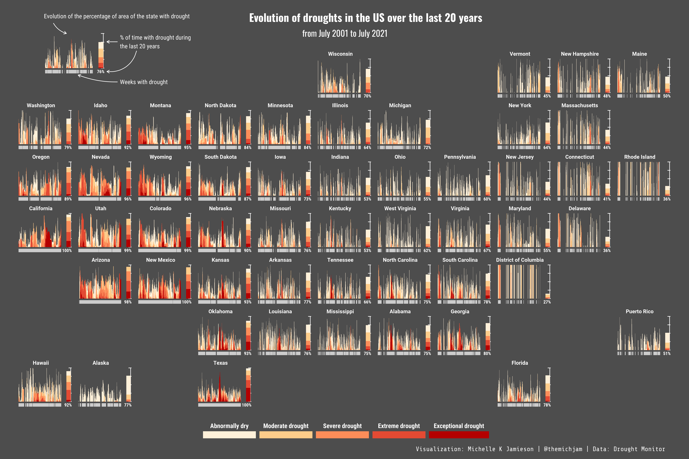
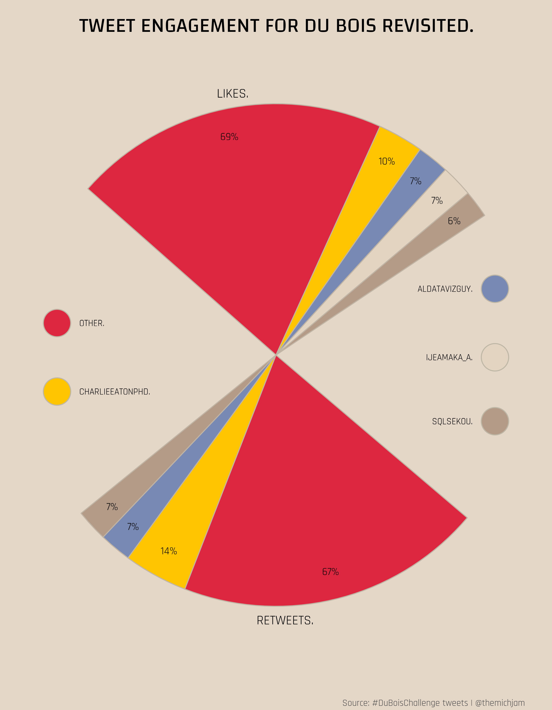

# TidyTuesday
  
Join the R4DS Online Learning Community in the weekly [#TidyTuesday](https://github.com/rfordatascience/tidytuesday) event!
    
Every week we post a raw dataset, a chart or article related to that dataset, and ask you to explore the data.
    
While the dataset will be “tamed”, it will not always be tidy! As such you might need to apply various R for Data Science techniques to wrangle the data into a true tidy format.

The goal of TidyTuesday is to apply your R skills, get feedback, explore other’s work, and connect with the greater #RStats community!

As such we encourage everyone of all skills to participate!

# 2021-07-27 (Week 31): Olympic Medals

Each country and the sport they most excelled at between 1980 and 2016.

# 2021-07-20 (Week 30): US Droughts

Evolution of droughts in the US over the last 20 years

# 2021-06-15 (Week 25): Du Bois & Juneteenth Revisited

Tweet engagement for the #DuBoisChallenge in the style of De Bois.

